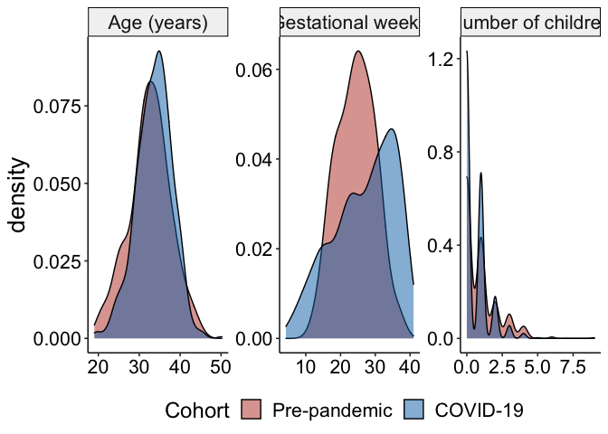
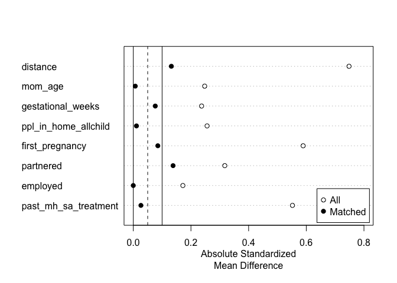
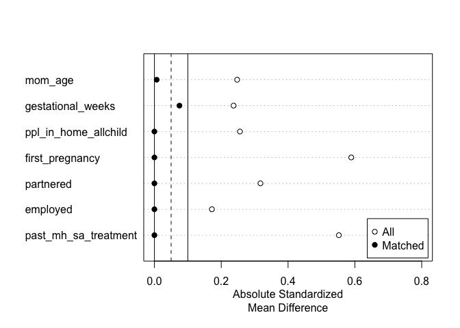
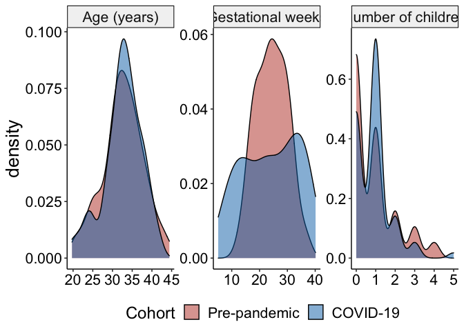
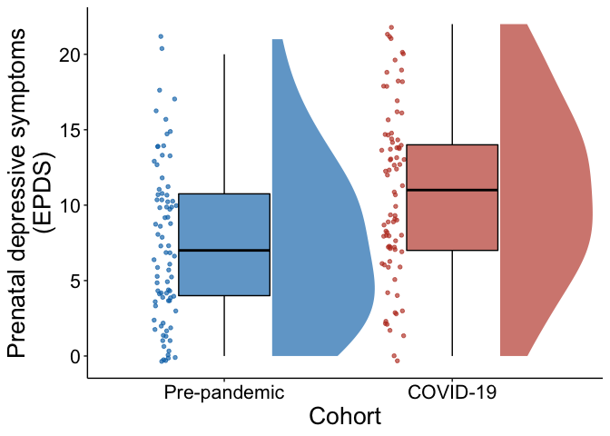
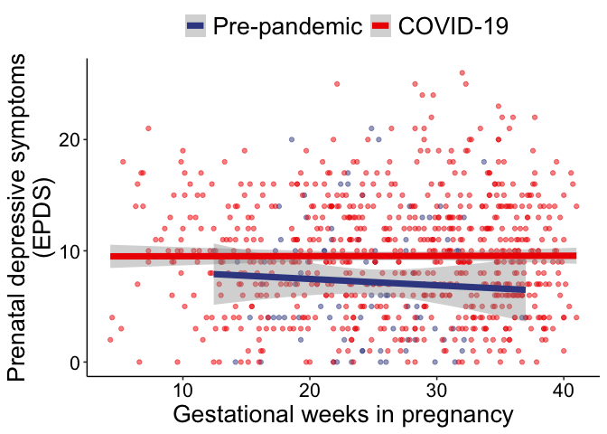

Analyses for Aim 1 of “Pregnancy during the pandemic: The impact of
COVID-19-related stress on risk for prenatal depression”
================
Lucy S. King
2020

  - [Set up environment](#set-up-environment)
  - [Read in data](#read-in-data)
      - [BABIES data](#babies-data)
      - [COPE data](#cope-data)
      - [Join BABIES and COPE](#join-babies-and-cope)
  - [Cleaning to enable comparisons](#cleaning-to-enable-comparisons)
  - [BABIES sample characteristics](#babies-sample-characteristics)
  - [Distributions](#distributions)
  - [Test initial differences](#test-initial-differences)
  - [Match samples](#match-samples)
      - [Optimal Nearest Neighbor](#optimal-nearest-neighbor)
      - [Coarsened exact matching](#coarsened-exact-matching)
      - [Distributions of matched data](#distributions-of-matched-data)
      - [Means, SDs, ranges of matched
        data](#means-sds-ranges-of-matched-data)
      - [Test differences after
        matching](#test-differences-after-matching)
  - [Test Aim 1](#test-aim-1)
  - [Center factors](#center-factors)
  - [Unadjusted t-test](#unadjusted-t-test)
  - [Adjusted OLS](#adjusted-ols)
  - [Unadjusted chi-square](#unadjusted-chi-square)
      - [Visualize main effect](#visualize-main-effect)
  - [Compare participants in COVID-19 subset to participants in full
    cohort](#compare-participants-in-covid-19-subset-to-participants-in-full-cohort)
  - [EPDS \~ gestational age](#epds-gestational-age)
  - [Export data to share](#export-data-to-share)

# Set up environment

``` r
# Libraries
library(tidyverse)
```

    ## ── Attaching packages ─────────────────────────────────────── tidyverse 1.3.0 ──

    ## ✓ ggplot2 3.3.2     ✓ purrr   0.3.4
    ## ✓ tibble  3.0.4     ✓ dplyr   1.0.2
    ## ✓ tidyr   1.1.2     ✓ stringr 1.4.0
    ## ✓ readr   1.4.0     ✓ forcats 0.5.0

    ## ── Conflicts ────────────────────────────────────────── tidyverse_conflicts() ──
    ## x dplyr::filter() masks stats::filter()
    ## x dplyr::lag()    masks stats::lag()

``` r
library(lubridate)
```

    ## 
    ## Attaching package: 'lubridate'

    ## The following objects are masked from 'package:base':
    ## 
    ##     date, intersect, setdiff, union

``` r
library(parameters)
library(ggsci)
library(ggpubr)
library(relaimpo)
```

    ## Loading required package: MASS

    ## 
    ## Attaching package: 'MASS'

    ## The following object is masked from 'package:dplyr':
    ## 
    ##     select

    ## Loading required package: boot

    ## Loading required package: survey

    ## Loading required package: grid

    ## Loading required package: Matrix

    ## 
    ## Attaching package: 'Matrix'

    ## The following objects are masked from 'package:tidyr':
    ## 
    ##     expand, pack, unpack

    ## Loading required package: survival

    ## 
    ## Attaching package: 'survival'

    ## The following object is masked from 'package:boot':
    ## 
    ##     aml

    ## 
    ## Attaching package: 'survey'

    ## The following object is masked from 'package:graphics':
    ## 
    ##     dotchart

    ## Loading required package: mitools

    ## This is the global version of package relaimpo.

    ## If you are a non-US user, a version with the interesting additional metric pmvd is available

    ## from Ulrike Groempings web site at prof.beuth-hochschule.de/groemping.

``` r
library(effectsize)
library(MatchIt)
library(cem)
```

    ## Loading required package: tcltk

    ## Loading required package: lattice

    ## 
    ## Attaching package: 'lattice'

    ## The following object is masked from 'package:boot':
    ## 
    ##     melanoma

    ## 
    ## How to use CEM? Type vignette("cem")

``` r
library(codebook)
library(labelled)
```

    ## 
    ## Attaching package: 'labelled'

    ## The following object is masked from 'package:codebook':
    ## 
    ##     to_factor

``` r
source("R_rainclouds.R")

# Data files

## BABIES
babies_data_home <- "~/Box/Mooddata_Coordinating/BABIES/Data/final_scored_data/"
babes_demo_file <- paste0(babies_data_home, "demographics/demo_longitudinal_cleaned_final.csv")
babies_epds_file <- paste0(babies_data_home, "EPDS/epds_wf_complete.csv")
babies_prams_file <- paste0(babies_data_home, "PRAMS/prams_alldata_cleaned.csv")
babies_treatment_file <- paste0(babies_data_home, "SCID/scid_lg_preg_treatment_history_complete.csv")

# ## COPE
cope_data <- "~/Box/Mooddata_Coordinating/COPE/data/wrangled_cleaned_data_PREG_20201118.csv"

set.seed(100588)
```

# Read in data

## BABIES data

``` r
babies <-
  read_csv(babes_demo_file) %>% 
  left_join(
    read_csv(babies_treatment_file), by = "ID"
  ) %>% 
  dplyr::select(
    ID,
    mom_age_t1,
    education = education_t1_txt,
    income_bins = annual_income_t1_txt,
    income_numeric = annual_income_t1_num,
    income_needs_t1, 
    employment_status_t1_txt,
    employment_explain_t1,
    pregnant_times_t1,
    pregnant_times_t2,
    pregnant_times_t3,
    current_num_child_t1 = current_num_children_t1,
    gestational_weeks_t1,
    ppl_in_home_adults_t1,
    ppl_in_home_allchild_t1,
    ppl_in_home_tot_t1,
    mom_race,
    mom_latinx,
    marital_status_t1_txt,
    past_mh_sa_treatment
  ) %>% 
  mutate(
    pregnant_times = if_else(
      is.na(pregnant_times_t1), pregnant_times_t2, pregnant_times_t1
    ),
    pregnant_times = if_else(
      is.na(pregnant_times), pregnant_times_t3, pregnant_times
    )
  ) %>% 
  dplyr::select(
    -pregnant_times_t1:-pregnant_times_t3
  ) %>% 
  rename_at(
    vars(-ID),
    funs(str_replace(., "_t1", ""))
  ) %>% 
  left_join(
    read_csv(babies_epds_file) %>% 
      dplyr::select(-epds_t3, -epds_t3_concern),
    by = "ID"
  ) %>% 
  mutate(cohort = "Pre-pandemic") %>% 
  dplyr::select(
    ID,
    cohort,
    epds_total = epds_t1,
    everything()
  ) %>% 
  mutate(
    job_status = case_when(
      employment_status_txt == "Out of work, looking for work" ~ "Unemployed",
      employment_status_txt == "Out of work, not looking for work" ~ "Unemployed",
      TRUE ~ employment_status_txt
    ),
    ID = paste0(ID, "_b"),
    first_pregnancy = if_else(
      !is.na(pregnant_times) & pregnant_times == 1, 1, 0
    ),
    current_num_child = if_else(
      is.na(current_num_child), ppl_in_home_allchild, current_num_child
    )
  ) %>% 
  #1078 did not actually participate in pregnancy; need to remove from BABIES pregnancy demographics
  filter(!is.na(epds_total))
```

    ## 
    ## ── Column specification ────────────────────────────────────────────────────────
    ## cols(
    ##   .default = col_double(),
    ##   educ_describe_t1 = col_logical(),
    ##   employment_explain_t1 = col_logical(),
    ##   mom_pob_t1 = col_character(),
    ##   mom_native_lang_t1 = col_character(),
    ##   primarylang_t1 = col_character(),
    ##   secondlang_type_t1 = col_character(),
    ##   marital_explain_t1 = col_character(),
    ##   partner_educ_describe_t1 = col_logical(),
    ##   partner_employ_describe_t1 = col_character(),
    ##   partner_pob_t1 = col_character(),
    ##   ppl_in_home_describe_t1 = col_character(),
    ##   second_childage_t1 = col_logical(),
    ##   second_childsex_t1 = col_logical(),
    ##   third_childage_t1 = col_logical(),
    ##   third_childsex_t1 = col_logical(),
    ##   fourth_childage_t1 = col_logical(),
    ##   fourth_childsex_t1 = col_logical(),
    ##   fifth_childage_t1 = col_logical(),
    ##   fifth_childsex_t1 = col_logical(),
    ##   sixth_childage_t1 = col_logical()
    ##   # ... with 99 more columns
    ## )
    ## ℹ Use `spec()` for the full column specifications.

    ## 
    ## ── Column specification ────────────────────────────────────────────────────────
    ## cols(
    ##   ID = col_double(),
    ##   past_mh_sa_treatment = col_double()
    ## )

    ## Warning: `funs()` is deprecated as of dplyr 0.8.0.
    ## Please use a list of either functions or lambdas: 
    ## 
    ##   # Simple named list: 
    ##   list(mean = mean, median = median)
    ## 
    ##   # Auto named with `tibble::lst()`: 
    ##   tibble::lst(mean, median)
    ## 
    ##   # Using lambdas
    ##   list(~ mean(., trim = .2), ~ median(., na.rm = TRUE))
    ## This warning is displayed once every 8 hours.
    ## Call `lifecycle::last_warnings()` to see where this warning was generated.

    ## 
    ## ── Column specification ────────────────────────────────────────────────────────
    ## cols(
    ##   ID = col_double(),
    ##   epds_t1 = col_double(),
    ##   epds_t2 = col_double(),
    ##   epds_t3 = col_double(),
    ##   epds_t1_concern = col_character(),
    ##   epds_t2_concern = col_character(),
    ##   epds_t3_concern = col_character(),
    ##   max_epds_t1t2 = col_double()
    ## )

``` r
babies <-
  babies %>% 
  group_by(ID) %>% 
   # inr based on the federal poverty thresholds for number of people in household and number that are children
  mutate(
    fpl_threshold = case_when(
      ppl_in_home_tot == 1 & ppl_in_home_allchild == 0 ~ 13300,
      ppl_in_home_tot == 2 & ppl_in_home_allchild == 0 ~ 17120,
      ppl_in_home_tot == 2 & ppl_in_home_allchild == 1 ~ 17622,
      ppl_in_home_tot == 3 & ppl_in_home_allchild == 0 ~ 19998,
      ppl_in_home_tot == 3 & ppl_in_home_allchild == 1 ~ 20578,
      ppl_in_home_tot == 3 & ppl_in_home_allchild == 2 ~ 20598,
      ppl_in_home_tot == 4 & ppl_in_home_allchild == 0 ~ 26370,
      ppl_in_home_tot == 4 & ppl_in_home_allchild == 1 ~ 26801,
      ppl_in_home_tot == 4 & ppl_in_home_allchild == 2 ~ 25926,
      ppl_in_home_tot == 4 & ppl_in_home_allchild == 3 ~ 26017,
      ppl_in_home_tot == 5 & ppl_in_home_allchild == 0 ~ 31800,
      ppl_in_home_tot == 5 & ppl_in_home_allchild == 1 ~ 32263,
      ppl_in_home_tot == 5 & ppl_in_home_allchild == 2 ~ 31275,
      ppl_in_home_tot == 5 & ppl_in_home_allchild == 3 ~ 30510,
      ppl_in_home_tot == 5 & ppl_in_home_allchild == 4 ~ 30044,
      ppl_in_home_tot == 6 & ppl_in_home_allchild == 0 ~ 36576,
      ppl_in_home_tot == 6 & ppl_in_home_allchild == 1 ~ 36721,
      ppl_in_home_tot == 6 & ppl_in_home_allchild == 2 ~ 35965,
      ppl_in_home_tot == 6 & ppl_in_home_allchild == 3 ~ 35239,
      ppl_in_home_tot == 6 & ppl_in_home_allchild == 4 ~ 34161,
      ppl_in_home_tot == 6 & ppl_in_home_allchild == 5 ~ 33522,
      ppl_in_home_tot == 7 & ppl_in_home_allchild == 0 ~ 42085,
      ppl_in_home_tot == 7 & ppl_in_home_allchild == 1 ~ 42348,
      ppl_in_home_tot == 7 & ppl_in_home_allchild == 2 ~ 41442,
      ppl_in_home_tot == 7 & ppl_in_home_allchild == 3 ~ 40811,
      ppl_in_home_tot == 7 & ppl_in_home_allchild == 4 ~ 39635,
      ppl_in_home_tot == 7 & ppl_in_home_allchild == 5 ~ 38262,
      ppl_in_home_tot == 7 & ppl_in_home_allchild == 6 ~ 36757,
      ppl_in_home_tot == 8 & ppl_in_home_allchild == 0 ~ 47069,
      ppl_in_home_tot == 8 & ppl_in_home_allchild == 1 ~ 47485,
      ppl_in_home_tot == 8 & ppl_in_home_allchild == 2 ~ 46630,
      ppl_in_home_tot == 8 & ppl_in_home_allchild == 3 ~ 45881,
      ppl_in_home_tot == 8 & ppl_in_home_allchild == 4 ~ 44818,
      ppl_in_home_tot == 8 & ppl_in_home_allchild == 5 ~ 43470,
      ppl_in_home_tot == 8 & ppl_in_home_allchild == 6 ~ 42066,
      ppl_in_home_tot == 8 & ppl_in_home_allchild == 7 ~ 41709,
      ppl_in_home_tot >= 9 & ppl_in_home_allchild == 0 ~ 56621,
      ppl_in_home_tot >= 9 & ppl_in_home_allchild == 1 ~ 56895,
      ppl_in_home_tot >= 9 & ppl_in_home_allchild == 2 ~ 56139,
      ppl_in_home_tot >= 9 & ppl_in_home_allchild == 3 ~ 55503,
      ppl_in_home_tot >= 9 & ppl_in_home_allchild == 4 ~ 54460,
      ppl_in_home_tot >= 9 & ppl_in_home_allchild == 5 ~ 53025,
      ppl_in_home_tot >= 9 & ppl_in_home_allchild == 6 ~ 51727,
      ppl_in_home_tot >= 9 & ppl_in_home_allchild == 7 ~ 51406,
      ppl_in_home_tot >= 9 & ppl_in_home_allchild >= 8 ~ 49426
    ),
    inr_fpl = income_numeric / fpl_threshold
  ) %>% 
  ungroup()
```

## COPE data

``` r
cope <-
  read_csv(cope_data) %>% 
  rename(current_num_child = current_num_bio_children, ID = cope_id) %>% 
  mutate(
    cohort = "COVID-19",
    past_mh_sa_treatment = dplyr::recode(
      past_mh_sa_treatment,
      "past treatment" = 1,
      "none" = 0
    )
  ) 
```

    ## 
    ## ── Column specification ────────────────────────────────────────────────────────
    ## cols(
    ##   .default = col_double(),
    ##   today_date = col_date(format = ""),
    ##   address_current = col_character(),
    ##   pregnant_due_date = col_date(format = ""),
    ##   currently_mother = col_logical(),
    ##   child_birth_date = col_logical(),
    ##   current_child_age = col_logical(),
    ##   birth_date = col_date(format = ""),
    ##   education = col_character(),
    ##   marriage_status = col_character(),
    ##   marriage_status_other = col_character(),
    ##   home_describe = col_character(),
    ##   home_rent_own = col_character(),
    ##   ppl_in_home_describe = col_character(),
    ##   country_birth = col_character(),
    ##   state_birth = col_character(),
    ##   race_other_describe = col_character(),
    ##   income = col_character(),
    ##   preg_birth_concern_describe = col_character(),
    ##   preg_supp_concern_describe = col_character(),
    ##   nicu = col_logical()
    ##   # ... with 28 more columns
    ## )
    ## ℹ Use `spec()` for the full column specifications.

## Join BABIES and COPE

``` r
d <-
  babies %>% 
  bind_rows(
    cope %>% 
      mutate(ID = as.character(ID))
  ) %>% 
  mutate(cohort = as.factor(cohort)) %>% 
  ungroup()
```

# Cleaning to enable comparisons

``` r
# create variable for "White" and "Person of color"
d <-
  d %>% 
  mutate(
    poc = case_when(
      race_c == "White" ~ 0,
      mom_race == "White" ~ 0,
      !is.na(mom_race) & mom_race != "White" ~ 1,
      !is.na(race_c) & race_c != "White" ~ 1,
      mom_latinx == 1 ~ 1
    )
  ) 
```

``` r
# recode job_status variable so BABIES and COPE bins are equivalent
d  <-
  d %>% 
  mutate(
    job_status = case_when(
      job_status == "Employed for wages" ~ "Employed",
      job_status == "fulltime paid job" ~ "Employed",
      job_status == "parttime paid job" ~ "Employed",
      job_status == "Self-employed" ~ "Employed",
      job_status == "Homemaker" ~ "Home caregiver",
      job_status == "home caregiver" ~ "Home caregiver",
      job_status == "Student" ~ "Student",
      job_status == "student" ~ "Student",
      job_status == "retired" ~ "Other",
      job_status == "other" ~ "Other",
      job_status == "Unable to work" ~ "Other",
      job_status == "Unemployed" ~ "Unemployed",
      job_status == "unemployed/looking" ~ "Unemployed"
    ),
    employed = if_else(
      !is.na(job_status) & job_status == "Employed", 1, 0
    )
  ) 
```

``` r
# recode education variables so BABIES and COPE bins are equivalent
d <-
  d %>% 
  mutate(
    education = case_when(
      education == "7th-9th grade" ~ "< High school diploma",
      education == "10th-12th grade" ~ "< High school diploma",
      education == "Some high school, no diploma" ~ "< High school diploma",
      education == "High school/GED" ~ "High school/GED",
      education == "Partial college" ~ "Partial college, no degree",
      education == "Some college credit, no degree" ~ "Partial college, no degree",
      education == "Trade school/apprenticeship" ~ "Trade/technical/vocational training",
      education == "Trade/technical/vocational training" ~ "Trade/technical/vocational training",
      education == "2-year college degree" ~ "Associate degree",
      education == "Associate degree" ~ "Associate degree",
      education == "4-year college degree" ~ "Bachelor's degree",
      education == "Bachelor's degree" ~ "Bachelor's degree",
      education == "Graduate degree" ~ "Graduate degree",
    ),
    college_or_higher = if_else(
      !is.na(education) & education == "Bachelor's degree" | education == "Graduate degree",
      1, 0
    )
  ) 
```

``` r
# create variable for partnered/married vs. not
d <-
  d %>% 
  mutate(
    partnered = case_when(
      marital_status_txt == "Married/domestic partnership" ~ 1,
      marriage_status == "Partner/married" ~ 1,
      TRUE ~ 0
    )
  ) 
```

``` r
d <-
  d %>% 
  mutate(
    low_income = if_else(
      income_numeric <= 2 * fpl_threshold, 1, 0
    )
  )
```

# BABIES sample characteristics

``` r
d %>% 
  filter(cohort == "Pre-pandemic") %>% 
  summarise_at(
    vars(
      mom_age,
      gestational_weeks,
      ppl_in_home_allchild,
      ppl_in_home_adults,
      inr_fpl,
      epds_total
    ),
    funs(mean, sd, min, max), na.rm = TRUE
  ) 
```

    ## # A tibble: 1 x 24
    ##   mom_age_mean gestational_wee… ppl_in_home_all… ppl_in_home_adu… inr_fpl_mean
    ##          <dbl>            <dbl>            <dbl>            <dbl>        <dbl>
    ## 1         32.6             24.4            0.880             2.38         5.61
    ## # … with 19 more variables: epds_total_mean <dbl>, mom_age_sd <dbl>,
    ## #   gestational_weeks_sd <dbl>, ppl_in_home_allchild_sd <dbl>,
    ## #   ppl_in_home_adults_sd <dbl>, inr_fpl_sd <dbl>, epds_total_sd <dbl>,
    ## #   mom_age_min <dbl>, gestational_weeks_min <dbl>,
    ## #   ppl_in_home_allchild_min <dbl>, ppl_in_home_adults_min <dbl>,
    ## #   inr_fpl_min <dbl>, epds_total_min <dbl>, mom_age_max <dbl>,
    ## #   gestational_weeks_max <dbl>, ppl_in_home_allchild_max <dbl>,
    ## #   ppl_in_home_adults_max <dbl>, inr_fpl_max <dbl>, epds_total_max <dbl>

``` r
d %>% 
  filter(cohort == "Pre-pandemic") %>% 
  count(first_pregnancy) %>% 
  mutate(per = n / sum(n))
```

    ## # A tibble: 2 x 3
    ##   first_pregnancy     n   per
    ##             <dbl> <int> <dbl>
    ## 1               0    64 0.727
    ## 2               1    24 0.273

``` r
d %>% 
  filter(cohort == "Pre-pandemic") %>% 
  count(mom_race, mom_latinx) %>% 
  mutate(per = n / sum(n)) %>% 
  arrange(desc(n))
```

    ## # A tibble: 10 x 4
    ##    mom_race                               mom_latinx     n    per
    ##    <chr>                                       <dbl> <int>  <dbl>
    ##  1 White                                           0    47 0.534 
    ##  2 Asian                                           0    19 0.216 
    ##  3 Other                                           0     5 0.0568
    ##  4 White                                           1     5 0.0568
    ##  5 Black/African American                          0     3 0.0341
    ##  6 Native Hawaiian/Other Pacific Islander          0     3 0.0341
    ##  7 Other                                           1     3 0.0341
    ##  8 American Indian/Alaska Native                   0     1 0.0114
    ##  9 White                                          NA     1 0.0114
    ## 10 <NA>                                            1     1 0.0114

``` r
d %>% 
  filter(cohort == "Pre-pandemic") %>% 
  count(poc) %>% 
  mutate(per = n / sum(n)) %>% 
  arrange(desc(n))
```

    ## # A tibble: 2 x 3
    ##     poc     n   per
    ##   <dbl> <int> <dbl>
    ## 1     0    53 0.602
    ## 2     1    35 0.398

``` r
d %>% 
  filter(cohort == "Pre-pandemic") %>% 
  count(income_numeric > 100000) %>% 
  mutate(per = n / sum(n)) 
```

    ## # A tibble: 3 x 3
    ##   `income_numeric > 1e+05`     n    per
    ##   <lgl>                    <int>  <dbl>
    ## 1 FALSE                       26 0.295 
    ## 2 TRUE                        61 0.693 
    ## 3 NA                           1 0.0114

``` r
d %>% 
  filter(cohort == "Pre-pandemic") %>% 
  count(low_income) %>% 
  mutate(per = n / sum(n)) 
```

    ## # A tibble: 3 x 3
    ##   low_income     n    per
    ##        <dbl> <int>  <dbl>
    ## 1          0    76 0.864 
    ## 2          1     7 0.0795
    ## 3         NA     5 0.0568

``` r
d %>% 
  filter(cohort == "Pre-pandemic") %>% 
  count(education) %>% 
  mutate(per = n / sum(n)) %>% 
  arrange(desc(n))
```

    ## # A tibble: 7 x 3
    ##   education                               n    per
    ##   <chr>                               <int>  <dbl>
    ## 1 Graduate degree                        39 0.443 
    ## 2 Bachelor's degree                      30 0.341 
    ## 3 Partial college, no degree              8 0.0909
    ## 4 Associate degree                        5 0.0568
    ## 5 Trade/technical/vocational training     4 0.0455
    ## 6 < High school diploma                   1 0.0114
    ## 7 <NA>                                    1 0.0114

``` r
d %>% 
  filter(cohort == "Pre-pandemic") %>%  
  count(college_or_higher) %>% 
  mutate(per = n / sum(n)) %>% 
  arrange(desc(n))
```

    ## # A tibble: 3 x 3
    ##   college_or_higher     n    per
    ##               <dbl> <int>  <dbl>
    ## 1                 1    69 0.784 
    ## 2                 0    18 0.205 
    ## 3                NA     1 0.0114

``` r
d %>% 
  filter(cohort == "Pre-pandemic") %>% 
  count(job_status) %>% 
  mutate(per = n / sum(n)) %>% 
  arrange(desc(n))
```

    ## # A tibble: 6 x 3
    ##   job_status         n    per
    ##   <chr>          <int>  <dbl>
    ## 1 Employed          60 0.682 
    ## 2 Home caregiver    15 0.170 
    ## 3 Unemployed         9 0.102 
    ## 4 Student            2 0.0227
    ## 5 Other              1 0.0114
    ## 6 <NA>               1 0.0114

``` r
d %>% 
  filter(cohort == "Pre-pandemic") %>% 
  count(partnered) %>% 
  mutate(per = n / sum(n)) %>% 
  arrange(desc(n))
```

    ## # A tibble: 2 x 3
    ##   partnered     n   per
    ##       <dbl> <int> <dbl>
    ## 1         1    73 0.830
    ## 2         0    15 0.170

``` r
d %>% 
  filter(cohort == "Pre-pandemic") %>% 
  count(past_mh_sa_treatment) %>% 
  mutate(per = n / sum(n))
```

    ## # A tibble: 3 x 3
    ##   past_mh_sa_treatment     n    per
    ##                  <dbl> <int>  <dbl>
    ## 1                    0    29 0.330 
    ## 2                    1    58 0.659 
    ## 3                   NA     1 0.0114

# Distributions

``` r
d %>% 
  dplyr::select(
    cohort,
    `Age (years)` = mom_age,
    `Number of children` = ppl_in_home_allchild,
    `Gestational weeks` = gestational_weeks
  ) %>% 
  gather(
    key, 
    value,
    -cohort
  ) %>% 
  ggplot(aes(value, fill = fct_rev(cohort))) +
  geom_density(alpha = 1/2) +
  scale_fill_nejm() +
  theme_pubr() +
  theme(
    strip.text = element_text(size = 16),
    axis.title.y = element_text(size = 20),
    axis.title.x = element_text(size = 20),
    axis.text.y = element_text(size = 16),
    axis.text.x = element_text(size = 16),
    legend.title = element_text(size = 18),
    legend.text = element_text(size = 16),
    legend.position = "bottom"
  ) +
  labs(
    x = NULL,
    fill = "Cohort"
  ) +
  facet_wrap(.~key, scales = "free")
```

    ## Warning: Removed 26 rows containing non-finite values (stat_density).

<!-- -->

``` r
ggsave(
  "~/Box/lucy_king_files/BABIES/cope/figures/babies_cope_density_plots.png",
  dpi = 600,
  width = 10,
  height = 4
)
```

    ## Warning: Removed 26 rows containing non-finite values (stat_density).

``` r
counts_table <-
  d %>% 
  dplyr::select(
    ID,
    cohort,
    first_pregnancy,
    partnered,
    poc,
    low_income,
    college_or_higher,
    employed,
    past_mh_sa_treatment,
  ) %>% 
  gather(variable, value, -cohort, -ID) %>% 
  group_by(cohort, variable) %>% 
  mutate(
    sample_size = sum(!is.na(value))
  ) %>% 
  group_by(cohort, variable) %>% 
  summarise(
    sample_size = mean(sample_size),
    n = sum(value, na.rm = TRUE),
  ) %>% 
  mutate(
    Percent = n / sample_size,
    variable = recode_factor(
      variable,
      "college_or_higher" = "College or higher",
      "employed" = "Employed",
      "first_pregnancy" = "Primiparous",
      "low_income" = "Low income",
      "partnered" = "Married or partnered",
      "poc" = "Person of color",
      "past_mh_sa_treatment" = "Past mental health/substance treatment"
    )
  ) %>% 
  dplyr::select(-sample_size) %>% 
  ungroup()
```

    ## `summarise()` regrouping output by 'cohort' (override with `.groups` argument)

# Test initial differences

``` r
chisq.test(d$employed, d$cohort)
```

``` 

    Pearson's Chi-squared test with Yates' continuity correction

data:  d$employed and d$cohort
X-squared = 2.3525, df = 1, p-value = 0.1251
```

``` r
chisq.test(d$college_or_higher, d$cohort)
```

``` 

    Pearson's Chi-squared test with Yates' continuity correction

data:  d$college_or_higher and d$cohort
X-squared = 1.1957, df = 1, p-value = 0.2742
```

``` r
chisq.test(d$low_income, d$cohort) 
```

``` 

    Pearson's Chi-squared test with Yates' continuity correction

data:  d$low_income and d$cohort
X-squared = 0.083156, df = 1, p-value = 0.7731
```

``` r
chisq.test(d$poc, d$cohort) 
```

``` 

    Pearson's Chi-squared test with Yates' continuity correction

data:  d$poc and d$cohort
X-squared = 0.11365, df = 1, p-value = 0.736
```

``` r
chisq.test(d$past_mh_sa_treatment, d$cohort) 
```

``` 

    Pearson's Chi-squared test with Yates' continuity correction

data:  d$past_mh_sa_treatment and d$cohort
X-squared = 20.053, df = 1, p-value = 7.531e-06
```

``` r
chisq.test(d$first_pregnancy, d$cohort) # significant
```

``` 

    Pearson's Chi-squared test with Yates' continuity correction

data:  d$first_pregnancy and d$cohort
X-squared = 14.522, df = 1, p-value = 0.0001386
```

``` r
chisq.test(d$partnered, d$cohort) # significant
```

    ## Warning in chisq.test(d$partnered, d$cohort): Chi-squared approximation may be
    ## incorrect

``` 

    Pearson's Chi-squared test with Yates' continuity correction

data:  d$partnered and d$cohort
X-squared = 37.228, df = 1, p-value = 1.051e-09
```

``` r
d %>% 
  count(cohort, partnered) %>% 
  group_by(cohort) %>% 
  mutate(per = n / sum(n))
```

    ## # A tibble: 4 x 4
    ## # Groups:   cohort [2]
    ##   cohort       partnered     n    per
    ##   <fct>            <dbl> <int>  <dbl>
    ## 1 COVID-19             0    19 0.0262
    ## 2 COVID-19             1   706 0.974 
    ## 3 Pre-pandemic         0    15 0.170 
    ## 4 Pre-pandemic         1    73 0.830

``` r
t.test(d$ppl_in_home_allchild ~ d$cohort)
```

``` 

    Welch Two Sample t-test

data:  d$ppl_in_home_allchild by d$cohort
t = -1.9655, df = 96.056, p-value = 0.05224
alternative hypothesis: true difference in means is not equal to 0
95 percent confidence interval:
 -0.495264400  0.002435152
sample estimates:
    mean in group COVID-19 mean in group Pre-pandemic 
                 0.6331034                  0.8795181 
```

``` r
t.test(d$mom_age ~ d$cohort) # significant
```

``` 

    Welch Two Sample t-test

data:  d$mom_age by d$cohort
t = 2.0063, df = 104.07, p-value = 0.04742
alternative hypothesis: true difference in means is not equal to 0
95 percent confidence interval:
 0.01306877 2.24199162
sample estimates:
    mean in group COVID-19 mean in group Pre-pandemic 
                  33.68562                   32.55809 
```

``` r
t.test(d$gestational_weeks ~ d$cohort) # significant
```

``` 

    Welch Two Sample t-test

data:  d$gestational_weeks by d$cohort
t = 3.5148, df = 148.5, p-value = 0.0005838
alternative hypothesis: true difference in means is not equal to 0
95 percent confidence interval:
 1.030143 3.676082
sample estimates:
    mean in group COVID-19 mean in group Pre-pandemic 
                  26.78818                   24.43506 
```

# Match samples

see:
<https://data.library.virginia.edu/getting-started-with-matching-methods/>

``` r
#first, only include COPE women in bay area counties
d %>% 
  count(ca_county)
```

    ## # A tibble: 19 x 2
    ##    ca_county         n
    ##    <chr>         <int>
    ##  1 Alameda          68
    ##  2 Contra Costa     23
    ##  3 Fresno            1
    ##  4 Humboldt          1
    ##  5 Marin            10
    ##  6 Monterey          1
    ##  7 Orange            2
    ##  8 Placer            2
    ##  9 Sacramento        1
    ## 10 San Benito        2
    ## 11 San Diego         1
    ## 12 San Francisco    44
    ## 13 San Joaquin       2
    ## 14 San Mateo        54
    ## 15 Santa Clara     118
    ## 16 Santa Cruz       11
    ## 17 Sonoma            1
    ## 18 Yolo              1
    ## 19 <NA>            470

``` r
d.1 <-
  d %>% 
  filter(
    !ca_county %in% c(
      "Monterey", 
      "Fresno", 
      "Orange", 
      "Humboldt", 
      "Sacramento", 
      "San Diego", 
      "Yolo"
    )
  ) %>% 
  mutate(
    exclude = if_else(cohort == "COVID-19" & is.na(ca_county), 1, 0)
  ) %>% 
  filter(exclude == 0)
```

## Optimal Nearest Neighbor

``` r
# define what we want to match on; missing values on covariates not allowed

# missing values not allowed
d.2 <-
  d.1 %>% 
  filter(
    !is.na(ppl_in_home_allchild),
    !is.na(mom_age),
    !is.na(low_income),
    !is.na(college_or_higher),
    !is.na(past_mh_sa_treatment)
  )


# including education led to poorer match; therefore, not included
m.out <- matchit(
  cohort ~
    mom_age +
    gestational_weeks +
    ppl_in_home_allchild +
    first_pregnancy +
    partnered +
    employed +
    past_mh_sa_treatment,
  data = d.2,
  method = "optimal"
)
```

``` r
# results of matching procedure
s.out <- summary(m.out, standardize = TRUE)
s.out
```

    ## 
    ## Call:
    ## matchit(formula = cohort ~ mom_age + gestational_weeks + ppl_in_home_allchild + 
    ##     first_pregnancy + partnered + employed + past_mh_sa_treatment, 
    ##     data = d.2, method = "optimal")
    ## 
    ## Summary of Balance for All Data:
    ##                      Means Treated Means Control Std. Mean Diff. Var. Ratio
    ## distance                    0.3148        0.1745          0.7483     2.3745
    ## mom_age                    32.6591       33.9259         -0.2476     1.3392
    ## gestational_weeks          24.3589       25.6961         -0.2369     0.3922
    ## ppl_in_home_allchild        0.8902        0.6087          0.2560     1.7761
    ## first_pregnancy             0.2439        0.4969         -0.5891          .
    ## partnered                   0.8537        0.9658         -0.3174          .
    ## employed                    0.6707        0.7516         -0.1720          .
    ## past_mh_sa_treatment        0.6951        0.4410          0.5520          .
    ##                      eCDF Mean eCDF Max
    ## distance                0.2368   0.3884
    ## mom_age                 0.0814   0.1682
    ## gestational_weeks       0.1030   0.2338
    ## ppl_in_home_allchild    0.0480   0.1108
    ## first_pregnancy         0.2530   0.2530
    ## partnered               0.1122   0.1122
    ## employed                0.0808   0.0808
    ## past_mh_sa_treatment    0.2541   0.2541
    ## 
    ## 
    ## Summary of Balance for Matched Data:
    ##                      Means Treated Means Control Std. Mean Diff. Var. Ratio
    ## distance                    0.3148        0.2900          0.1320     1.5326
    ## mom_age                    32.6591       32.6237          0.0069     1.1374
    ## gestational_weeks          24.3589       23.9286          0.0762     0.3150
    ## ppl_in_home_allchild        0.8902        0.8780          0.0111     1.5612
    ## first_pregnancy             0.2439        0.2805         -0.0852          .
    ## partnered                   0.8537        0.9024         -0.1380          .
    ## employed                    0.6707        0.6707          0.0000          .
    ## past_mh_sa_treatment        0.6951        0.6829          0.0265          .
    ##                      eCDF Mean eCDF Max Std. Pair Dist.
    ## distance                0.0117   0.1098          0.1361
    ## mom_age                 0.0219   0.0854          0.7983
    ## gestational_weeks       0.1208   0.2439          1.4993
    ## ppl_in_home_allchild    0.0508   0.1341          0.8536
    ## first_pregnancy         0.0366   0.0366          0.5964
    ## partnered               0.0488   0.0488          0.4140
    ## employed                0.0000   0.0000          0.5122
    ## past_mh_sa_treatment    0.0122   0.0122          0.6623
    ## 
    ## Percent Balance Improvement:
    ##                      Std. Mean Diff. Var. Ratio eCDF Mean eCDF Max
    ## distance                        82.4       50.6      95.1     71.7
    ## mom_age                         97.2       55.9      73.0     49.2
    ## gestational_weeks               67.8      -23.4     -17.4     -4.3
    ## ppl_in_home_allchild            95.7       22.5      -5.9    -21.1
    ## first_pregnancy                 85.5          .      85.5     85.5
    ## partnered                       56.5          .      56.5     56.5
    ## employed                       100.0          .     100.0    100.0
    ## past_mh_sa_treatment            95.2          .      95.2     95.2
    ## 
    ## Sample Sizes:
    ##           Control Treated
    ## All           322      82
    ## Matched        82      82
    ## Unmatched     240       0
    ## Discarded       0       0

``` r
plot(
  s.out, 
  xlim = c(0, .8)
)
```

<!-- -->

``` r
# save matched data
d_matched <- match.data(m.out) 
```

## Coarsened exact matching

``` r
m.out_cem <- matchit(
  cohort ~
    mom_age +
    gestational_weeks +
    ppl_in_home_allchild +
    first_pregnancy +
    partnered +
    employed +
    past_mh_sa_treatment,
  data = d.2,
  method = "cem"
)
```

``` r
# results of matching procedure
s.out_cem <- summary(m.out_cem, standardize = TRUE)
s.out_cem
```

    ## 
    ## Call:
    ## matchit(formula = cohort ~ mom_age + gestational_weeks + ppl_in_home_allchild + 
    ##     first_pregnancy + partnered + employed + past_mh_sa_treatment, 
    ##     data = d.2, method = "cem")
    ## 
    ## Summary of Balance for All Data:
    ##                      Means Treated Means Control Std. Mean Diff. Var. Ratio
    ## mom_age                    32.6591       33.9259         -0.2476     1.3392
    ## gestational_weeks          24.3589       25.6961         -0.2369     0.3922
    ## ppl_in_home_allchild        0.8902        0.6087          0.2560     1.7761
    ## first_pregnancy             0.2439        0.4969         -0.5891          .
    ## partnered                   0.8537        0.9658         -0.3174          .
    ## employed                    0.6707        0.7516         -0.1720          .
    ## past_mh_sa_treatment        0.6951        0.4410          0.5520          .
    ##                      eCDF Mean eCDF Max
    ## mom_age                 0.0814   0.1682
    ## gestational_weeks       0.1030   0.2338
    ## ppl_in_home_allchild    0.0480   0.1108
    ## first_pregnancy         0.2530   0.2530
    ## partnered               0.1122   0.1122
    ## employed                0.0808   0.0808
    ## past_mh_sa_treatment    0.2541   0.2541
    ## 
    ## 
    ## Summary of Balance for Matched Data:
    ##                      Means Treated Means Control Std. Mean Diff. Var. Ratio
    ## mom_age                    33.6399       33.6054          0.0067     1.1535
    ## gestational_weeks          24.8143       24.3917          0.0749     0.9561
    ## ppl_in_home_allchild        0.4000        0.4000          0.0000     1.0070
    ## first_pregnancy             0.5500        0.5500          0.0000          .
    ## partnered                   1.0000        1.0000          0.0000          .
    ## employed                    0.9000        0.9000          0.0000          .
    ## past_mh_sa_treatment        0.6500        0.6500          0.0000          .
    ##                      eCDF Mean eCDF Max Std. Pair Dist.
    ## mom_age                 0.0243   0.1000          0.2008
    ## gestational_weeks       0.0247   0.1417          0.2399
    ## ppl_in_home_allchild    0.0000   0.0000          0.0000
    ## first_pregnancy         0.0000   0.0000          0.0000
    ## partnered               0.0000   0.0000          0.0000
    ## employed                0.0000   0.0000          0.0000
    ## past_mh_sa_treatment    0.0000   0.0000          0.0000
    ## 
    ## Percent Balance Improvement:
    ##                      Std. Mean Diff. Var. Ratio eCDF Mean eCDF Max
    ## mom_age                         97.3       51.1      70.2     40.5
    ## gestational_weeks               68.4       95.2      76.0     39.4
    ## ppl_in_home_allchild           100.0       98.8     100.0    100.0
    ## first_pregnancy                100.0          .     100.0    100.0
    ## partnered                      100.0          .     100.0    100.0
    ## employed                       100.0          .     100.0    100.0
    ## past_mh_sa_treatment           100.0          .     100.0    100.0
    ## 
    ## Sample Sizes:
    ##               Control Treated
    ## All            322.        82
    ## Matched (ESS)   23.08      20
    ## Matched         32.        20
    ## Unmatched      290.        62
    ## Discarded        0.         0

``` r
plot(
  s.out_cem, 
  xlim = c(0, .8)
)
```

<!-- -->

``` r
# save matched data
d_matched_cem <- match.data(m.out_cem) 
d_matched_cem %>% 
  count(cohort)
```

    ## # A tibble: 2 x 2
    ##   cohort           n
    ##   <fct>        <int>
    ## 1 COVID-19        32
    ## 2 Pre-pandemic    20

## Distributions of matched data

``` r
d_matched %>% 
  dplyr::select(
    cohort,
    `Age (years)` = mom_age,
    `Number of children` = ppl_in_home_allchild,
    `Gestational weeks` = gestational_weeks
  ) %>% 
  gather(
    key, 
    value,
    -cohort
  ) %>% 
  ggplot(aes(value, fill = fct_rev(cohort))) +
  geom_density(alpha = 1/2) +
  scale_fill_nejm() +
  theme_pubr() +
  theme(
    strip.text = element_text(size = 16),
    axis.title.y = element_text(size = 20),
    axis.title.x = element_text(size = 20),
    axis.text.y = element_text(size = 16),
    axis.text.x = element_text(size = 16),
    legend.title = element_text(size = 18),
    legend.text = element_text(size = 16),
    legend.position = "bottom"
  ) +
  labs(
    x = NULL,
    fill = "Cohort"
  ) +
  facet_wrap(.~key, scales = "free")
```

<!-- -->

``` r
ggsave(
  "~/Box/lucy_king_files/BABIES/cope/figures/babies_cope_density_plots_matched.png",
  dpi = 600,
  width = 10,
  height = 4
)
```

``` r
counts_table_matched <-
  d_matched %>% 
  dplyr::select(
    ID,
    cohort,
    first_pregnancy,
    partnered,
    poc,
    low_income,
    college_or_higher,
    employed,
    past_mh_sa_treatment,
  ) %>% 
  gather(variable, value, -cohort, -ID) %>% 
  group_by(cohort, variable) %>% 
  mutate(
    sample_size = sum(!is.na(value))
  ) %>% 
  group_by(cohort, variable) %>% 
  summarise(
    sample_size = mean(sample_size),
    n = sum(value, na.rm = TRUE),
  ) %>% 
  mutate(
    Percent = n / sample_size,
    variable = recode_factor(
      variable,
      "college_or_higher" = "College or higher",
      "employed" = "Employed",
      "first_pregnancy" = "Primiparous",
      "low_income" = "Low income",
      "partnered" = "Married or partnered",
      "poc" = "Person of color",
      "past_mh_sa_treatment" = "Past mental health/substance treatment"
    )
  ) %>% 
  dplyr::select(-sample_size) %>% 
  ungroup()
```

    ## `summarise()` regrouping output by 'cohort' (override with `.groups` argument)

``` r
counts_table_matched
```

    ## # A tibble: 14 x 4
    ##    cohort       variable                                   n Percent
    ##    <fct>        <fct>                                  <dbl>   <dbl>
    ##  1 COVID-19     College or higher                         58  0.707 
    ##  2 COVID-19     Employed                                  55  0.671 
    ##  3 COVID-19     Primiparous                               23  0.280 
    ##  4 COVID-19     Low income                                 8  0.0976
    ##  5 COVID-19     Married or partnered                      74  0.902 
    ##  6 COVID-19     Past mental health/substance treatment    56  0.683 
    ##  7 COVID-19     Person of color                           38  0.463 
    ##  8 Pre-pandemic College or higher                         66  0.805 
    ##  9 Pre-pandemic Employed                                  55  0.671 
    ## 10 Pre-pandemic Primiparous                               20  0.244 
    ## 11 Pre-pandemic Low income                                 7  0.0854
    ## 12 Pre-pandemic Married or partnered                      70  0.854 
    ## 13 Pre-pandemic Past mental health/substance treatment    57  0.695 
    ## 14 Pre-pandemic Person of color                           33  0.402

## Means, SDs, ranges of matched data

``` r
d_matched %>% 
  group_by(cohort) %>% 
  summarise_at(
    vars(
      ppl_in_home_allchild,
      mom_age,
      gestational_weeks
    ),
    funs(mean, sd, min, max), na.rm = TRUE
  )
```

    ## # A tibble: 2 x 13
    ##   cohort ppl_in_home_all… mom_age_mean gestational_wee… ppl_in_home_all…
    ##   <fct>             <dbl>        <dbl>            <dbl>            <dbl>
    ## 1 COVID…            0.878         32.6             23.9            0.880
    ## 2 Pre-p…            0.890         32.7             24.4            1.10 
    ## # … with 8 more variables: mom_age_sd <dbl>, gestational_weeks_sd <dbl>,
    ## #   ppl_in_home_allchild_min <dbl>, mom_age_min <dbl>,
    ## #   gestational_weeks_min <dbl>, ppl_in_home_allchild_max <dbl>,
    ## #   mom_age_max <dbl>, gestational_weeks_max <dbl>

## Test differences after matching

``` r
chisq.test(d_matched$employed, d_matched$cohort)
```

``` 

    Pearson's Chi-squared test

data:  d_matched$employed and d_matched$cohort
X-squared = 0, df = 1, p-value = 1
```

``` r
chisq.test(d_matched$college_or_higher, d_matched$cohort)
```

``` 

    Pearson's Chi-squared test with Yates' continuity correction

data:  d_matched$college_or_higher and d_matched$cohort
X-squared = 1.6202, df = 1, p-value = 0.2031
```

``` r
chisq.test(d_matched$low_income, d_matched$cohort) 
```

``` 

    Pearson's Chi-squared test with Yates' continuity correction

data:  d_matched$low_income and d_matched$cohort
X-squared = 0, df = 1, p-value = 1
```

``` r
chisq.test(d_matched$poc, d_matched$cohort) 
```

``` 

    Pearson's Chi-squared test with Yates' continuity correction

data:  d_matched$poc and d_matched$cohort
X-squared = 0.3974, df = 1, p-value = 0.5284
```

``` r
chisq.test(d_matched$past_mh_sa_treatment, d_matched$cohort) 
```

``` 

    Pearson's Chi-squared test with Yates' continuity correction

data:  d_matched$past_mh_sa_treatment and d_matched$cohort
X-squared = 0, df = 1, p-value = 1
```

``` r
chisq.test(d_matched$first_pregnancy, d_matched$cohort) 
```

``` 

    Pearson's Chi-squared test with Yates' continuity correction

data:  d_matched$first_pregnancy and d_matched$cohort
X-squared = 0.12608, df = 1, p-value = 0.7225
```

``` r
chisq.test(d_matched$partnered, d_matched$cohort) 
```

``` 

    Pearson's Chi-squared test with Yates' continuity correction

data:  d_matched$partnered and d_matched$cohort
X-squared = 0.5125, df = 1, p-value = 0.4741
```

``` r
t.test(d_matched$ppl_in_home_allchild ~ d_matched$cohort)
```

``` 

    Welch Two Sample t-test

data:  d_matched$ppl_in_home_allchild by d_matched$cohort
t = -0.078379, df = 154.58, p-value = 0.9376
alternative hypothesis: true difference in means is not equal to 0
95 percent confidence interval:
 -0.3195536  0.2951634
sample estimates:
    mean in group COVID-19 mean in group Pre-pandemic 
                 0.8780488                  0.8902439 
```

``` r
t.test(d_matched$mom_age ~ d_matched$cohort) 
```

``` 

    Welch Two Sample t-test

data:  d_matched$mom_age by d_matched$cohort
t = -0.045692, df = 161.33, p-value = 0.9636
alternative hypothesis: true difference in means is not equal to 0
95 percent confidence interval:
 -1.565061  1.494274
sample estimates:
    mean in group COVID-19 mean in group Pre-pandemic 
                  32.62368                   32.65907 
```

``` r
t.test(d_matched$gestational_weeks ~ d_matched$cohort) 
```

``` 

    Welch Two Sample t-test

data:  d_matched$gestational_weeks by d_matched$cohort
t = -0.33792, df = 127.42, p-value = 0.736
alternative hypothesis: true difference in means is not equal to 0
95 percent confidence interval:
 -2.950074  2.089447
sample estimates:
    mean in group COVID-19 mean in group Pre-pandemic 
                  23.92857                   24.35889 
```

# Test Aim 1

H1: The COPE sample of pregnant mothers will have higher mean EPDS than
the BABIES/pre-COVID pregnant mothers.

# Center factors

``` r
d_matched <-
  d_matched %>% 
  mutate_at(
    vars(college_or_higher, employed, poc, first_pregnancy, past_mh_sa_treatment, partnered, low_income),
    as.factor
  )

contrasts(d_matched$cohort)
```

    ##              Pre-pandemic
    ## COVID-19                0
    ## Pre-pandemic            1

``` r
contrasts(d_matched$low_income) <- c(-.5, .5)

contrasts(d_matched$college_or_higher) <- c(-.5, .5)

contrasts(d_matched$employed) <- c(-.5, .5)

contrasts(d_matched$first_pregnancy) <- c(-.5, .5)

contrasts(d_matched$past_mh_sa_treatment) <- c(-.5, .5)

contrasts(d_matched$partnered) <- c(-.5, .5)
```

# Unadjusted t-test

``` r
t.test(d_matched$epds_total ~ d_matched$cohort)
```

``` 

    Welch Two Sample t-test

data:  d_matched$epds_total by d_matched$cohort
t = 4.1568, df = 161.01, p-value = 5.23e-05
alternative hypothesis: true difference in means is not equal to 0
95 percent confidence interval:
 1.850033 5.198748
sample estimates:
    mean in group COVID-19 mean in group Pre-pandemic 
                 10.841463                   7.317073 
```

``` r
cohens_d(d_matched$epds_total, d_matched$cohort)
```

    ## Cohen's d |       95% CI
    ## ------------------------
    ##      0.65 | [0.33, 0.96]

# Adjusted OLS

``` r
lm_a1.1 <- 
  lm(
  epds_total ~
    cohort +
    low_income +
    college_or_higher +
    employed +
    first_pregnancy +
    past_mh_sa_treatment +
    partnered +
    poc +
    scale(mom_age, scale = FALSE) +
    scale(gestational_weeks, scale = FALSE) +
    scale(ppl_in_home_allchild, scale = FALSE),
  data = d_matched
)
summary(lm_a1.1)
```

    ## 
    ## Call:
    ## lm(formula = epds_total ~ cohort + low_income + college_or_higher + 
    ##     employed + first_pregnancy + past_mh_sa_treatment + partnered + 
    ##     poc + scale(mom_age, scale = FALSE) + scale(gestational_weeks, 
    ##     scale = FALSE) + scale(ppl_in_home_allchild, scale = FALSE), 
    ##     data = d_matched)
    ## 
    ## Residuals:
    ##      Min       1Q   Median       3Q      Max 
    ## -11.0445  -3.0913  -0.4029   3.5611  14.2414 
    ## 
    ## Coefficients:
    ##                                             Estimate Std. Error t value
    ## (Intercept)                                 8.348931   1.099587   7.593
    ## cohortPre-pandemic                         -3.167097   0.804872  -3.935
    ## low_income1                                -1.004889   1.563111  -0.643
    ## college_or_higher1                         -1.199539   1.047187  -1.145
    ## employed1                                  -0.649140   0.905905  -0.717
    ## first_pregnancy1                            1.255112   1.041603   1.205
    ## past_mh_sa_treatment1                       4.065832   0.894437   4.546
    ## partnered1                                  1.494678   1.326489   1.127
    ## poc1                                        2.971053   0.854449   3.477
    ## scale(mom_age, scale = FALSE)              -0.161573   0.093071  -1.736
    ## scale(gestational_weeks, scale = FALSE)     0.004906   0.050196   0.098
    ## scale(ppl_in_home_allchild, scale = FALSE)  0.122663   0.477014   0.257
    ##                                            Pr(>|t|)    
    ## (Intercept)                                2.95e-12 ***
    ## cohortPre-pandemic                         0.000126 ***
    ## low_income1                                0.521272    
    ## college_or_higher1                         0.253808    
    ## employed1                                  0.474742    
    ## first_pregnancy1                           0.230084    
    ## past_mh_sa_treatment1                      1.11e-05 ***
    ## partnered1                                 0.261606    
    ## poc1                                       0.000661 ***
    ## scale(mom_age, scale = FALSE)              0.084587 .  
    ## scale(gestational_weeks, scale = FALSE)    0.922265    
    ## scale(ppl_in_home_allchild, scale = FALSE) 0.797412    
    ## ---
    ## Signif. codes:  0 '***' 0.001 '**' 0.01 '*' 0.05 '.' 0.1 ' ' 1
    ## 
    ## Residual standard error: 5.052 on 152 degrees of freedom
    ## Multiple R-squared:  0.2657, Adjusted R-squared:  0.2126 
    ## F-statistic:     5 on 11 and 152 DF,  p-value: 1.266e-06

``` r
model_parameters(lm_a1.1, standardize = "refit")
```

    ## Parameter                | Coefficient |   SE |         95% CI | t(152) |      p
    ## --------------------------------------------------------------------------------
    ## (Intercept)              |       -0.13 | 0.19 | [-0.51,  0.25] |  -0.66 | 0.508 
    ## cohort [Pre-pandemic]    |       -0.56 | 0.14 | [-0.84, -0.28] |  -3.93 | < .001
    ## low_income [1]           |       -0.18 | 0.27 | [-0.72,  0.37] |  -0.64 | 0.521 
    ## college_or_higher [1]    |       -0.21 | 0.18 | [-0.57,  0.15] |  -1.15 | 0.254 
    ## employed [1]             |       -0.11 | 0.16 | [-0.43,  0.20] |  -0.72 | 0.475 
    ## first_pregnancy [1]      |        0.22 | 0.18 | [-0.14,  0.58] |   1.20 | 0.230 
    ## past_mh_sa_treatment [1] |        0.71 | 0.16 | [ 0.40,  1.02] |   4.55 | < .001
    ## partnered [1]            |        0.26 | 0.23 | [-0.20,  0.72] |   1.13 | 0.262 
    ## poc [1]                  |        0.52 | 0.15 | [ 0.23,  0.82] |   3.48 | < .001
    ## mom_age                  |       -0.14 | 0.08 | [-0.30,  0.02] |  -1.74 | 0.085 
    ## gestational_weeks        |    7.01e-03 | 0.07 | [-0.13,  0.15] |   0.10 | 0.922 
    ## ppl_in_home_allchild     |        0.02 | 0.08 | [-0.14,  0.19] |   0.26 | 0.797

# Unadjusted chi-square

``` r
d_matched <-
  d_matched %>% 
  mutate(
    epds_above_cutoff = if_else(
      epds_total >= 11, 1, 0
    )
  )

chisq.test(d_matched$epds_above_cutoff, d_matched$cohort)
```

``` 

    Pearson's Chi-squared test with Yates' continuity correction

data:  d_matched$epds_above_cutoff and d_matched$cohort
X-squared = 10.31, df = 1, p-value = 0.001323
```

``` r
epds_cutoff_table <- 
  d_matched %>% 
  count(cohort, epds_above_cutoff) %>% 
  group_by(cohort) %>% 
  mutate(per = n / sum(n))

epds_cutoff_table
```

    ## # A tibble: 4 x 4
    ## # Groups:   cohort [2]
    ##   cohort       epds_above_cutoff     n   per
    ##   <fct>                    <dbl> <int> <dbl>
    ## 1 COVID-19                     0    40 0.488
    ## 2 COVID-19                     1    42 0.512
    ## 3 Pre-pandemic                 0    61 0.744
    ## 4 Pre-pandemic                 1    21 0.256

``` r
# relative risk of COPE vs. BABIES
depression_cope <- epds_cutoff_table[2, 4] %>% pull()
depression_babies <- epds_cutoff_table[4, 4] %>% pull()
RR <- depression_cope / depression_babies
RR
```

    ## [1] 2

## Visualize main effect

``` r
d_matched %>% 
  ggplot(aes(x = fct_rev(cohort), y = epds_total, fill = cohort)) +
  geom_flat_violin(
    aes(fill = cohort),
    position = position_nudge(x = .21, y = 0), 
    adjust = 1.5, 
    trim = TRUE, 
    alpha = .65, 
    colour = NA
  ) +
  geom_point(
    aes(x = as.numeric(fct_rev(cohort))-.26, y = epds_total, colour = cohort),
    position = position_jitter(width = .05), 
    size = 2,
    alpha = .65,
    shape = 20
  ) +
  geom_boxplot(
    aes(x = fct_rev(cohort), y = epds_total, fill = cohort),
    outlier.shape = NA, 
    alpha = .65, 
    width = .4, 
    colour = "black"
  ) +
  # remove grid lines, etc.
  theme_pubr() +
  # adjust size and position of labels
  theme(
    axis.title.y = element_text(size = 20),
    axis.title.x = element_text(size = 20),
    axis.text.y = element_text(size = 16),
    axis.text.x = element_text(size = 16),
    # remove legend
    legend.position = "none"
  ) +
  # change names of labels
  labs(
    x = "Cohort",
    y = "Prenatal depressive symptoms\n(EPDS)"
  ) +
  # add color pallete
  scale_color_nejm() +
  scale_fill_nejm() 
```

<!-- -->

``` r
ggsave(
  "~/Box/lucy_king_files/BABIES/cope/figures/babies_cope_epds.jpeg",
  width = 6,
  height = 5,
  dpi = 1000
)
```

# Compare participants in COVID-19 subset to participants in full cohort

``` r
d_matched <-
  d_matched %>% 
  mutate(
    matched_subset = if_else(
      cohort == "COVID-19", 1, 0
    )
  )

cope <-
  cope %>% 
  left_join(
    d_matched %>% 
      filter(cohort == "COVID-19") %>% 
      dplyr::select(ID, matched_subset) %>% 
      mutate(ID = as.numeric(ID)),
    by = "ID"
  )

cope <-
  cope %>% 
  mutate(
    matched_subset = as.factor(
      if_else(is.na(matched_subset), 0, matched_subset)
    )
  ) 
```

``` r
cope %>% 
  group_by(matched_subset) %>% 
  summarise_at(
    vars(epds_total),
    funs(mean, sd), na.rm = TRUE
  )
```

    ## # A tibble: 2 x 3
    ##   matched_subset  mean    sd
    ##   <fct>          <dbl> <dbl>
    ## 1 0               9.37  5.13
    ## 2 1              10.8   5.64

``` r
t.test(cope$epds_total ~ cope$matched_subset)
```

``` 

    Welch Two Sample t-test

data:  cope$epds_total by cope$matched_subset
t = -2.2505, df = 99.064, p-value = 0.02663
alternative hypothesis: true difference in means is not equal to 0
95 percent confidence interval:
 -2.7737904 -0.1744425
sample estimates:
mean in group 0 mean in group 1 
       9.367347       10.841463 
```

``` r
cohens_d(cope$epds_total, cope$matched_subset)
```

    ## Cohen's d |         95% CI
    ## --------------------------
    ##     -0.28 | [-0.51, -0.05]

# EPDS \~ gestational age

``` r
d %>% 
  ggplot(aes(gestational_weeks, epds_total, color = fct_rev(cohort))) +
  geom_point(alpha = 1/2, size = 1.5) +
  geom_smooth(method = "lm", size = 2.5) +
  scale_color_aaas() +
  theme_pubr() +
  theme(
    strip.text = element_text(size = 18),
    axis.title.y = element_text(size = 20),
    axis.title.x = element_text(size = 20),
    axis.text.y = element_text(size = 16),
    axis.text.x = element_text(size = 16),
    legend.text = element_text(size = 20)
  ) +
  labs(
    color = NULL,
    x = "Gestational weeks in pregnancy",
    y = "Prenatal depressive symptoms\n(EPDS)"
  ) 
```

    ## `geom_smooth()` using formula 'y ~ x'

    ## Warning: Removed 6 rows containing non-finite values (stat_smooth).

    ## Warning: Removed 6 rows containing missing values (geom_point).

<!-- -->

``` r
ggsave(
  "~/Box/lucy_king_files/BABIES/cope/figures/gestation_weeks_epds_cohort.png",
  width = 7,
  height = 5,
  dpi = 1000
)
```

    ## `geom_smooth()` using formula 'y ~ x'

    ## Warning: Removed 6 rows containing non-finite values (stat_smooth).
    
    ## Warning: Removed 6 rows containing missing values (geom_point).

# Export data to share

``` r
matched_COPE_IDs <-
  cope %>% 
  dplyr::select(ID, matched_subset)

write_csv(
  matched_COPE_IDs,
  "~/Box/lucy_king_files/BABIES/cope/matched_COPE_IDs_n82_20201207.csv"
)

matched_IDs <-
  d_matched %>% 
  mutate(matched_subset = "matched_subset") %>% 
  dplyr::select(ID, matched_subset)

d_share <-
  d %>% 
  dplyr::select(
    ID,
    cohort,
    epds_total,
    mom_age,
    mom_race,
    mom_latinx,
    job_status,
    employed,
    education,
    college_or_higher,
    income_numeric,
    low_income,
    inr_fpl,
    poc,
    past_mh_sa_treatment,
    first_pregnancy,
    partnered,
    ppl_in_home_allchild,
    ppl_in_home_adults,
    gestational_weeks,
    ca_county
  ) %>% 
  left_join(
    matched_IDs, by = "ID"
  )

var_label(d_share) <-
  list(
    cohort = "Women pregnant prior to or during the COVID-19 pandemic",
    epds_total = "Total score on Edinburgh Postnatal Depression Scale",
    mom_age = "Participant's age at assessment",
    mom_race = "Participant's self-reported race",
    mom_latinx = "Did participant self-reported Hispanic/Latinx ethnicity?",
    job_status = "Is participant employed for wages?",
    education = "Participant's self-reported level of education",
    college_or_higher = "Did participant complete at least a 4-year college degree?",
    income_numeric = "Participant's self reported income (originally reported in bins; here, midpoint of bin to allow calculation of income-to-needs ratio)",
    inr_fpl = "Income-to-needs ratio based on federal poverty line",
    poc = "Did participant identify as a person of color?",
    past_mh_sa_treatment = "Did participant receive treatment for mental health difficulties or substance abuse in the past?",
    first_pregnancy = "Is this the participant's first pregnancy?",
    partnered = "Does the participant have a partner/significant other?",
    ppl_in_home_allchild = "Total number of children in participant's household",
    ppl_in_home_adults = "Total number of adults in participan'ts household",
    ca_county = "California county in which participant resides (missing for pre-pandemic participants because all were from San Francisco Bay Area counties",
    matched_subset = "Is the COVID-19 participant part of the subset matched to the pre-prandemic participants?",
    gestational_weeks = "Number of gestational weeks into pregnancy (calculated based on due date)"
  )

metadata(d_share)$name <- "Analysed data for Aim 1 of \"Pregnancy during the pandemic\\: The impact of COVID-19-related stress on risk for prenatal depression\" (King et al. 2020)"

write_csv(
  d_share,
  "~/Desktop/BABIES/COPE/cope_git/analyzed_data_Aim1.csv"
)
```
