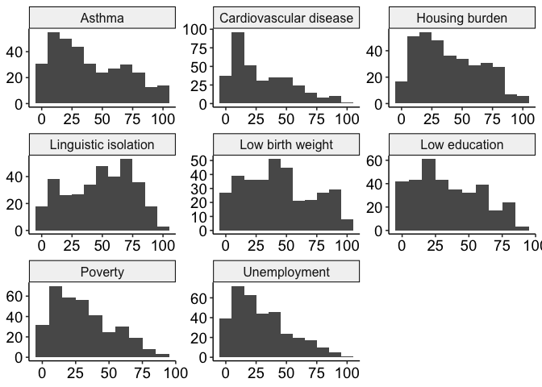
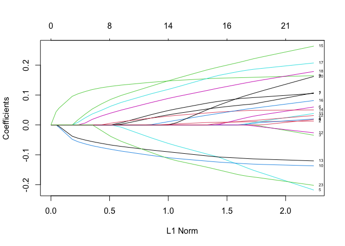
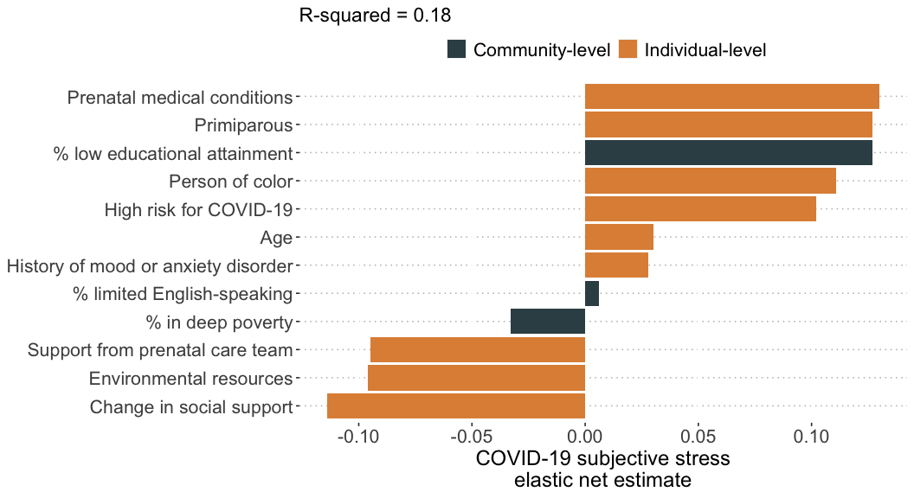
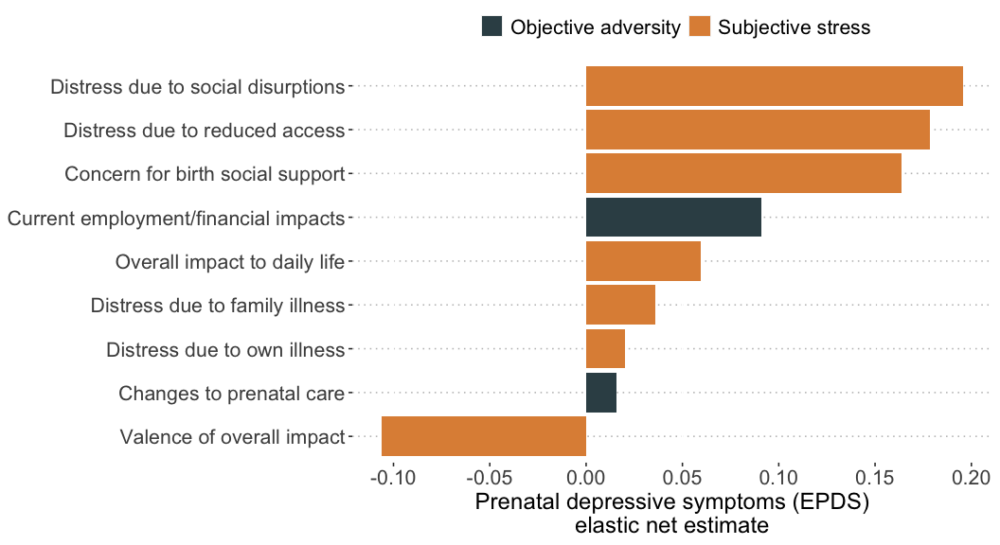

Analyses for Aims 2-4 of “Pregnancy during the pandemic: The impact of
COVID-19-related stress on risk for prenatal depression”
================
Lucy S. King
2020

  - [Environment](#environment)
  - [Read in data](#read-in-data)
      - [Sample characteristics](#sample-characteristics)
      - [Pregnancy: Histograms and tables for stress/adversity
        variables](#pregnancy-histograms-and-tables-for-stressadversity-variables)
      - [Correlations among stress/adversity
        variables](#correlations-among-stressadversity-variables)
  - [Aim 2: EFA](#aim-2-efa)
      - [Table of stress/adversity
        items](#table-of-stressadversity-items)
      - [Export data for Mplus](#export-data-for-mplus)
      - [Import results from Mplus](#import-results-from-mplus)
      - [Differences between matched and non-matched COPE participants
        in factor
        scores](#differences-between-matched-and-non-matched-cope-participants-in-factor-scores)
      - [Single most stressful thing](#single-most-stressful-thing)
  - [Open-ended responses](#open-ended-responses)
  - [Aim 3](#aim-3)
      - [Tables for categorical
        variables](#tables-for-categorical-variables)
      - [Histograms and descriptives for continuous and count
        variables](#histograms-and-descriptives-for-continuous-and-count-variables)
      - [Elastic net regression](#elastic-net-regression)
  - [Aim 4](#aim-4)
      - [OLS in full pregnancy sample](#ols-in-full-pregnancy-sample)
      - [OLS in California addressed
        sample](#ols-in-california-addressed-sample)
      - [Visualize effects of factor scores on EPDS in full
        sample](#visualize-effects-of-factor-scores-on-epds-in-full-sample)
      - [Elastic net with EFA items](#elastic-net-with-efa-items)
      - [Print coefficients for model with optimal
        lambda](#print-coefficients-for-model-with-optimal-lambda-1)
  - [Additional analyses by reviewer
    request](#additional-analyses-by-reviewer-request)
      - [Gestational weeks and stress and
        adversity](#gestational-weeks-and-stress-and-adversity)
      - [Aim 4 by phases of pregnancy](#aim-4-by-phases-of-pregnancy)
  - [Export data for sharing](#export-data-for-sharing)

# Environment

``` r
library(tidyverse)
```

    ## ── Attaching packages ─────────────────────────────────────── tidyverse 1.3.0 ──

    ## ✓ ggplot2 3.3.3     ✓ purrr   0.3.4
    ## ✓ tibble  3.0.6     ✓ dplyr   1.0.4
    ## ✓ tidyr   1.1.2     ✓ stringr 1.4.0
    ## ✓ readr   1.4.0     ✓ forcats 0.5.1

    ## ── Conflicts ────────────────────────────────────────── tidyverse_conflicts() ──
    ## x dplyr::filter() masks stats::filter()
    ## x dplyr::lag()    masks stats::lag()

``` r
library(MplusAutomation)
```

    ## Version:  0.8
    ## We work hard to write this free software. Please help us get credit by citing: 
    ## 
    ## Hallquist, M. N. & Wiley, J. F. (2018). MplusAutomation: An R Package for Facilitating Large-Scale Latent Variable Analyses in Mplus. Structural Equation Modeling, 25, 621-638. doi: 10.1080/10705511.2017.1402334.
    ## 
    ## -- see citation("MplusAutomation").

``` r
library(glmnet)
```

    ## Loading required package: Matrix

    ## 
    ## Attaching package: 'Matrix'

    ## The following objects are masked from 'package:tidyr':
    ## 
    ##     expand, pack, unpack

    ## Loaded glmnet 4.1-1

``` r
library(broom)
library(ggpubr)
library(ggsci)
library(formattable)
library(performance)
library(parameters)
library(car)
```

    ## Loading required package: carData

    ## 
    ## Attaching package: 'car'

    ## The following object is masked from 'package:dplyr':
    ## 
    ##     recode

    ## The following object is masked from 'package:purrr':
    ## 
    ##     some

``` r
library(effectsize)
```

    ## 
    ## Attaching package: 'effectsize'

    ## The following object is masked from 'package:formattable':
    ## 
    ##     normalize

``` r
library(corrr)
library(relaimpo)
```

    ## Loading required package: MASS

    ## 
    ## Attaching package: 'MASS'

    ## The following object is masked from 'package:formattable':
    ## 
    ##     area

    ## The following object is masked from 'package:dplyr':
    ## 
    ##     select

    ## Loading required package: boot

    ## 
    ## Attaching package: 'boot'

    ## The following object is masked from 'package:car':
    ## 
    ##     logit

    ## Loading required package: survey

    ## Loading required package: grid

    ## Loading required package: survival

    ## 
    ## Attaching package: 'survival'

    ## The following object is masked from 'package:boot':
    ## 
    ##     aml

    ## 
    ## Attaching package: 'survey'

    ## The following object is masked from 'package:graphics':
    ## 
    ##     dotchart

    ## Loading required package: mitools

    ## This is the global version of package relaimpo.

    ## If you are a non-US user, a version with the interesting additional metric pmvd is available

    ## from Ulrike Groempings web site at prof.beuth-hochschule.de/groemping.

``` r
library(labelled)
library(codebook)
```

    ## 
    ## Attaching package: 'codebook'

    ## The following object is masked from 'package:labelled':
    ## 
    ##     to_factor

``` r
source("R_rainclouds.R")
source("mplus.R")
```

    ## [1] "Loaded rhdf5 package"

``` r
cope_preg_clean_file <- "~/Box/Mooddata_Coordinating/COPE/data/wrangled_cleaned_data_PREG_20201208.csv"
cope_matched_IDs_file <- "~/Box/lucy_king_files/BABIES/cope/matched_COPE_IDs_n82_20201207.csv"

set.seed(100588)
```

``` r
plot_histogram <- function(data, x) {
  x = sym(x)
  
  ggplot(data, aes(!!x)) +
  geom_histogram(binwidth = 1)
}

plot_boxplot <- function(data, x, y) {
  x = enquo(x)
  y = enquo(y)
  
  ggplot(data, aes(!!x, !!y)) +
    geom_boxplot()
}

plot_lm <- function(data, x, y) {
  x = enquo(x)
  y = enquo(y)
  
  ggplot(data, aes(!!x, !!y)) +
    geom_point() +
    geom_smooth(method = "lm")  
}

customBlue = "#0009B"
customRed = "#ff7f7f"
```

# Read in data

``` r
cc2_preg <- 
  read_csv(cope_preg_clean_file) %>% 
  left_join(
    read_csv(cope_matched_IDs_file) %>% 
      rename(cope_id = ID),
    by = "cope_id"
  ) %>% 
  mutate(
    matched_subset = as.factor(matched_subset)
  )
```

    ## 
    ## ── Column specification ────────────────────────────────────────────────────────
    ## cols(
    ##   .default = col_double(),
    ##   today_date = col_date(format = ""),
    ##   address_current = col_character(),
    ##   pregnant_due_date = col_date(format = ""),
    ##   currently_mother = col_logical(),
    ##   child_birth_date = col_logical(),
    ##   current_child_age = col_logical(),
    ##   birth_date = col_date(format = ""),
    ##   education = col_character(),
    ##   marriage_status = col_character(),
    ##   marriage_status_other = col_character(),
    ##   home_describe = col_character(),
    ##   home_rent_own = col_character(),
    ##   ppl_in_home_describe = col_character(),
    ##   country_birth = col_character(),
    ##   state_birth = col_character(),
    ##   race_other_describe = col_character(),
    ##   income = col_character(),
    ##   preg_birth_concern_describe = col_character(),
    ##   preg_supp_concern_describe = col_character(),
    ##   nicu = col_logical()
    ##   # ... with 28 more columns
    ## )
    ## ℹ Use `spec()` for the full column specifications.

    ## 
    ## ── Column specification ────────────────────────────────────────────────────────
    ## cols(
    ##   ID = col_double(),
    ##   matched_subset = col_double()
    ## )

``` r
cc2_preg_cal <-
  cc2_preg %>% 
  filter(!is.na(ca_county))
```

## Sample characteristics

``` r
cc2_preg %>% 
  summarise_at(
    vars(
      mom_age,
      gestational_weeks,
      ppl_in_home_allchild,
      ppl_in_home_adults,
      inr_fpl,
      epds_total
    ),
    funs(mean, sd, min, max), na.rm = TRUE
  ) 
```

    ## Warning: `funs()` was deprecated in dplyr 0.8.0.
    ## Please use a list of either functions or lambdas: 
    ## 
    ##   # Simple named list: 
    ##   list(mean = mean, median = median)
    ## 
    ##   # Auto named with `tibble::lst()`: 
    ##   tibble::lst(mean, median)
    ## 
    ##   # Using lambdas
    ##   list(~ mean(., trim = .2), ~ median(., na.rm = TRUE))

    ## # A tibble: 1 x 24
    ##   mom_age_mean gestational_wee… ppl_in_home_all… ppl_in_home_adu… inr_fpl_mean
    ##          <dbl>            <dbl>            <dbl>            <dbl>        <dbl>
    ## 1         33.7             26.8            0.633             2.30         8.47
    ## # … with 19 more variables: epds_total_mean <dbl>, mom_age_sd <dbl>,
    ## #   gestational_weeks_sd <dbl>, ppl_in_home_allchild_sd <dbl>,
    ## #   ppl_in_home_adults_sd <dbl>, inr_fpl_sd <dbl>, epds_total_sd <dbl>,
    ## #   mom_age_min <dbl>, gestational_weeks_min <dbl>,
    ## #   ppl_in_home_allchild_min <dbl>, ppl_in_home_adults_min <dbl>,
    ## #   inr_fpl_min <dbl>, epds_total_min <dbl>, mom_age_max <dbl>,
    ## #   gestational_weeks_max <dbl>, ppl_in_home_allchild_max <dbl>,
    ## #   ppl_in_home_adults_max <dbl>, inr_fpl_max <dbl>, epds_total_max <dbl>

``` r
cc2_preg %>% 
  count(epds_total >= 11) %>% 
  mutate(per = n / sum(n))
```

    ## # A tibble: 3 x 3
    ##   `epds_total >= 11`     n     per
    ## * <lgl>              <int>   <dbl>
    ## 1 FALSE                414 0.571  
    ## 2 TRUE                 305 0.421  
    ## 3 NA                     6 0.00828

``` r
cc2_preg %>% 
  count(epds_total >= 13) %>% 
  mutate(per = n / sum(n))
```

    ## # A tibble: 3 x 3
    ##   `epds_total >= 13`     n     per
    ## * <lgl>              <int>   <dbl>
    ## 1 FALSE                509 0.702  
    ## 2 TRUE                 210 0.290  
    ## 3 NA                     6 0.00828

``` r
cc2_preg %>% 
  count(epds_total >= 15) %>% 
  mutate(per = n / sum(n))
```

    ## # A tibble: 3 x 3
    ##   `epds_total >= 15`     n     per
    ## * <lgl>              <int>   <dbl>
    ## 1 FALSE                596 0.822  
    ## 2 TRUE                 123 0.170  
    ## 3 NA                     6 0.00828

``` r
cc2_preg %>% 
  count(inr_fpl > 1)
```

    ## # A tibble: 3 x 2
    ##   `inr_fpl > 1`     n
    ## * <lgl>         <int>
    ## 1 FALSE            19
    ## 2 TRUE            705
    ## 3 NA                1

``` r
cc2_preg %>% 
  count(income) %>% 
  mutate(per = n / sum(n)) %>% 
  arrange(desc(n))
```

    ## # A tibble: 16 x 3
    ##    income          n     per
    ##    <chr>       <int>   <dbl>
    ##  1 >$250k        185 0.255  
    ##  2 $120k-$140k    66 0.0910 
    ##  3 $140k-$160k    60 0.0828 
    ##  4 $200k-$220k    55 0.0759 
    ##  5 $220k-$250k    53 0.0731 
    ##  6 $100k-$120k    51 0.0703 
    ##  7 $160k-$180k    46 0.0634 
    ##  8 $180k-$200k    46 0.0634 
    ##  9 $60k-$80k      45 0.0621 
    ## 10 $80k-$100k     45 0.0621 
    ## 11 $20k-$30k      23 0.0317 
    ## 12 $50k-$60k      23 0.0317 
    ## 13 $40k-$50k      17 0.0234 
    ## 14 $10k-$20k       5 0.00690
    ## 15 <$10k           4 0.00552
    ## 16 $30k-$40k       1 0.00138

``` r
cc2_preg %>% 
  count(education) %>% 
  mutate(per = n / sum(n)) %>% 
  arrange(desc(n))
```

    ## # A tibble: 9 x 3
    ##   education                       n     per
    ##   <chr>                       <int>   <dbl>
    ## 1 Graduate degree               369 0.509  
    ## 2 4-year college degree         242 0.334  
    ## 3 Partial college                47 0.0648 
    ## 4 2-year college degree          34 0.0469 
    ## 5 High school/GED                15 0.0207 
    ## 6 Trade school/apprenticeship    10 0.0138 
    ## 7 10th-12th grade                 4 0.00552
    ## 8 7th-9th grade                   2 0.00276
    ## 9 Unknown/unsure                  2 0.00276

``` r
cc2_preg %>% 
  count(job_status) %>% 
  mutate(
    per = n / sum(n)
  ) %>% 
  arrange(desc(n))
```

    ## # A tibble: 8 x 3
    ##   job_status             n     per
    ##   <chr>              <int>   <dbl>
    ## 1 fulltime paid job    468 0.646  
    ## 2 parttime paid job     85 0.117  
    ## 3 home caregiver        74 0.102  
    ## 4 unemployed/looking    61 0.0841 
    ## 5 other                 18 0.0248 
    ## 6 student               11 0.0152 
    ## 7 <NA>                   5 0.00690
    ## 8 retired                3 0.00414

``` r
cc2_preg %>% 
  count(first_pregnancy) %>% 
  mutate(per = n / sum(n))
```

    ## # A tibble: 2 x 3
    ##   first_pregnancy     n   per
    ## *           <dbl> <int> <dbl>
    ## 1               0   367 0.506
    ## 2               1   358 0.494

``` r
cc2_preg %>% 
  count(race_native_american) %>% 
  mutate(per = n / sum(n)) %>% 
  arrange(desc(n))
```

    ## # A tibble: 2 x 3
    ##   race_native_american     n     per
    ##                  <dbl> <int>   <dbl>
    ## 1                    0   718 0.990  
    ## 2                    1     7 0.00966

``` r
cc2_preg %>% 
  count(race_c) %>% 
  mutate(per = n / sum(n)) %>% 
  arrange(desc(n))
```

    ## # A tibble: 6 x 3
    ##   race_c                      n    per
    ##   <chr>                   <int>  <dbl>
    ## 1 White                     449 0.619 
    ## 2 Asian or Asian American   124 0.171 
    ## 3 Hispanic or Latinx         80 0.110 
    ## 4 Multi-racial               48 0.0662
    ## 5 BIPOC                      15 0.0207
    ## 6 <NA>                        9 0.0124

``` r
cc2_preg %>% 
  count(marriage_status) %>% 
  mutate(per = n / sum(n)) %>% 
  arrange(desc(n))
```

    ## # A tibble: 4 x 3
    ##   marriage_status        n     per
    ##   <chr>              <int>   <dbl>
    ## 1 Partner/married      706 0.974  
    ## 2 Single                17 0.0234 
    ## 3 Divorced/separated     1 0.00138
    ## 4 Other                  1 0.00138

``` r
cc2_preg %>% 
  count(!is.na(address_clean))
```

    ## # A tibble: 2 x 2
    ##   `!is.na(address_clean)`     n
    ## * <lgl>                   <int>
    ## 1 FALSE                     297
    ## 2 TRUE                      428

``` r
cc2_preg <-
  cc2_preg %>% 
  mutate(
    state_current_ca = case_when(
      str_detect(address_clean, "CA") ~ "CA",
      str_detect(address_clean, "CALIFORNIA") ~ "CA",
      str_detect(zip_code_clean, "^94") ~ "CA",
      !is.na(ca_county) ~ "CA",
      is.na(ca_county) & !is.na(address_clean) ~ "Other state"
    )
  )

cc2_preg %>% 
  count(state_current_ca)
```

    ## # A tibble: 3 x 2
    ##   state_current_ca     n
    ## * <chr>            <int>
    ## 1 CA                 353
    ## 2 Other state         75
    ## 3 <NA>               297

``` r
cc2_preg %>% 
  count(!is.na(ca_county))
```

    ## # A tibble: 2 x 2
    ##   `!is.na(ca_county)`     n
    ## * <lgl>               <int>
    ## 1 FALSE                 382
    ## 2 TRUE                  343

``` r
cc2_preg %>% 
  count(ca_county) %>% 
  arrange(desc(n))
```

    ## # A tibble: 19 x 2
    ##    ca_county         n
    ##    <chr>         <int>
    ##  1 <NA>            382
    ##  2 Santa Clara     118
    ##  3 Alameda          68
    ##  4 San Mateo        54
    ##  5 San Francisco    44
    ##  6 Contra Costa     23
    ##  7 Santa Cruz       11
    ##  8 Marin            10
    ##  9 Orange            2
    ## 10 Placer            2
    ## 11 San Benito        2
    ## 12 San Joaquin       2
    ## 13 Fresno            1
    ## 14 Humboldt          1
    ## 15 Monterey          1
    ## 16 Sacramento        1
    ## 17 San Diego         1
    ## 18 Sonoma            1
    ## 19 Yolo              1

``` r
cc2_preg %>% 
  summarise(n_distinct(census_tract))
```

    ## # A tibble: 1 x 1
    ##   `n_distinct(census_tract)`
    ##                        <int>
    ## 1                        375

``` r
cc2_preg %>% 
  count(past_mh_sa_treatment) %>% 
  mutate(per = n / sum(n))
```

    ## # A tibble: 2 x 3
    ##   past_mh_sa_treatment     n   per
    ## * <chr>                <int> <dbl>
    ## 1 none                   429 0.592
    ## 2 past treatment         296 0.408

``` r
cc2_preg %>% 
  count(self_test) # 1 = tested positive
```

    ## # A tibble: 3 x 2
    ##   self_test     n
    ## *     <dbl> <int>
    ## 1         0   721
    ## 2         1     3
    ## 3        NA     1

``` r
cc2_preg %>% 
  dplyr::select(starts_with("epds"), -epds_total) %>% 
  psych::alpha()
```

    ## 
    ## Reliability analysis   
    ## Call: psych::alpha(x = .)
    ## 
    ##   raw_alpha std.alpha G6(smc) average_r S/N    ase mean   sd median_r
    ##       0.85      0.85    0.86      0.36 5.7 0.0077 0.95 0.52     0.36
    ## 
    ##  lower alpha upper     95% confidence boundaries
    ## 0.84 0.85 0.87 
    ## 
    ##  Reliability if an item is dropped:
    ##         raw_alpha std.alpha G6(smc) average_r S/N alpha se var.r med.r
    ## epds_1       0.85      0.84    0.85      0.37 5.4   0.0080 0.019  0.39
    ## epds_2       0.85      0.84    0.85      0.37 5.4   0.0080 0.019  0.39
    ## epds_3       0.85      0.84    0.86      0.37 5.4   0.0080 0.022  0.38
    ## epds_4       0.84      0.83    0.85      0.36 5.0   0.0085 0.022  0.36
    ## epds_5       0.84      0.83    0.84      0.36 5.0   0.0086 0.022  0.36
    ## epds_6       0.83      0.83    0.85      0.35 4.9   0.0088 0.023  0.35
    ## epds_7       0.83      0.83    0.84      0.34 4.7   0.0090 0.022  0.36
    ## epds_8       0.82      0.82    0.83      0.33 4.5   0.0094 0.019  0.35
    ## epds_9       0.83      0.83    0.84      0.35 4.8   0.0088 0.022  0.36
    ## epds_10      0.86      0.86    0.87      0.40 6.0   0.0078 0.015  0.40
    ## 
    ##  Item statistics 
    ##           n raw.r std.r r.cor r.drop mean   sd
    ## epds_1  719  0.56  0.58  0.53   0.46 0.55 0.66
    ## epds_2  719  0.57  0.58  0.54   0.46 0.77 0.71
    ## epds_3  719  0.59  0.58  0.50   0.47 1.12 0.84
    ## epds_4  719  0.69  0.66  0.62   0.58 1.55 0.88
    ## epds_5  719  0.71  0.68  0.64   0.60 1.16 0.94
    ## epds_6  719  0.71  0.71  0.67   0.63 1.36 0.75
    ## epds_7  719  0.76  0.74  0.71   0.67 0.92 0.91
    ## epds_8  719  0.81  0.81  0.80   0.74 1.17 0.88
    ## epds_9  719  0.72  0.73  0.71   0.64 0.79 0.73
    ## epds_10 719  0.39  0.43  0.33   0.30 0.14 0.52
    ## 
    ## Non missing response frequency for each item
    ##            0    1    2    3 miss
    ## epds_1  0.54 0.37 0.08 0.00 0.01
    ## epds_2  0.38 0.48 0.13 0.01 0.01
    ## epds_3  0.25 0.43 0.27 0.05 0.01
    ## epds_4  0.16 0.22 0.51 0.10 0.01
    ## epds_5  0.31 0.30 0.33 0.07 0.01
    ## epds_6  0.14 0.38 0.46 0.02 0.01
    ## epds_7  0.40 0.35 0.19 0.06 0.01
    ## epds_8  0.27 0.35 0.34 0.05 0.01
    ## epds_9  0.37 0.50 0.10 0.03 0.01
    ## epds_10 0.92 0.05 0.02 0.02 0.01

## Pregnancy: Histograms and tables for stress/adversity variables

### Tables for count variables

Determine inclusion as indicators based on counts

``` r
# generate a list of frequency tables for the show_table function
tables_list <- purrr::map(
  cc2_preg %>% 
    dplyr::select(
      prenatal_care_changes,
      curr_finance_impacts,
      fut_finance_impacts,
      covid_restrictions
    ),
  janitor::tabyl 
)

tables_list
```

    ## $prenatal_care_changes
    ##  .x[[i]]   n     percent
    ##        0  82 0.113103448
    ##        1 141 0.194482759
    ##        2 182 0.251034483
    ##        3 162 0.223448276
    ##        4 125 0.172413793
    ##        5  27 0.037241379
    ##        6   6 0.008275862
    ## 
    ## $curr_finance_impacts
    ##  .x[[i]]   n     percent
    ##        0  22 0.030344828
    ##        1  49 0.067586207
    ##        2 119 0.164137931
    ##        3  69 0.095172414
    ##        4 129 0.177931034
    ##        5  85 0.117241379
    ##        6  83 0.114482759
    ##        7  48 0.066206897
    ##        8  54 0.074482759
    ##        9  23 0.031724138
    ##       10  20 0.027586207
    ##       11   7 0.009655172
    ##       12   7 0.009655172
    ##       13   3 0.004137931
    ##       14   2 0.002758621
    ##       15   3 0.004137931
    ##       18   1 0.001379310
    ##       19   1 0.001379310
    ## 
    ## $fut_finance_impacts
    ##  .x[[i]]   n     percent
    ##        0 146 0.201379310
    ##        1  63 0.086896552
    ##        2 124 0.171034483
    ##        3  65 0.089655172
    ##        4  85 0.117241379
    ##        5  36 0.049655172
    ##        6  66 0.091034483
    ##        7  29 0.040000000
    ##        8  33 0.045517241
    ##        9  17 0.023448276
    ##       10  13 0.017931034
    ##       11  11 0.015172414
    ##       12  13 0.017931034
    ##       13   9 0.012413793
    ##       14   7 0.009655172
    ##       15   1 0.001379310
    ##       16   2 0.002758621
    ##       17   1 0.001379310
    ##       19   2 0.002758621
    ##       20   1 0.001379310
    ##       22   1 0.001379310
    ## 
    ## $covid_restrictions
    ##  .x[[i]]   n     percent
    ##        0  26 0.035862069
    ##        1 376 0.518620690
    ##        2 307 0.423448276
    ##        3  12 0.016551724
    ##        4   4 0.005517241

### Histograms for continuous variables

Based on histograms, preg\_birth\_concern\_rating,
preg\_supp\_concern\_rating, mat\_care\_concern\_rating, and
child\_health\_concern\_rating all have floor effects because of the way
question was asked (first asked to indicate yes/no whether they were
concerned and then only if said yes provided rating) and the fact that I
imputed “0” for anyone who said they weren’t concerned.

``` r
histograms_names <- 
  cc2_preg %>% 
  dplyr::select(
    preg_birth_concern_rating,
    preg_supp_concern_rating,
    mat_care_concern_rating,
    child_health_concern_rating,
    covid_self_distress,
    covid_family_distress,
    current_job_distress,
    future_job_distress,
    reduced_access_distress,
    impact_covid_rating,
    impact_covid_valence
  ) %>% 
  names()

histograms_list <-
  map(histograms_names, ~plot_histogram(cc2_preg, .x))

histograms_list
```

    ## [[1]]

    ## Warning: Removed 2 rows containing non-finite values (stat_bin).

<!-- -->

    ## 
    ## [[2]]

    ## Warning: Removed 4 rows containing non-finite values (stat_bin).

<!-- -->

    ## 
    ## [[3]]

    ## Warning: Removed 12 rows containing non-finite values (stat_bin).

<!-- -->

    ## 
    ## [[4]]

<!-- -->

    ## 
    ## [[5]]

<!-- -->

    ## 
    ## [[6]]

<!-- -->

    ## 
    ## [[7]]

<!-- -->

    ## 
    ## [[8]]

<!-- -->

    ## 
    ## [[9]]

    ## Warning: Removed 2 rows containing non-finite values (stat_bin).

<!-- -->

    ## 
    ## [[10]]

<!-- -->

    ## 
    ## [[11]]

<!-- -->

``` r
cc2_preg %>% 
  dplyr::select(
    `Current employment/finance impacts` = curr_finance_impacts,
    `Expected employment/finance impacts` = fut_finance_impacts,
    `Concern for birth medical care` = preg_birth_concern_rating,
    `Concern for birth social support` = preg_supp_concern_rating,
    `Concern for caregiving capacity` = mat_care_concern_rating,
    `Concern for infant's health` = child_health_concern_rating,
    `Distress social disruptions` = social_disruptions_rating,
    `Distress own illness` = covid_self_distress,
    `Distress family illness` = covid_family_distress,
    `Distress current employment/finance` = current_job_distress,
    `Distress expected employment/finance` = future_job_distress,
    `Distress reduced access` = reduced_access_distress,
    `Overall impact to daily life` = impact_covid_rating,
    `Valence of overall impact` = impact_covid_valence,
    `Changes to prenatal care` = prenatal_care_changes
  ) %>% 
  gather(key, value) %>% 
  ggplot(aes(value)) +
  geom_histogram(binwidth = 1) +
  theme_pubr() +
  theme(
    axis.title = element_blank(), 
    axis.text.y = element_text(size = 14),
    axis.text.x = element_text(size = 14),
    strip.text = element_text(size = 11)
  ) +
  facet_wrap(.~key, scales = "free")
```

    ## Warning: Removed 20 rows containing non-finite values (stat_bin).

<!-- -->

``` r
ggsave(
  "~/Box/lucy_king_files/BABIES/cope/figures/stress_adversity_histograms.png",
  width = 13,
  height = 9
)
```

    ## Warning: Removed 20 rows containing non-finite values (stat_bin).

## Correlations among stress/adversity variables

``` r
stress_vars_preg <-
  cc2_preg %>% 
  dplyr::select(
    cope_id, 
    prenatal_care_changes,
    preg_birth_concern_rating,
    preg_supp_concern_rating,
    mat_care_concern_rating,
    child_health_concern_rating,
    covid_self_distress,
    covid_family_distress,
    curr_finance_impacts,
    current_job_distress,
    fut_finance_impacts,
    future_job_distress,
    social_disruptions_rating,
    covid_restrictions,
    reduced_access_distress,
    impact_covid_rating,
    impact_covid_valence,
    covid_confirmed_number,
    covid_positive_contacts
  ) 
```

``` r
stress_vars_preg %>% 
  dplyr::select(-cope_id) %>% 
  correlate(method = "kendall") %>% 
  rearrange() %>% 
  shave() %>% 
  fashion() 
```

    ## 
    ## Correlation method: 'kendall'
    ## Missing treated using: 'pairwise.complete.obs'

    ##                           term future_job_distress current_job_distress
    ## 1          future_job_distress                                         
    ## 2         current_job_distress                 .68                     
    ## 3          impact_covid_rating                 .29                  .32
    ## 4  child_health_concern_rating                 .28                  .24
    ## 5    preg_birth_concern_rating                 .26                  .21
    ## 6     preg_supp_concern_rating                 .22                  .20
    ## 7      reduced_access_distress                 .30                  .25
    ## 8        covid_family_distress                 .28                  .25
    ## 9      mat_care_concern_rating                 .19                  .16
    ## 10   social_disruptions_rating                 .26                  .25
    ## 11         covid_self_distress                 .22                  .18
    ## 12         fut_finance_impacts                 .31                  .21
    ## 13        curr_finance_impacts                 .16                  .23
    ## 14       prenatal_care_changes                 .11                  .10
    ## 15          covid_restrictions                 .13                  .13
    ## 16      covid_confirmed_number                 .03                  .04
    ## 17     covid_positive_contacts                 .02                  .05
    ## 18        impact_covid_valence                -.30                 -.31
    ##    impact_covid_rating child_health_concern_rating preg_birth_concern_rating
    ## 1                                                                           
    ## 2                                                                           
    ## 3                                                                           
    ## 4                  .21                                                      
    ## 5                  .21                         .35                          
    ## 6                  .27                         .29                       .44
    ## 7                  .28                         .27                       .33
    ## 8                  .20                         .31                       .23
    ## 9                  .23                         .31                       .29
    ## 10                 .29                         .16                       .18
    ## 11                 .19                         .26                       .21
    ## 12                 .17                         .14                       .13
    ## 13                 .14                         .03                       .05
    ## 14                 .08                         .02                       .17
    ## 15                 .10                         .10                       .05
    ## 16                 .05                        -.00                      -.01
    ## 17                 .03                         .01                       .05
    ## 18                -.43                        -.26                      -.23
    ##    preg_supp_concern_rating reduced_access_distress covid_family_distress
    ## 1                                                                        
    ## 2                                                                        
    ## 3                                                                        
    ## 4                                                                        
    ## 5                                                                        
    ## 6                                                                        
    ## 7                       .24                                              
    ## 8                       .22                     .25                      
    ## 9                       .27                     .25                   .19
    ## 10                      .20                     .25                   .21
    ## 11                      .19                     .18                   .55
    ## 12                      .10                     .17                   .13
    ## 13                      .07                     .08                   .09
    ## 14                      .12                     .15                   .05
    ## 15                      .04                     .13                   .10
    ## 16                      .07                     .01                   .07
    ## 17                      .04                    -.00                   .05
    ## 18                     -.31                    -.24                  -.20
    ##    mat_care_concern_rating social_disruptions_rating covid_self_distress
    ## 1                                                                       
    ## 2                                                                       
    ## 3                                                                       
    ## 4                                                                       
    ## 5                                                                       
    ## 6                                                                       
    ## 7                                                                       
    ## 8                                                                       
    ## 9                                                                       
    ## 10                     .21                                              
    ## 11                     .18                       .17                    
    ## 12                     .16                       .11                 .10
    ## 13                     .05                       .06                 .06
    ## 14                     .11                       .09                 .05
    ## 15                     .05                       .11                 .10
    ## 16                     .01                       .03                 .02
    ## 17                    -.01                       .04                 .04
    ## 18                    -.27                      -.30                -.14
    ##    fut_finance_impacts curr_finance_impacts prenatal_care_changes
    ## 1                                                                
    ## 2                                                                
    ## 3                                                                
    ## 4                                                                
    ## 5                                                                
    ## 6                                                                
    ## 7                                                                
    ## 8                                                                
    ## 9                                                                
    ## 10                                                               
    ## 11                                                               
    ## 12                                                               
    ## 13                 .35                                           
    ## 14                 .14                  .08                      
    ## 15                 .10                  .10                   .06
    ## 16                 .06                  .09                   .07
    ## 17                 .04                  .07                   .04
    ## 18                -.16                 -.15                  -.08
    ##    covid_restrictions covid_confirmed_number covid_positive_contacts
    ## 1                                                                   
    ## 2                                                                   
    ## 3                                                                   
    ## 4                                                                   
    ## 5                                                                   
    ## 6                                                                   
    ## 7                                                                   
    ## 8                                                                   
    ## 9                                                                   
    ## 10                                                                  
    ## 11                                                                  
    ## 12                                                                  
    ## 13                                                                  
    ## 14                                                                  
    ## 15                                                                  
    ## 16                .01                                               
    ## 17                .03                    .34                        
    ## 18               -.02                   -.10                    -.03
    ##    impact_covid_valence
    ## 1                      
    ## 2                      
    ## 3                      
    ## 4                      
    ## 5                      
    ## 6                      
    ## 7                      
    ## 8                      
    ## 9                      
    ## 10                     
    ## 11                     
    ## 12                     
    ## 13                     
    ## 14                     
    ## 15                     
    ## 16                     
    ## 17                     
    ## 18

# Aim 2: EFA

## Table of stress/adversity items

``` r
stress_vars_preg_table <-
  cc2_preg %>% 
  dplyr::select(
    `Changes to prenatal care` = prenatal_care_changes,
    `Concern for birth medical care` = preg_birth_concern_rating,
    `Concern for birth social support` =  preg_supp_concern_rating,
    `Concern for caregiving capacity` = mat_care_concern_rating,
    `Concern for infant's health` = child_health_concern_rating,
    `Distress due to own illness` = covid_self_distress,
    `Distress due to family illness` = covid_family_distress,
    `Current employment/financial impacts` = curr_finance_impacts,
    `Distress due to current financial impacts` = current_job_distress,
    `Expected employment/financial impacts` = fut_finance_impacts,
    `Distress due to expected financial impacts` = future_job_distress,
    `Distress due to social disruptions` = social_disruptions_rating,
    `Self-quarantine/government restrictions` = covid_restrictions,
    `Distress due to reduced access` = reduced_access_distress,
    `Overall impact to daily life` = impact_covid_rating,
    `Valence of overall impact` = impact_covid_valence
  ) %>% 
  gather(variable, value) %>% 
  group_by(variable) %>% 
  summarise_at(
    vars(value),
    list(
     "mean" = mean,
      "sd" = sd,
      "min" = min,
      "max" = max
    ),
    na.rm = TRUE
  )

stress_vars_preg_table %>% 
  formattable(
    align = c(
      "l",
      "c",
      "c",
      "c",
      "c"
    )
  ) %>% 
  rename(
    Variable = variable,
    Mean = mean,
    SD = sd,
    Minimum = min,
    Maximum = max
  )
```

<table class="table table-condensed">

<thead>

<tr>

<th style="text-align:left;">

Variable

</th>

<th style="text-align:center;">

Mean

</th>

<th style="text-align:center;">

SD

</th>

<th style="text-align:center;">

Minimum

</th>

<th style="text-align:center;">

Maximum

</th>

</tr>

</thead>

<tbody>

<tr>

<td style="text-align:left;">

Changes to prenatal care

</td>

<td style="text-align:center;">

2.292414

</td>

<td style="text-align:center;">

1.3945475

</td>

<td style="text-align:center;">

0

</td>

<td style="text-align:center;">

6

</td>

</tr>

<tr>

<td style="text-align:left;">

Concern for birth medical care

</td>

<td style="text-align:center;">

4.062241

</td>

<td style="text-align:center;">

2.3981177

</td>

<td style="text-align:center;">

0

</td>

<td style="text-align:center;">

7

</td>

</tr>

<tr>

<td style="text-align:left;">

Concern for birth social support

</td>

<td style="text-align:center;">

4.955617

</td>

<td style="text-align:center;">

2.1410601

</td>

<td style="text-align:center;">

0

</td>

<td style="text-align:center;">

7

</td>

</tr>

<tr>

<td style="text-align:left;">

Concern for caregiving capacity

</td>

<td style="text-align:center;">

3.516129

</td>

<td style="text-align:center;">

2.8516860

</td>

<td style="text-align:center;">

0

</td>

<td style="text-align:center;">

7

</td>

</tr>

<tr>

<td style="text-align:left;">

Concern for infant’s health

</td>

<td style="text-align:center;">

4.038621

</td>

<td style="text-align:center;">

2.6553705

</td>

<td style="text-align:center;">

0

</td>

<td style="text-align:center;">

7

</td>

</tr>

<tr>

<td style="text-align:left;">

Current employment/financial impacts

</td>

<td style="text-align:center;">

4.714483

</td>

<td style="text-align:center;">

2.8773016

</td>

<td style="text-align:center;">

0

</td>

<td style="text-align:center;">

19

</td>

</tr>

<tr>

<td style="text-align:left;">

Distress due to current financial impacts

</td>

<td style="text-align:center;">

2.686897

</td>

<td style="text-align:center;">

2.0571683

</td>

<td style="text-align:center;">

0

</td>

<td style="text-align:center;">

6

</td>

</tr>

<tr>

<td style="text-align:left;">

Distress due to expected financial impacts

</td>

<td style="text-align:center;">

2.977931

</td>

<td style="text-align:center;">

2.0837595

</td>

<td style="text-align:center;">

0

</td>

<td style="text-align:center;">

6

</td>

</tr>

<tr>

<td style="text-align:left;">

Distress due to family illness

</td>

<td style="text-align:center;">

3.306207

</td>

<td style="text-align:center;">

2.0151437

</td>

<td style="text-align:center;">

0

</td>

<td style="text-align:center;">

6

</td>

</tr>

<tr>

<td style="text-align:left;">

Distress due to own illness

</td>

<td style="text-align:center;">

1.864828

</td>

<td style="text-align:center;">

1.9912631

</td>

<td style="text-align:center;">

0

</td>

<td style="text-align:center;">

6

</td>

</tr>

<tr>

<td style="text-align:left;">

Distress due to reduced access

</td>

<td style="text-align:center;">

1.468050

</td>

<td style="text-align:center;">

0.6937424

</td>

<td style="text-align:center;">

0

</td>

<td style="text-align:center;">

3

</td>

</tr>

<tr>

<td style="text-align:left;">

Distress due to social disruptions

</td>

<td style="text-align:center;">

2.762759

</td>

<td style="text-align:center;">

1.9422585

</td>

<td style="text-align:center;">

0

</td>

<td style="text-align:center;">

6

</td>

</tr>

<tr>

<td style="text-align:left;">

Expected employment/financial impacts

</td>

<td style="text-align:center;">

3.873103

</td>

<td style="text-align:center;">

3.6870547

</td>

<td style="text-align:center;">

0

</td>

<td style="text-align:center;">

22

</td>

</tr>

<tr>

<td style="text-align:left;">

Overall impact to daily life

</td>

<td style="text-align:center;">

4.142069

</td>

<td style="text-align:center;">

1.2124851

</td>

<td style="text-align:center;">

0

</td>

<td style="text-align:center;">

6

</td>

</tr>

<tr>

<td style="text-align:left;">

Self-quarantine/government restrictions

</td>

<td style="text-align:center;">

1.437241

</td>

<td style="text-align:center;">

0.6200990

</td>

<td style="text-align:center;">

0

</td>

<td style="text-align:center;">

4

</td>

</tr>

<tr>

<td style="text-align:left;">

Valence of overall impact

</td>

<td style="text-align:center;">

\-1.742069

</td>

<td style="text-align:center;">

1.0384639

</td>

<td style="text-align:center;">

\-3

</td>

<td style="text-align:center;">

3

</td>

</tr>

</tbody>

</table>

## Export data for Mplus

Conducting a series of EFAs in Mplus. Factor analysis benefits from
samples with N ≥ 300 (Costello & Osborne, 2005; MacCallum et al., 1999)
and where N ≥ 5 \* the number of variables.

``` r
#prepareMplusData(stress_vars_preg, "~/Desktop/BABIES/COPE/covid_stress_vars_preg.dat")
```

## Import results from Mplus

### Factor loadings

``` r
model_summary <- readModels(
  "~/Desktop/BABIES/COPE/cope_git/efa_models/efa_preg_1_3_delete_covid_exp_delete_crossloadings.out", 
  recursive = TRUE
  )
```

    ## Reading model:  ~/Desktop/BABIES/COPE/cope_git/efa_models/efa_preg_1_3_delete_covid_exp_delete_crossloadings.out

``` r
factor_names = c(
  "Factor 1:\n Objective Adversity", 
  "Factor 2:\n Subjective Stress"
  )

efa2_loadings <-
  model_summary$parameters$efa$f2$loadings$estimates %>% 
  as.data.frame() %>% 
  rownames_to_column(var = "indicator") %>% 
  rename(
    F1 = `1`,
    F2 = `2`
  ) %>% 
  gather(factor, loading, -indicator) %>%  
  mutate(factor = as.character(factor(factor, labels = factor_names))) 

order <- 
  efa2_loadings %>%
  group_by(indicator) %>%
  top_n(1, abs(loading)) %>%
  ungroup() %>%
  arrange(desc(factor), abs(loading)) %>%
  mutate(order = 1:length(levels(factor(efa2_loadings$indicator)))) %>%
  dplyr::select(indicator, order)
```

Variance explained not provided my Mplus:
<http://www.statmodel.com/discussion/messages/8/46.html?1472140515>
“Variance explained in a set of variables by a factor is not given in
Mplus. We have not been inclined to add this for 3 reasons. One is that
factor analysis does not aim to explain variance but correlations. The
other is that typically, oblique factors need to be extracted in which
case the concept of variance explained by a factor is not clearcut.
Variance explained also connects with Principal Component Analysis which
is not factor analysis.”

### Final variables included

``` r
stress_vars_preg <-
  cc2_preg %>% 
  dplyr::select(
    cope_id,
    `Changes to prenatal care` = prenatal_care_changes,
    `Concern for birth medical care` = preg_birth_concern_rating,
    `Concern for birth social support` =  preg_supp_concern_rating,
    `Concern for caregiving capacity` = mat_care_concern_rating,
    `Concern for infants's health` = child_health_concern_rating,
    `Distress due to own illness` = covid_self_distress,
    `Distress due to family illness` = covid_family_distress,
    `Current empl oyment/financial impacts` = curr_finance_impacts,
    `Expected employment/financial impacts` = fut_finance_impacts,
    `Distress due to social disruptions` = social_disruptions_rating,
    `Distress due to reduced access` = reduced_access_distress,
    `Overall impact to daily life` = impact_covid_rating,
    `Valence of overall impact` = impact_covid_valence
  ) 
```

### Factor scores

Factor scores cannot be extracted from EFA in Mplus. Therefore, factor
scores were extracted using a CFA in which the variance of each factor
was set at 1, their correlation was set at .409 (as in the final
2-factor solution), and factors were set at the factor loadings
identified in the final 2-factor solution.

``` r
fscores <-
  read_delim(
    "~/Desktop/BABIES/COPE/cfa_pre_2_fscores.txt", 
    col_names = FALSE, 
    delim = " "
  ) %>% 
  dplyr::select(
    f1_score = X14,
    f1_se = X15,
    f2_score = X16,
    f2_se = X17
  ) %>% 
  mutate_all(
    as.numeric
  )
```

    ## 
    ## ── Column specification ────────────────────────────────────────────────────────
    ## cols(
    ##   X1 = col_character(),
    ##   X2 = col_character(),
    ##   X3 = col_character(),
    ##   X4 = col_character(),
    ##   X5 = col_character(),
    ##   X6 = col_character(),
    ##   X7 = col_character(),
    ##   X8 = col_character(),
    ##   X9 = col_character(),
    ##   X10 = col_character(),
    ##   X11 = col_character(),
    ##   X12 = col_character(),
    ##   X13 = col_character(),
    ##   X14 = col_character(),
    ##   X15 = col_character(),
    ##   X16 = col_character(),
    ##   X17 = col_character()
    ## )

``` r
stress_vars_preg <-
  stress_vars_preg %>% 
  cbind(fscores)

stress_vars_preg %>% 
  dplyr::select(
    "Objective adversity" = f1_score, 
    "Subjective stress" = f2_score
    ) %>% 
  gather(factor, score) %>% 
  ggplot(aes(score)) +
  geom_histogram() +
  theme_pubr() +
  theme(
    plot.title = element_text(size = 20),
    strip.text = element_text(size = 20),
    axis.title.y = element_text(size = 20),
    axis.title.x = element_text(size = 20),
    axis.text.y = element_text(size = 16),
    axis.text.x = element_text(size = 16),
    # remove legend
    legend.position = "none"
  ) +
  labs(
    x = "Estimated factor score"
  ) +
  facet_grid(.~factor)
```

    ## `stat_bin()` using `bins = 30`. Pick better value with `binwidth`.

<!-- -->

``` r
ggsave(
  "~/Box/lucy_king_files/BABIES/cope/figures/f1_f2_hist.png",
  width = 7,
  height = 5
)
```

    ## `stat_bin()` using `bins = 30`. Pick better value with `binwidth`.

``` r
stress_vars_preg %>% 
  ggplot(aes(f1_score, f2_score)) +
  geom_point(alpha = 1/2, size = 1.5) +
  geom_smooth(method = "lm", size = 2.5, color = "black") +
  scale_x_continuous(breaks = seq.int(-2, 2, 1)) +
  theme_pubr() +
  theme(
    plot.title = element_text(size = 20),
    strip.text = element_text(size = 20),
    axis.title.y = element_text(size = 20),
    axis.title.x = element_text(size = 20),
    axis.text.y = element_text(size = 16),
    axis.text.x = element_text(size = 16),
    # remove legend
    legend.position = "none"
  ) +
  labs(
    x = "Objective adversity\nestimated factor score",
    y = "Subjective stress\nestimated factor score"
  ) 
```

    ## `geom_smooth()` using formula 'y ~ x'

<!-- -->

``` r
ggsave("~/Box/lucy_king_files/BABIES/cope/figures/f1_f2_cor.png")
```

    ## Saving 7 x 5 in image

    ## `geom_smooth()` using formula 'y ~ x'

``` r
stress_vars_preg %>% 
  dplyr::select(-cope_id) %>% 
  correlate(method = "pearson") %>% 
  rearrange() %>% 
  shave() %>% 
  fashion() 
```

    ## 
    ## Correlation method: 'pearson'
    ## Missing treated using: 'pairwise.complete.obs'

    ##                                     term f2_score f1_score
    ## 1                               f2_score                  
    ## 2                               f1_score      .48         
    ## 3         Distress due to reduced access      .85      .32
    ## 4  Expected employment/financial impacts      .35      .79
    ## 5           Overall impact to daily life      .64      .32
    ## 6  Current empl oyment/financial impacts      .25      .77
    ## 7         Distress due to family illness      .56      .23
    ## 8         Concern for birth medical care      .52      .23
    ## 9       Concern for birth social support      .49      .24
    ## 10    Distress due to social disruptions      .52      .20
    ## 11       Concern for caregiving capacity      .45      .22
    ## 12          Concern for infants's health      .49      .18
    ## 13           Distress due to own illness      .51      .18
    ## 14              Changes to prenatal care      .23      .42
    ## 15                                 f2_se     -.16     -.21
    ## 16             Valence of overall impact     -.58     -.27
    ## 17                                 f1_se     -.48     -.99
    ##    Distress.due.to.reduced.access Expected.employment.financial.impacts
    ## 1                                                                      
    ## 2                                                                      
    ## 3                                                                      
    ## 4                             .24                                      
    ## 5                             .38                                   .23
    ## 6                             .11                                   .49
    ## 7                             .32                                   .15
    ## 8                             .39                                   .17
    ## 9                             .29                                   .12
    ## 10                            .33                                   .14
    ## 11                            .31                                   .20
    ## 12                            .33                                   .16
    ## 13                            .27                                   .12
    ## 14                            .19                                   .16
    ## 15                           -.35                                  -.13
    ## 16                           -.28                                  -.20
    ## 17                           -.32                                  -.75
    ##    Overall.impact.to.daily.life Current.empl.oyment.financial.impacts
    ## 1                                                                    
    ## 2                                                                    
    ## 3                                                                    
    ## 4                                                                    
    ## 5                                                                    
    ## 6                           .21                                      
    ## 7                           .25                                   .13
    ## 8                           .23                                   .08
    ## 9                           .30                                   .13
    ## 10                          .37                                   .10
    ## 11                          .26                                   .07
    ## 12                          .23                                   .04
    ## 13                          .25                                   .08
    ## 14                          .11                                   .11
    ## 15                         -.16                                  -.13
    ## 16                         -.47                                  -.18
    ## 17                         -.33                                  -.74
    ##    Distress.due.to.family.illness Concern.for.birth.medical.care
    ## 1                                                               
    ## 2                                                               
    ## 3                                                               
    ## 4                                                               
    ## 5                                                               
    ## 6                                                               
    ## 7                                                               
    ## 8                             .25                               
    ## 9                             .26                            .46
    ## 10                            .26                            .20
    ## 11                            .23                            .31
    ## 12                            .35                            .37
    ## 13                            .65                            .26
    ## 14                            .07                            .20
    ## 15                           -.12                           -.06
    ## 16                           -.23                           -.25
    ## 17                           -.24                           -.23
    ##    Concern.for.birth.social.support Distress.due.to.social.disruptions
    ## 1                                                                     
    ## 2                                                                     
    ## 3                                                                     
    ## 4                                                                     
    ## 5                                                                     
    ## 6                                                                     
    ## 7                                                                     
    ## 8                                                                     
    ## 9                                                                     
    ## 10                              .24                                   
    ## 11                              .27                                .25
    ## 12                              .30                                .18
    ## 13                              .23                                .22
    ## 14                              .15                                .11
    ## 15                             -.11                               -.06
    ## 16                             -.30                               -.34
    ## 17                             -.25                               -.19
    ##    Concern.for.caregiving.capacity Concern.for.infants.s.health
    ## 1                                                              
    ## 2                                                              
    ## 3                                                              
    ## 4                                                              
    ## 5                                                              
    ## 6                                                              
    ## 7                                                              
    ## 8                                                              
    ## 9                                                              
    ## 10                                                             
    ## 11                                                             
    ## 12                             .32                             
    ## 13                             .23                          .32
    ## 14                             .13                          .01
    ## 15                            -.06                         -.07
    ## 16                            -.27                         -.28
    ## 17                            -.22                         -.19
    ##    Distress.due.to.own.illness Changes.to.prenatal.care f2_se
    ## 1                                                            
    ## 2                                                            
    ## 3                                                            
    ## 4                                                            
    ## 5                                                            
    ## 6                                                            
    ## 7                                                            
    ## 8                                                            
    ## 9                                                            
    ## 10                                                           
    ## 11                                                           
    ## 12                                                           
    ## 13                                                           
    ## 14                         .05                               
    ## 15                        -.07                     -.10      
    ## 16                        -.18                     -.07   .06
    ## 17                        -.18                     -.42   .22
    ##    Valence.of.overall.impact f1_se
    ## 1                                 
    ## 2                                 
    ## 3                                 
    ## 4                                 
    ## 5                                 
    ## 6                                 
    ## 7                                 
    ## 8                                 
    ## 9                                 
    ## 10                                
    ## 11                                
    ## 12                                
    ## 13                                
    ## 14                                
    ## 15                                
    ## 16                                
    ## 17                       .27

``` r
cc2_preg <-
  cc2_preg %>% 
  left_join(
    stress_vars_preg %>% 
      dplyr::select(cope_id, starts_with("f1"), starts_with("f2")),
    by = "cope_id"
  )

cc2_preg_cal <-
  cc2_preg_cal %>% 
  left_join(
    stress_vars_preg %>% 
      dplyr::select(cope_id, starts_with("f1"), starts_with("f2")),
    by = "cope_id"
  )
```

### Visualize loadings

``` r
loadings_plot_data <- 
  efa2_loadings %>% 
  left_join(order, by = "indicator") %>% 
  mutate(
    loading_chr = as.character(round(loading, 2)),
    loading_chr = case_when(
      loading_chr == "0" ~ "-0.01",
      loading_chr == "1" ~ "1.00",
      loading_chr == "-.1" ~ "-.10",
      TRUE ~ loading_chr
    )
  )

loadings_plot_data %>% 
  mutate(
    indicator = dplyr::recode(
      indicator,
      "CARE_CHG" = "Changes to prenatal care",
      "CUR_FIN" = "Current employment/financial impacts",
      "FUT_FIN" = "Expected employment/financial impacts",
      "FAM_R" = "Distress due to family illness",
      "SELF_R" = "Distress due to own illness",
      "ACCES_R" = "Distress due to reduced access",
      "CHEALTH_" = "Concern for infant's health",
      "BIRTH_R" = "Concern for birth medical care",
      "PSUPP_R" = "Concern for birth social support",
      "IMPACT_R" = "Overall impact to daily life",
      "S_DIS_R" = "Distress due to social disurptions",
      "MCARE_R" = "Concern for caregiving capacity",
      "IMPACT_V" = "Valence of overall impact"
    )
  ) %>% 
  ggplot(
    aes(
      x = factor, 
      y = reorder(indicator, order), 
      fill = loading,
      label = loading_chr
    )
  ) +
  geom_tile(color = "black") +
  geom_text(size = 6, color = "black") +
  scale_fill_distiller(
    limits = c(-1, 1.1), 
    palette = "RdYlBu",
    guide = guide_colorbar(barheight = 20)
  ) +
  scale_x_discrete(position = "top") +
  theme_minimal() +
  theme(
    legend.title = element_text(size = 16),
    legend.text = element_text(size = 14),
    axis.title = element_blank(), 
    axis.text.y = element_text(size = 18),
    axis.text.x = element_text(size = 17)
  )
```

<!-- -->

``` r
ggsave(
  "~/Box/lucy_king_files/BABIES/cope/figures/EFA_2.png",
  height = 7,
  width = 11,
  dpi = 800
)
```

## Differences between matched and non-matched COPE participants in factor scores

``` r
t.test(cc2_preg_cal$f1_score ~ cc2_preg_cal$matched_subset)
```

``` 

    Welch Two Sample t-test

data:  cc2_preg_cal$f1_score by cc2_preg_cal$matched_subset
t = 1.4092, df = 113.58, p-value = 0.1615
alternative hypothesis: true difference in means is not equal to 0
95 percent confidence interval:
 -0.04565155  0.27064043
sample estimates:
mean in group 0 mean in group 1 
     0.08695785     -0.02553659 
```

``` r
t.test(cc2_preg_cal$f2_score ~ cc2_preg_cal$matched_subset)
```

``` 

    Welch Two Sample t-test

data:  cc2_preg_cal$f2_score by cc2_preg_cal$matched_subset
t = 0.092101, df = 122.07, p-value = 0.9268
alternative hypothesis: true difference in means is not equal to 0
95 percent confidence interval:
 -0.2365074  0.2595885
sample estimates:
mean in group 0 mean in group 1 
     0.05173563      0.04019512 
```

## Single most stressful thing

``` r
cc2_preg_cal %>% 
  count(source_stress_covid) %>% 
  mutate(per = n / sum(n)) %>% 
  arrange(desc(n))
```

    ## # A tibble: 12 x 3
    ##    source_stress_covid              n    per
    ##    <chr>                        <int>  <dbl>
    ##  1 Impact on child                 69 0.201 
    ##  2 Financial concerns              55 0.160 
    ##  3 Social distancing/quarantine    54 0.157 
    ##  4 Health concerns                 53 0.155 
    ##  5 Impact on other family          37 0.108 
    ##  6 Impact on society               31 0.0904
    ##  7 Other                           13 0.0379
    ##  8 Impact on partner               10 0.0292
    ##  9 Impact on community              7 0.0204
    ## 10 Access to baby supplies          5 0.0146
    ## 11 Access to food                   5 0.0146
    ## 12 Not stressed                     4 0.0117

``` r
cc2_preg_cal %>% 
  count(source_stress_covid) %>% 
  mutate(per = n / sum(n)) %>% 
  arrange(desc(n)) %>% 
  ggplot(aes(fct_reorder(source_stress_covid, per), per)) +
  scale_y_continuous(labels = scales::percent_format(accuracy = 1)) +
  geom_col() +
  theme_pubr() +
  theme(
    axis.text.x = element_text(size = 15),
    axis.title.y = element_text(size = 20),
    axis.title.x = element_text(size = 18),
    axis.text.y = element_text(size = 16),
    strip.text = element_text(size = 18),
    legend.position = "none"
  ) +
  labs(
    y = "Percentage endorsed",
    x = NULL
  ) +
  coord_flip()
```

<!-- -->

``` r
ggsave(
  "~/Box/lucy_king_files/BABIES/cope/figures/most_stressful_thing.png",
  height = 4,
  width = 8.5,
  dpi = 1000
)
```

# Open-ended responses

``` r
preg_birth_concerns_txt <-
  cc2_preg %>% 
  dplyr::select(cope_id, preg_birth_concern_describe) %>% 
  filter(!is.na(preg_birth_concern_describe)) 

write_csv(
  preg_birth_concerns_txt,
  "~/Box/Mooddata_Coordinating/COPE/data/qualitative_data/PREG_birth_concerns.csv"
)

preg_supp_concerns_txt <-
  cc2_preg %>% 
  dplyr::select(cope_id, preg_supp_concern_describe) %>% 
  filter(!is.na(preg_supp_concern_describe)) 

write_csv(
  preg_supp_concerns_txt,
  "~/Box/Mooddata_Coordinating/COPE/data/qualitative_data/PREG_supp_concerns.csv"
)

preg_infant_health_concern_txt <-
  cc2_preg %>% 
  dplyr::select(cope_id, child_health_concern_describe) %>% 
  filter(!is.na(child_health_concern_describe)) 

write_csv(
  preg_infant_health_concern_txt,
  "~/Box/Mooddata_Coordinating/COPE/data/qualitative_data/PREG_infant_health_concerns.csv"
)

mat_care_concern_txt <-
  cc2_preg %>% 
  dplyr::select(cope_id, mat_care_concern_describe) %>% 
  filter(!is.na(mat_care_concern_describe)) 

write_csv(
  mat_care_concern_txt,
  "~/Box/Mooddata_Coordinating/COPE/data/qualitative_data/PREG_mat_care_concerns.csv"
)
```

# Aim 3

## Tables for categorical variables

``` r
# generate a list of frequency tables for the show_table function
tables_list <- purrr::map(
  cc2_preg_cal %>% 
    dplyr::select(
      race_poc,
      covid_high_risk_self,
      first_pregnancy,
      history_mh_disorder,
      pregnancy_loss_d,
      education,
      job_status_d,
      medical_history_d,
      home_multi,
      immigrant
    ),
  janitor::tabyl 
)
tables_list
```

    ## $race_poc
    ##  .x[[i]]   n   percent
    ##      POC 136 0.3965015
    ##    White 207 0.6034985
    ## 
    ## $covid_high_risk_self
    ##  .x[[i]]   n   percent
    ##        0 260 0.7580175
    ##        1  83 0.2419825
    ## 
    ## $first_pregnancy
    ##  .x[[i]]   n   percent
    ##        0 170 0.4956268
    ##        1 173 0.5043732
    ## 
    ## $history_mh_disorder
    ##  .x[[i]]   n  percent
    ##        0 250 0.728863
    ##        1  93 0.271137
    ## 
    ## $pregnancy_loss_d
    ##  .x[[i]]   n   percent
    ##     loss 106 0.3090379
    ##  no loss 237 0.6909621
    ## 
    ## $education
    ##                      .x[[i]]   n     percent
    ##              10th-12th grade   3 0.008746356
    ##        2-year college degree  14 0.040816327
    ##        4-year college degree 120 0.349854227
    ##                7th-9th grade   1 0.002915452
    ##              Graduate degree 171 0.498542274
    ##              High school/GED   7 0.020408163
    ##              Partial college  20 0.058309038
    ##  Trade school/apprenticeship   6 0.017492711
    ##               Unknown/unsure   1 0.002915452
    ## 
    ## $job_status_d
    ##   .x[[i]]   n     percent valid_percent
    ##     other  79 0.230320700     0.2323529
    ##  paid job 261 0.760932945     0.7676471
    ##      <NA>   3 0.008746356            NA
    ## 
    ## $medical_history_d
    ##     .x[[i]]   n   percent
    ##     history  80 0.2332362
    ##  no history 263 0.7667638
    ## 
    ## $home_multi
    ##  .x[[i]]   n     percent valid_percent
    ##        0  63 0.183673469     0.1842105
    ##        1 279 0.813411079     0.8157895
    ##       NA   1 0.002915452            NA
    ## 
    ## $immigrant
    ##  .x[[i]]   n   percent
    ##        0 274 0.7988338
    ##        1  69 0.2011662

## Histograms and descriptives for continuous and count variables

``` r
cc2_preg_cal %>% 
  dplyr::select(
    Asthma = asthma_pctl,
    `Low birth weight` = low_birth_weight_pctl,
    `Cardiovascular disease` = cardio_disease_pctl,
    `Low education` = education_ce_pctl,
    `Poverty` = poverty_pctl,
    `Housing burden` = housing_burden_pctl,
    `Linguistic isolation` = linguistic_isolation_pctl,
    `Unemployment` = unemployment_ce_pctl
  ) %>% 
  gather(key, value) %>% 
  ggplot(aes(value)) +
  geom_histogram(binwidth = 10) +
  theme_pubr() +
  theme(
    axis.title = element_blank(), 
    axis.text.y = element_text(size = 14),
    axis.text.x = element_text(size = 14),
    strip.text = element_text(size = 12)
  ) +
  facet_wrap(.~key, scales = "free")
```

    ## Warning: Removed 12 rows containing non-finite values (stat_bin).

<!-- -->

``` r
ggsave(
  "~/Box/lucy_king_files/BABIES/cope/figures/calenviro_histograms.png",
  width = 13,
  height = 9
)
```

    ## Warning: Removed 12 rows containing non-finite values (stat_bin).

``` r
cc2_preg_cal %>% 
  dplyr::select(
    `Income-to-Federal Poverty Line` = inr_fpl,
    `Prenatal medical conditions` = prenatal_complications,
    `Support from prenatal care team` = prenatal_support,
    `Current social support` = current_social_supp_rating,
    `Previous social support` = prior_social_supp_rating,
    `Change in social support` = social_supp_change,
    `Environmental resources` =  access
  ) %>% 
  gather(key, value) %>% 
  ggplot(aes(value)) +
  geom_histogram(binwidth = 1) +
  theme_pubr() +
  theme(
    axis.title = element_blank(), 
    axis.text.y = element_text(size = 14),
    axis.text.x = element_text(size = 14),
    strip.text = element_text(size = 12)
  ) +
  facet_wrap(.~key, scales = "free")
```

    ## Warning: Removed 1 rows containing non-finite values (stat_bin).

<!-- -->

``` r
ggsave(
  "~/Box/lucy_king_files/BABIES/cope/figures/individual_risks_histograms.png",
  width = 13,
  height = 9
)
```

    ## Warning: Removed 1 rows containing non-finite values (stat_bin).

``` r
risk_protect_vars_table <- 
  cc2_preg_cal %>% 
  dplyr::select(
    Asthma = asthma_pctl,
    `Low birth weight` = low_birth_weight_pctl,
    `Cardiovascular disease` = cardio_disease_pctl,
    `Low education` = education_ce_pctl,
    `Poverty` = poverty_pctl,
    `Housing burden` = housing_burden_pctl,
    `Linguistic isolation` = linguistic_isolation_pctl,
    `Unemployment` = unemployment_ce_pctl,
    `Income-to-Federal Poverty Line` = inr_fpl,
    `Prenatal medical conditions` = prenatal_complications,
    `Support from prenatal care team` = prenatal_support,
    `Current social support` = current_social_supp_rating,
    `Previous social support` = prior_social_supp_rating,
    `Change in social support` = social_supp_change,
    `Environmental resources` =  access
  ) %>% 
  gather(variable, value) %>% 
  group_by(variable) %>% 
  summarise_at(
    vars(value),
    list(
      "mean" = mean,
      "sd" = sd,
      "min" = min,
      "max" = max
    ),
    na.rm = TRUE
  )

risk_protect_vars_table %>% 
  formattable(
    align = c(
      "l",
      "c",
      "c",
      "c",
      "c"
    )
  ) %>% 
  rename(
    Variable = variable,
    Mean = mean,
    SD = sd,
    Minimum = min,
    Maximum = max
  )
```

<table class="table table-condensed">

<thead>

<tr>

<th style="text-align:left;">

Variable

</th>

<th style="text-align:center;">

Mean

</th>

<th style="text-align:center;">

SD

</th>

<th style="text-align:center;">

Minimum

</th>

<th style="text-align:center;">

Maximum

</th>

</tr>

</thead>

<tbody>

<tr>

<td style="text-align:left;">

Asthma

</td>

<td style="text-align:center;">

39.1315363

</td>

<td style="text-align:center;">

28.6546455

</td>

<td style="text-align:center;">

0.02493455

</td>

<td style="text-align:center;">

99.61351

</td>

</tr>

<tr>

<td style="text-align:left;">

Cardiovascular disease

</td>

<td style="text-align:center;">

29.5257747

</td>

<td style="text-align:center;">

23.8520832

</td>

<td style="text-align:center;">

0.32414911

</td>

<td style="text-align:center;">

95.72373

</td>

</tr>

<tr>

<td style="text-align:left;">

Change in social support

</td>

<td style="text-align:center;">

\-0.6355685

</td>

<td style="text-align:center;">

1.4604394

</td>

<td style="text-align:center;">

\-5.00000000

</td>

<td style="text-align:center;">

4.00000

</td>

</tr>

<tr>

<td style="text-align:left;">

Current social support

</td>

<td style="text-align:center;">

3.9125364

</td>

<td style="text-align:center;">

1.5796366

</td>

<td style="text-align:center;">

0.00000000

</td>

<td style="text-align:center;">

6.00000

</td>

</tr>

<tr>

<td style="text-align:left;">

Environmental resources

</td>

<td style="text-align:center;">

4.2128280

</td>

<td style="text-align:center;">

0.8540642

</td>

<td style="text-align:center;">

0.00000000

</td>

<td style="text-align:center;">

5.00000

</td>

</tr>

<tr>

<td style="text-align:left;">

Housing burden

</td>

<td style="text-align:center;">

39.8738013

</td>

<td style="text-align:center;">

25.5769109

</td>

<td style="text-align:center;">

0.26656512

</td>

<td style="text-align:center;">

98.94643

</td>

</tr>

<tr>

<td style="text-align:left;">

Income-to-Federal Poverty Line

</td>

<td style="text-align:center;">

8.6608486

</td>

<td style="text-align:center;">

4.0680553

</td>

<td style="text-align:center;">

0.21445421

</td>

<td style="text-align:center;">

14.60280

</td>

</tr>

<tr>

<td style="text-align:left;">

Linguistic isolation

</td>

<td style="text-align:center;">

47.9396491

</td>

<td style="text-align:center;">

26.2668045

</td>

<td style="text-align:center;">

0.00000000

</td>

<td style="text-align:center;">

99.34675

</td>

</tr>

<tr>

<td style="text-align:left;">

Low birth weight

</td>

<td style="text-align:center;">

43.7270348

</td>

<td style="text-align:center;">

27.6409902

</td>

<td style="text-align:center;">

0.00000000

</td>

<td style="text-align:center;">

99.82058

</td>

</tr>

<tr>

<td style="text-align:left;">

Low education

</td>

<td style="text-align:center;">

34.4043017

</td>

<td style="text-align:center;">

24.2201830

</td>

<td style="text-align:center;">

0.17663386

</td>

<td style="text-align:center;">

91.72344

</td>

</tr>

<tr>

<td style="text-align:left;">

Poverty

</td>

<td style="text-align:center;">

30.7932924

</td>

<td style="text-align:center;">

21.6695545

</td>

<td style="text-align:center;">

0.23884349

</td>

<td style="text-align:center;">

90.79824

</td>

</tr>

<tr>

<td style="text-align:left;">

Prenatal medical conditions

</td>

<td style="text-align:center;">

0.2215743

</td>

<td style="text-align:center;">

0.4811060

</td>

<td style="text-align:center;">

0.00000000

</td>

<td style="text-align:center;">

2.00000

</td>

</tr>

<tr>

<td style="text-align:left;">

Previous social support

</td>

<td style="text-align:center;">

4.5481050

</td>

<td style="text-align:center;">

1.3943875

</td>

<td style="text-align:center;">

0.00000000

</td>

<td style="text-align:center;">

6.00000

</td>

</tr>

<tr>

<td style="text-align:left;">

Support from prenatal care team

</td>

<td style="text-align:center;">

1.6005831

</td>

<td style="text-align:center;">

0.5626792

</td>

<td style="text-align:center;">

0.00000000

</td>

<td style="text-align:center;">

2.00000

</td>

</tr>

<tr>

<td style="text-align:left;">

Unemployment

</td>

<td style="text-align:center;">

29.5335721

</td>

<td style="text-align:center;">

22.6023417

</td>

<td style="text-align:center;">

0.03807590

</td>

<td style="text-align:center;">

98.45158

</td>

</tr>

</tbody>

</table>

## Elastic net regression

### dummy code categorical variables

``` r
cc2_preg_cal <-
  cc2_preg_cal %>% 
  mutate(
    race_poc_dummy = if_else(
      race_poc == "White", 0, 1
    ),
    job_status_dummy = if_else(
      job_status_d == "other", 0, 1
    ),
    pregnancy_loss_dummy = if_else(
      pregnancy_loss_d == 0, 0, 1
    ),
    medical_history_dummy = if_else(
      medical_history_d == 0, 0, 1
    ),
   # remove value for one person who reported no access; biasing results
   access = if_else(
     access == 0, NA_real_, access
   ),
   low_income_dummy = if_else(
      income_numeric <= 2 * fpl_threshold, 1, 0
    )
  ) 
```

### Prepare data

``` r
z_score <- function(x) {
  diff_mu <- x - mean(x, na.rm = T)
  sd <- sd(x, na.rm = T)
  diff_mu / sd
}
```

``` r
cal_env_vars <-
  cc2_preg_cal %>% 
  dplyr::select(
    asthma_pctl,
    low_birth_weight_pctl,
    cardio_disease_pctl,
    education_ce_pctl,
    poverty_pctl,
    housing_burden_pctl,
    linguistic_isolation_pctl,
    unemployment_ce_pctl
  ) %>% 
  names()

cc2_preg_cal_en <-
  cc2_preg_cal %>% 
  dplyr::select(
    f1_score,
    f2_score,
    all_of(cal_env_vars),
    prenatal_complications,
    prenatal_support,
    current_social_supp_rating,
    social_supp_change,
    access,
    mom_age,
    immigrant,
    covid_high_risk_self,
    first_pregnancy,
    history_mh_disorder,
    medical_history_dummy,
    home_multi,
    pregnancy_loss_dummy,
    race_poc_dummy,
    low_income_dummy
  ) %>% 
  mutate_at(
    vars(asthma_pctl:mom_age),
    funs(z_score)
  ) %>% 
  mutate_all(
    as.numeric
  ) %>% 
  na.omit()
```

``` r
predictors <- 
  cc2_preg_cal_en %>% 
  dplyr::select(-f1_score, -f2_score) %>% 
  as.matrix()

f1_score <- z_score(cc2_preg_cal_en$f1_score)
f2_score <- z_score(cc2_preg_cal_en$f2_score)
```

### Run model over 100 increasingly relaxed lambda values

#### F1 model

``` r
fit_net_cope_f1 <- glmnet(
  predictors, 
  f1_score, 
  family = "gaussian", 
  standarize = FALSE
)
plot(fit_net_cope_f1, label = TRUE)
```

<!-- -->

#### F2 model

``` r
fit_net_cope_f2 <- glmnet(
  predictors, 
  f2_score, 
  family = "gaussian", 
  standarize = FALSE
)
plot(fit_net_cope_f2, label = TRUE)
```

<!-- -->

### Run leave-one-out cross validation to identify optimal lambda value

If nfolds is set to the sample size = leave-one-out CV
<https://sciphy-stats.com/post/2019-01-25-finalizing-glmnet-models/>

``` r
k <- nrow(cc2_preg_cal_en)
```

#### F1

``` r
# run cross validation
fit_cv_f1 <- cv.glmnet(
    x = predictors, 
    y = f1_score, 
    type.measure = "mse", 
    family = "gaussian", 
    alpha = .5,
    nfolds = k,
    grouped = FALSE,
    standarize = FALSE # variables already standardized
  )

lambda_f1 <- fit_cv_f1$lambda.min
```

#### F2

``` r
# run cross validation
fit_cv_f2 <- cv.glmnet(
    x = predictors, 
    y = f2_score, 
    type.measure = "mse", 
    family = "gaussian", 
    alpha = .5,
    nfolds = k,
    grouped = FALSE,
    standarize = FALSE # variables already standardized
  )

lambda_f2 <- fit_cv_f2$lambda.min
```

### Calculate EN model performance

#### F1

``` r
# save model matrix
cc2_preg_cal_en_f1 <-
  cc2_preg_cal_en %>% 
  dplyr::select(-f2_score)

x_f1 <- model.matrix(f1_score ~ ., cc2_preg_cal_en_f1)[,-1]

# get predicted values
y_hat_f1 <- predict(fit_cv_f1,  newx = x_f1,  s = "lambda.min")

r_sq_f1 <- 1 - (sum((f1_score - y_hat_f1)^2) / sum((f1_score - mean(f1_score))^2))

r_sq_f1
```

    ## [1] 0.1070637

``` r
pretty_sq_f1 <- round(r_sq_f1, 2)
```

#### F2

``` r
# save model matrix
cc2_preg_cal_en_f2 <-
  cc2_preg_cal_en %>% 
  dplyr::select(-f1_score)

x_f2 <- model.matrix(f2_score ~ ., cc2_preg_cal_en_f2)[,-1]

# get predicted values
y_hat_f2 <- predict(fit_cv_f2,  newx = x_f2,  s = "lambda.min")

r_sq_f2 <- 1 - (sum((f2_score - y_hat_f2)^2) / sum((f2_score - mean(f2_score))^2))

r_sq_f2
```

    ## [1] 0.1778937

``` r
pretty_sq_f2 <- round(r_sq_f2, 2)
```

### Print coefficients for model with optimal lambda

#### F1

``` r
fit_net_final_f1 <- glmnet(
  predictors, 
  f1_score, 
  family = "gaussian", 
  alpha = .5, 
  lambda = lambda_f1,
  standardize = FALSE # variables already standardized
)
coefs_f1 <- coef(fit_net_final_f1) 
coefs_f1
```

    ## 24 x 1 sparse Matrix of class "dgCMatrix"
    ##                                     s0
    ## (Intercept)                -0.07055781
    ## asthma_pctl                 0.04894091
    ## low_birth_weight_pctl       0.01139522
    ## cardio_disease_pctl         .         
    ## education_ce_pctl           .         
    ## poverty_pctl               -0.08929040
    ## housing_burden_pctl         .         
    ## linguistic_isolation_pctl   0.06661883
    ## unemployment_ce_pctl        .         
    ## prenatal_complications      0.15373117
    ## prenatal_support           -0.11877222
    ## current_social_supp_rating  .         
    ## social_supp_change          .         
    ## access                     -0.09211131
    ## mom_age                     0.04325663
    ## immigrant                   0.07176237
    ## covid_high_risk_self        .         
    ## first_pregnancy             0.09570717
    ## history_mh_disorder         0.04094147
    ## medical_history_dummy       .         
    ## home_multi                  .         
    ## pregnancy_loss_dummy        .         
    ## race_poc_dummy              .         
    ## low_income_dummy            .

``` r
en_coef_tbl_f1 <- 
  tidy(coef(fit_net_final_f1))  %>% 
  dplyr::select(-column) %>% 
  mutate(
    `Variable type` = dplyr::recode(
      row,
      "(Intercept)" = NA_character_,
      "asthma_pctl" = "Community-level",
      "low_birth_weight_pctl" = "Community-level",
      "linguistic_isolation_pctl" = "Community-level",
      "poverty_pctl" = "Community-level",
      "inr_fpl" = "Individual-level",
      "prenatal_complications" = "Individual-level",
      "prenatal_support" = "Individual-level",
      "access" = "Individual-level",
      "mom_age" = "Individual-level",
      "immigrant" = "Individual-level",
      "covid_high_risk_self" = "Individual-level",
      "first_pregnancy" = "Individual-level",
      "history_mh_disorder" = "Individual-level",
    )
  ) %>% 
  rename(
    Variable = row,
    `Elastic net estimate` = value
  ) %>%
  mutate(
    Variable = dplyr::recode(
      Variable,
      "(Intercept)" = "(Intercept)",
      "asthma_pctl" = "Rate of ER visits for asthma",
      "low_birth_weight_pctl" = "% low birth weight",
      "linguistic_isolation_pctl" = "% limited english-speaking",
      "poverty_pctl" = "% in deep poverty",
      "prenatal_complications" = "Prenatal medical conditions",
      "prenatal_support" = "Support from prenatal care team",
      "access" = "Environmental resources",
      "mom_age" = "Age",
      "immigrant" = "Immigrant to U.S.",
      "first_pregnancy" = "Primiparous",
      "history_mh_disorder" = "History of mood or anxiety disorder"
    )
  ) %>% 
  mutate_at(vars(`Elastic net estimate`) , round, 2) %>% 
  dplyr::select(
    `Variable`,
    `Variable type`,
    everything()
  )
```

    ## Warning: 'tidy.dgCMatrix' is deprecated.
    ## See help("Deprecated")

    ## Warning: 'tidy.dgTMatrix' is deprecated.
    ## See help("Deprecated")

``` r
en_coef_tbl_f1
```

    ##                               Variable    Variable type Elastic net estimate
    ## 1                          (Intercept)             <NA>                -0.07
    ## 2         Rate of ER visits for asthma  Community-level                 0.05
    ## 3                   % low birth weight  Community-level                 0.01
    ## 4                    % in deep poverty  Community-level                -0.09
    ## 5           % limited english-speaking  Community-level                 0.07
    ## 6          Prenatal medical conditions Individual-level                 0.15
    ## 7      Support from prenatal care team Individual-level                -0.12
    ## 8              Environmental resources Individual-level                -0.09
    ## 9                                  Age Individual-level                 0.04
    ## 10                   Immigrant to U.S. Individual-level                 0.07
    ## 11                         Primiparous Individual-level                 0.10
    ## 12 History of mood or anxiety disorder Individual-level                 0.04

``` r
en_coef_tbl_f1 %>% 
  filter(!is.na(`Variable type`)) %>% 
  ggplot(
    aes(
      fct_reorder(Variable, `Elastic net estimate`), 
      `Elastic net estimate`, 
      fill = `Variable type`)
  ) +
  geom_col() +
  scale_y_continuous(breaks = seq.int(-.20, .20, .05)) +
  scale_fill_jama() +
  theme_pubclean() +
  theme(
    axis.title = element_text(size = 18),
    axis.text = element_text(size = 16),
    legend.text = element_text(size = 16),
    plot.title = element_text(size = 17),
  ) +
  coord_flip() +
  labs(
    title = paste0("R-squared = ", pretty_sq_f1),
    x = NULL,
    fill = NULL,
    y = "COVID-19 objective adversity\nelastic net estimate"
  )
```

<!-- -->

``` r
ggsave(
  "~/Box/lucy_king_files/BABIES/cope/figures/en_f1_20201111.png",
  height = 6,
  width = 11
)
```

#### F2

``` r
fit_net_final_f2 <- glmnet(
  predictors, 
  f2_score, 
  family = "gaussian", 
  alpha = .5, 
  lambda = lambda_f2,
  standardize = FALSE # variables already standardized
)
coefs_f2 <- coef(fit_net_final_f2) 
coefs_f2
```

    ## 24 x 1 sparse Matrix of class "dgCMatrix"
    ##                                      s0
    ## (Intercept)                -0.134997882
    ## asthma_pctl                 .          
    ## low_birth_weight_pctl       .          
    ## cardio_disease_pctl         .          
    ## education_ce_pctl           0.127174407
    ## poverty_pctl               -0.032765919
    ## housing_burden_pctl         .          
    ## linguistic_isolation_pctl   0.006210371
    ## unemployment_ce_pctl        .          
    ## prenatal_complications      0.129674682
    ## prenatal_support           -0.094557009
    ## current_social_supp_rating  .          
    ## social_supp_change         -0.114096614
    ## access                     -0.095688784
    ## mom_age                     0.030246580
    ## immigrant                   .          
    ## covid_high_risk_self        0.101543590
    ## first_pregnancy             0.126630718
    ## history_mh_disorder         0.028040405
    ## medical_history_dummy       .          
    ## home_multi                  .          
    ## pregnancy_loss_dummy        .          
    ## race_poc_dummy              0.111071552
    ## low_income_dummy            .

``` r
en_coef_tbl_f2 <- 
  tidy(coef(fit_net_final_f2))  %>% 
  dplyr::select(-column) %>% 
  mutate(
    `Variable type` = dplyr::recode(
      row,
      "(Intercept)" = NA_character_,
      "low_birth_weight_pctl" = "Community-level",
      "cardio_disease_pctl" = "Community-level",
      "linguistic_isolation_pctl" = "Community-level",
      "poverty_pctl" = "Community-level",
      "education_ce_pctl" = "Community-level",
      "prenatal_complications" = "Individual-level",
      "prenatal_support" = "Individual-level",
      "access" = "Individual-level",
      "mom_age" = "Individual-level",
      "immigrant" = "Individual-level",
      "covid_high_risk_self" = "Individual-level",
      "first_pregnancy" = "Individual-level",
      "history_mh_disorder" = "Individual-level",
      "race_poc_dummy" = "Individual-level",
      "social_supp_change" = "Individual-level"
    )
  ) %>% 
  rename(
    Variable = row,
    `Elastic net estimate` = value
  ) %>%
  mutate(
    Variable = dplyr::recode(
      Variable,
       "(Intercept)" = "(Intercept)",
      "low_birth_weight_pctl" = "Rate of low weight births",
      "education_ce_pctl" = "% low educational attainment",
      "linguistic_isolation_pctl" = "% limited English-speaking",
      "cardio_disease_pctl" = "Rate of ER visits for heart attacks",
      "poverty_pctl" = "% in deep poverty",
      "prenatal_complications" = "Prenatal medical conditions",
      "prenatal_support" = "Support from prenatal care team",
      "access" = "Environmental resources",
      "mom_age" = "Age",
      "social_supp_change" = "Change in social support",
      "immigrant" = "Immigrant to U.S.",
      "covid_high_risk_self" = "High risk for COVID-19",
      "first_pregnancy" = "Primiparous",
      "history_mh_disorder" = "History of mood or anxiety disorder",
      "race_poc_dummy" = "Person of color"
    )
  ) %>% 
  mutate_at(vars(`Elastic net estimate`) , round, 3) %>% 
  dplyr::select(
    `Variable`,
    `Variable type`,
    everything()
  )
```

    ## Warning: 'tidy.dgCMatrix' is deprecated.
    ## See help("Deprecated")

    ## Warning: 'tidy.dgTMatrix' is deprecated.
    ## See help("Deprecated")

``` r
en_coef_tbl_f2
```

    ##                               Variable    Variable type Elastic net estimate
    ## 1                          (Intercept)             <NA>               -0.135
    ## 2         % low educational attainment  Community-level                0.127
    ## 3                    % in deep poverty  Community-level               -0.033
    ## 4           % limited English-speaking  Community-level                0.006
    ## 5          Prenatal medical conditions Individual-level                0.130
    ## 6      Support from prenatal care team Individual-level               -0.095
    ## 7             Change in social support Individual-level               -0.114
    ## 8              Environmental resources Individual-level               -0.096
    ## 9                                  Age Individual-level                0.030
    ## 10              High risk for COVID-19 Individual-level                0.102
    ## 11                         Primiparous Individual-level                0.127
    ## 12 History of mood or anxiety disorder Individual-level                0.028
    ## 13                     Person of color Individual-level                0.111

``` r
en_coef_tbl_f2 %>% 
  filter(!is.na(`Variable type`)) %>% 
  ggplot(
    aes(
      fct_reorder(Variable, `Elastic net estimate`), 
      `Elastic net estimate`, 
      fill = `Variable type`)
  ) +
  geom_col() +
  scale_y_continuous(breaks = seq.int(-.20, .20, .05)) +
  scale_fill_jama() +
  theme_pubclean() +
  theme(
    axis.title = element_text(size = 18),
    axis.text = element_text(size = 16),
    legend.text = element_text(size = 16),
    plot.title = element_text(size = 17),
  ) +
  coord_flip() +
  labs(
    title = paste0("R-squared = ", pretty_sq_f2),
    x = NULL,
    fill = NULL,
    y = "COVID-19 subjective stress\nelastic net estimate"
  )
```

<!-- -->

``` r
ggsave(
  "~/Box/lucy_king_files/BABIES/cope/figures/en_f2_20201111.png",
  height = 6,
  width = 11
)
```

### Zero-order effect sizes

#### F1

##### visualize zero-order effects

###### binary variables

``` r
cc2_preg_cal %>% 
  dplyr::select(
    first_pregnancy,
    immigrant,
    history_mh_disorder,
    f1_score
  ) %>% 
  mutate(
    first_pregnancy = recode_factor(
      first_pregnancy,
      "1" = "Primiparous",
      "0" = "Multiparous"
    ),
    history_mh_disorder = recode_factor(
      history_mh_disorder,
      "1" = "Positive history",
      "0" = "No history"
    ),
    immigrant = recode_factor(
      immigrant,
      "1" = "U.S. immigrant",
      "0" = "Born in U.S."
    )
  ) %>% 
  gather(variable, value, -f1_score) %>% 
  mutate(
    variable = recode_factor(
      variable,
      "first_pregnancy" = "Parity",
      "history_mh_disorder" = "History of mood/anxiety disorder",
      "immigrant" = "Immigrant to U.S."
    ),
    value = factor(value)
  ) %>% 
  ggplot(aes(value, f1_score)) +
  geom_flat_violin(
    aes(fill = value),
    position = position_nudge(x = .21, y = 0), 
    adjust = 1.5, 
    trim = TRUE, 
    alpha = .65, 
    colour = NA
  ) +
  geom_boxplot(
    aes(x = value, y = f1_score, fill = value),
    outlier.shape = NA, 
    alpha = .65, 
    width = .4, 
    colour = "black"
  ) +
  scale_fill_npg() +
  theme_pubr() +
  theme(
    axis.text.x = element_text(size = 18, angle = 320, hjust = .1),
    axis.title.y = element_text(size = 20),
    axis.title.x = element_text(size = 22),
    axis.text.y = element_text(size = 16),
    strip.text = element_text(size = 18),
    legend.position = "none"
  ) +
  facet_wrap(.~variable, scales = "free") +
  labs(
    x = NULL,
    y = "Objective COVID-19 adversity\n(estimated factor score)"
  )
```

    ## Warning: attributes are not identical across measure variables;
    ## they will be dropped

<!-- -->

``` r
ggsave(
  "~/Box/lucy_king_files/BABIES/cope/figures/f1_EN_discrete_vars.jpeg",
  dpi = 1000,
  width = 13,
  height = 5
)
```

###### continuous variables

``` r
# all 
cc2_preg_cal %>% 
  dplyr::select(
    asthma_pctl,
    low_birth_weight_pctl,
    linguistic_isolation_pctl,
    poverty_pctl,
    mom_age,
    prenatal_complications,
    prenatal_support,
    access,
    f1_score
  ) %>% 
  gather(variable, value, -f1_score) %>% 
  mutate(
    variable = recode_factor(
      variable,
      "access" = "Environmental resources",
      "asthma_pctl" = "Rate of ER visits for asthma",
      "linguistic_isolation_pctl" = "% limited English-speaking",
      "low_birth_weight_pctl" = "Rate of low weight births",
      "mom_age" = "Age",
      "poverty_pctl" = "% in poverty",
      "prenatal_complications" = "Prenatal medical conditions",
      "prenatal_support" = "Support from prenatal care team"
    )
  ) %>% 
  plot_lm(value, f1_score) +
  theme_pubclean() +
  facet_wrap(.~variable, scales = "free")
```

    ## `geom_smooth()` using formula 'y ~ x'

    ## Warning: Removed 16 rows containing non-finite values (stat_smooth).

    ## Warning: Removed 16 rows containing missing values (geom_point).

<!-- -->

``` r
# community-level
cc2_preg_cal %>% 
  dplyr::select(
    asthma_pctl,
    low_birth_weight_pctl,
    linguistic_isolation_pctl,
    poverty_pctl,
    f1_score
  ) %>% 
  gather(variable, value, -f1_score) %>% 
  mutate(
    variable = recode_factor(
      variable,
      "asthma_pctl" = "Rate of ER visits for asthma",
      "linguistic_isolation_pctl" = "% limited English-speaking",
      "low_birth_weight_pctl" = "Rate of low weight births",
      "poverty_pctl" = "% in poverty"
    )
  ) %>% 
  ggplot(aes(value, f1_score)) +
  geom_jitter(alpha = 1/2, size = 1) +
  geom_smooth(method = "lm", size = 2, color = "black") +
  scale_y_continuous(breaks = seq.int(-2, 2, 1)) +
  theme_pubr() +
  theme(
    axis.text.x = element_text(size = 16, hjust = .1),
    axis.title.y = element_text(size = 20),
    axis.title.x = element_text(size = 22),
    axis.text.y = element_text(size = 16),
    strip.text = element_text(size = 18),
    legend.position = "none"
  ) +
  facet_wrap(.~variable, nrow = 1, scales = "free") +
  labs(
    x = "Percentile relative to other census tracts",
    y = "Objective COVID-19 adversity\n(estimated factor score)"
  ) +
  coord_cartesian(expand = FALSE)
```

    ## `geom_smooth()` using formula 'y ~ x'

    ## Warning: Removed 4 rows containing non-finite values (stat_smooth).

    ## Warning: Removed 4 rows containing missing values (geom_point).

<!-- -->

``` r
ggsave(
  "~/Box/lucy_king_files/BABIES/cope/figures/f1_EN_comm_continuous_vars.jpeg",
  dpi = 1000,
  width = 17,
  height = 4
)
```

    ## `geom_smooth()` using formula 'y ~ x'

    ## Warning: Removed 4 rows containing non-finite values (stat_smooth).
    
    ## Warning: Removed 4 rows containing missing values (geom_point).

``` r
# individual-level
cc2_preg_cal %>% 
  dplyr::select(
    mom_age,
    prenatal_complications,
    prenatal_support,
    access,
    f1_score
  ) %>% 
  gather(variable, value, -f1_score) %>% 
  mutate(
    variable = recode_factor(
      variable,
      "access" = "Environmental resources",
      "mom_age" = "Age",
      "prenatal_complications" = "Prenatal medical conditions",
      "prenatal_support" = "Support from prenatal care team"
    )
  ) %>% 
  ggplot(aes(value, f1_score)) +
  geom_jitter(alpha = 1/2, size = 1) +
  geom_smooth(method = "lm", size = 2, color = "black") +
  scale_y_continuous(breaks = seq.int(-2, 2, 1)) +
  theme_pubr() +
  theme(
    axis.text.x = element_text(size = 16, hjust = .1),
    axis.title.y = element_text(size = 20),
    axis.title.x = element_text(size = 22),
    axis.text.y = element_text(size = 16),
    strip.text = element_text(size = 18),
    legend.position = "none"
  ) +
  facet_wrap(.~variable, nrow = 1, scales = "free") +
  labs(
    x = "Value",
    y = "Objective COVID-19 adversity\n(estimated factor score)"
  ) +
  coord_cartesian(expand = TRUE)
```

    ## `geom_smooth()` using formula 'y ~ x'

    ## Warning: Removed 12 rows containing non-finite values (stat_smooth).

    ## Warning: Removed 12 rows containing missing values (geom_point).

<!-- -->

``` r
ggsave(
  "~/Box/lucy_king_files/BABIES/cope/figures/f1_EN_indv_continuous_vars.jpeg",
  dpi = 1000,
  width = 17,
  height = 4
)
```

    ## `geom_smooth()` using formula 'y ~ x'

    ## Warning: Removed 12 rows containing non-finite values (stat_smooth).
    
    ## Warning: Removed 12 rows containing missing values (geom_point).

#### calculate zero-order effects

``` r
library(DescTools)
```

    ## 
    ## Attaching package: 'DescTools'

    ## The following object is masked from 'package:car':
    ## 
    ##     Recode

``` r
## continuous variables
cor.test(cc2_preg_cal_en$f1_score, cc2_preg_cal_en$asthma_pctl)
```

``` 

    Pearson's product-moment correlation

data:  cc2_preg_cal_en$f1_score and cc2_preg_cal_en$asthma_pctl
t = 1.1944, df = 317, p-value = 0.2332
alternative hypothesis: true correlation is not equal to 0
95 percent confidence interval:
 -0.04319328  0.17545846
sample estimates:
       cor 
0.06693618 
```

``` r
cor.test(cc2_preg_cal_en$f1_score, cc2_preg_cal_en$linguistic_isolation_pctl)
```

``` 

    Pearson's product-moment correlation

data:  cc2_preg_cal_en$f1_score and cc2_preg_cal_en$linguistic_isolation_pctl
t = 1.1055, df = 317, p-value = 0.2698
alternative hypothesis: true correlation is not equal to 0
95 percent confidence interval:
 -0.04816584  0.17062472
sample estimates:
       cor 
0.06197393 
```

``` r
cor.test(cc2_preg_cal_en$f1_score, cc2_preg_cal_en$low_birth_weight_pctl)
```

``` 

    Pearson's product-moment correlation

data:  cc2_preg_cal_en$f1_score and cc2_preg_cal_en$low_birth_weight_pctl
t = 0.8228, df = 317, p-value = 0.4112
alternative hypothesis: true correlation is not equal to 0
95 percent confidence interval:
 -0.06397264  0.15518890
sample estimates:
       cor 
0.04616363 
```

``` r
cor.test(cc2_preg_cal_en$f1_score, cc2_preg_cal_en$poverty_pctl)
```

``` 

    Pearson's product-moment correlation

data:  cc2_preg_cal_en$f1_score and cc2_preg_cal_en$poverty_pctl
t = -0.72146, df = 317, p-value = 0.4712
alternative hypothesis: true correlation is not equal to 0
95 percent confidence interval:
 -0.14963488  0.06963337
sample estimates:
       cor 
-0.0404882 
```

``` r
cor.test(cc2_preg_cal_en$f1_score, cc2_preg_cal_en$mom_age)
```

``` 

    Pearson's product-moment correlation

data:  cc2_preg_cal_en$f1_score and cc2_preg_cal_en$mom_age
t = 1.0858, df = 317, p-value = 0.2784
alternative hypothesis: true correlation is not equal to 0
95 percent confidence interval:
 -0.04926744  0.16955244
sample estimates:
       cor 
0.06087387 
```

``` r
SpearmanRho(cc2_preg_cal_en$f1_score, cc2_preg_cal_en$prenatal_complications, conf.level = .95)
```

    ##        rho     lwr.ci     upr.ci 
    ## 0.19946000 0.09165557 0.30264315

``` r
SpearmanRho(cc2_preg_cal_en$f1_score, cc2_preg_cal_en$prenatal_support, conf.level = .95)
```

    ##         rho      lwr.ci      upr.ci 
    ## -0.13835376 -0.24445180 -0.02898211

``` r
SpearmanRho(cc2_preg_cal_en$f1_score, cc2_preg_cal_en$access, conf.level = .95)
```

    ##          rho       lwr.ci       upr.ci 
    ## -0.107156651 -0.214445228  0.002686938

``` r
cc2_preg_cal_en <-
  cc2_preg_cal_en %>% 
  mutate(
    first_pregnancy_f = as.factor(first_pregnancy),
    immigrant_f = as.factor(immigrant),
    history_mh_disorder_f = as.factor(history_mh_disorder),
    race_poc_f = as.factor(race_poc_dummy),
    covid_high_risk_self_f = as.factor(covid_high_risk_self)
  )

cohens_d(cc2_preg_cal_en$f1_score, cc2_preg_cal_en$first_pregnancy_f)
```

    ## Cohen's d |        95% CI
    ## -------------------------
    ## -0.15     | [-0.37, 0.07]
    ## 
    ## - Estimated using pooled SD.

``` r
cohens_d(cc2_preg_cal_en$f1_score, cc2_preg_cal_en$immigrant_f)
```

    ## Cohen's d |        95% CI
    ## -------------------------
    ## -0.20     | [-0.47, 0.07]
    ## 
    ## - Estimated using pooled SD.

``` r
cohens_d(cc2_preg_cal_en$f1_score, cc2_preg_cal_en$history_mh_disorder_f)
```

    ## Cohen's d |        95% CI
    ## -------------------------
    ## -0.20     | [-0.45, 0.05]
    ## 
    ## - Estimated using pooled SD.

#### F2

##### visualize zero-order effects

###### binary variables

``` r
cc2_preg_cal %>% 
  dplyr::select(
    first_pregnancy,
    history_mh_disorder,
    race_poc,
    covid_high_risk_self,
    f2_score
  ) %>% 
  mutate(
    first_pregnancy = recode_factor(
      first_pregnancy,
      "1" = "Primiparous",
      "0" = "Multiparous"
    ),
    history_mh_disorder = recode_factor(
      history_mh_disorder,
      "1" = "Positive history",
      "0" = "No history"
    ),
    covid_high_risk_self = recode_factor(
      covid_high_risk_self,
      "1" = "High risk",
      "0" = "Not high risk"
    )
  ) %>% 
  gather(variable, value, -f2_score) %>% 
  mutate(
    variable = recode_factor(
      variable,
      "first_pregnancy" = "Parity",
      "history_mh_disorder" = "History of mood/anxiety disorder",
      "covid_high_risk_self" = "High risk for COVID-19",
      "race_poc" = "Person of color"
    ),
    value = factor(value)
  ) %>% 
  ggplot(aes(value, f2_score)) +
  geom_flat_violin(
    aes(fill = value),
    position = position_nudge(x = .21, y = 0), 
    adjust = 1.5, 
    trim = TRUE, 
    alpha = .65, 
    colour = NA
  ) +
  geom_boxplot(
    aes(x = value, y = f2_score, fill = value),
    outlier.shape = NA, 
    alpha = .65, 
    width = .4, 
    colour = "black"
  ) +
  scale_fill_npg() +
  theme_pubr() +
  theme(
    axis.text.x = element_text(size = 18, angle = 320, hjust = .1),
    axis.title.y = element_text(size = 20),
    axis.title.x = element_text(size = 22),
    axis.text.y = element_text(size = 16),
    strip.text = element_text(size = 18),
    legend.position = "none"
  ) +
  facet_wrap(.~variable, scales = "free", nrow = 1) +
  labs(
    x = NULL,
    y = "Subjective COVID-19 adversity\n(estimated factor score)"
  )
```

    ## Warning: attributes are not identical across measure variables;
    ## they will be dropped

<!-- -->

``` r
ggsave(
  "~/Box/lucy_king_files/BABIES/cope/figures/f2_EN_discrete_vars.jpeg",
  dpi = 1000,
  width = 17,
  height = 5
)
```

###### continuous variables

``` r
# community-level
cc2_preg_cal %>% 
  dplyr::select(
    education_ce_pctl,
    linguistic_isolation_pctl,
    poverty_pctl,
    f2_score
  ) %>% 
  gather(variable, value, -f2_score) %>% 
  mutate(
    variable = recode_factor(
      variable,
      "education_ce_pctl" = "% low educational attainment",
      "linguistic_isolation_pctl" = "% limited English-speaking",
      "poverty_pctl" = "% in poverty"
    )
  ) %>% 
  ggplot(aes(value, f2_score)) +
  geom_jitter(alpha = 1/2, size = 1) +
  geom_smooth(method = "lm", size = 2, color = "black") +
  scale_y_continuous(breaks = seq.int(-2, 2, 1)) +
  theme_pubr() +
  theme(
    axis.text.x = element_text(size = 16, hjust = .1),
    axis.title.y = element_text(size = 20),
    axis.title.x = element_text(size = 22),
    axis.text.y = element_text(size = 16),
    strip.text = element_text(size = 18),
    legend.position = "none"
  ) +
  facet_wrap(.~variable, nrow = 1, scales = "free") +
  labs(
    x = "Percentile relative to other census tracts",
    y = "Subjective COVID-19 adversity\n(estimated factor score)"
  ) +
  coord_cartesian(expand = FALSE)
```

    ## `geom_smooth()` using formula 'y ~ x'

    ## Warning: Removed 6 rows containing non-finite values (stat_smooth).

    ## Warning: Removed 6 rows containing missing values (geom_point).

<!-- -->

``` r
ggsave(
  "~/Box/lucy_king_files/BABIES/cope/figures/f2_EN_comm_continuous_vars.jpeg",
  dpi = 1000,
  width = 13,
  height = 4.5
)
```

    ## `geom_smooth()` using formula 'y ~ x'

    ## Warning: Removed 6 rows containing non-finite values (stat_smooth).
    
    ## Warning: Removed 6 rows containing missing values (geom_point).

``` r
# individual-level
cc2_preg_cal %>% 
  dplyr::select(
    mom_age,
    prenatal_complications,
    prenatal_support,
    access,
    social_supp_change,
    f2_score
  ) %>% 
  gather(variable, value, -f2_score) %>% 
  mutate(
    variable = recode_factor(
      variable,
      "access" = "Environmental resources",
      "mom_age" = "Age",
      "prenatal_complications" = "Prenatal med. conditions",
      "prenatal_support" = "Support from care team",
      "social_supp_change" = "Change in social support"
    )
  ) %>% 
  ggplot(aes(value, f2_score)) +
  geom_jitter(alpha = 1/2, size = 1) +
  geom_smooth(method = "lm", size = 2, color = "black") +
  scale_y_continuous(breaks = seq.int(-2, 2, 1)) +
  theme_pubr() +
  theme(
    axis.text.x = element_text(size = 16, hjust = .1),
    axis.title.y = element_text(size = 20),
    axis.title.x = element_text(size = 22),
    axis.text.y = element_text(size = 16),
    strip.text = element_text(size = 18),
    legend.position = "none"
  ) +
  facet_wrap(.~variable, nrow = 1, scales = "free") +
  labs(
    x = "Value",
    y = "Subjective COVID-19 adversity\n(estimated factor score)"
  ) +
  coord_cartesian(expand = TRUE)
```

    ## `geom_smooth()` using formula 'y ~ x'

    ## Warning: Removed 12 rows containing non-finite values (stat_smooth).

    ## Warning: Removed 12 rows containing missing values (geom_point).

<!-- -->

``` r
ggsave(
  "~/Box/lucy_king_files/BABIES/cope/figures/f2_EN_indv_continuous_vars.jpeg",
  dpi = 1000,
  width = 17,
  height = 4
)
```

    ## `geom_smooth()` using formula 'y ~ x'

    ## Warning: Removed 12 rows containing non-finite values (stat_smooth).
    
    ## Warning: Removed 12 rows containing missing values (geom_point).

#### calculate zero-order effects

``` r
# continuous variables
cor.test(cc2_preg_cal_en$f2_score, cc2_preg_cal_en$education_ce_pctl)
```

``` 

    Pearson's product-moment correlation

data:  cc2_preg_cal_en$f2_score and cc2_preg_cal_en$education_ce_pctl
t = 2.8238, df = 317, p-value = 0.005046
alternative hypothesis: true correlation is not equal to 0
95 percent confidence interval:
 0.04765058 0.26194902
sample estimates:
      cor 
0.1566429 
```

``` r
cor.test(cc2_preg_cal_en$f2_score, cc2_preg_cal_en$linguistic_isolation_pctl)
```

``` 

    Pearson's product-moment correlation

data:  cc2_preg_cal_en$f2_score and cc2_preg_cal_en$linguistic_isolation_pctl
t = 2.1818, df = 317, p-value = 0.02986
alternative hypothesis: true correlation is not equal to 0
95 percent confidence interval:
 0.01197962 0.22839300
sample estimates:
      cor 
0.1216316 
```

``` r
cor.test(cc2_preg_cal_en$f2_score, cc2_preg_cal_en$poverty_pctl)
```

``` 

    Pearson's product-moment correlation

data:  cc2_preg_cal_en$f2_score and cc2_preg_cal_en$poverty_pctl
t = 0.51482, df = 317, p-value = 0.607
alternative hypothesis: true correlation is not equal to 0
95 percent confidence interval:
 -0.08116657  0.13827612
sample estimates:
       cor 
0.02890302 
```

``` r
cor.test(cc2_preg_cal_en$f2_score, cc2_preg_cal_en$mom_age)
```

``` 

    Pearson's product-moment correlation

data:  cc2_preg_cal_en$f2_score and cc2_preg_cal_en$mom_age
t = 0.53977, df = 317, p-value = 0.5897
alternative hypothesis: true correlation is not equal to 0
95 percent confidence interval:
 -0.07977509  0.13964962
sample estimates:
       cor 
0.03030234 
```

``` r
cor.test(cc2_preg_cal_en$f2_score, cc2_preg_cal_en$social_supp_change)
```

``` 

    Pearson's product-moment correlation

data:  cc2_preg_cal_en$f2_score and cc2_preg_cal_en$social_supp_change
t = -2.9536, df = 317, p-value = 0.003375
alternative hypothesis: true correlation is not equal to 0
95 percent confidence interval:
 -0.26864087 -0.05483018
sample estimates:
       cor 
-0.1636568 
```

``` r
SpearmanRho(cc2_preg_cal_en$f2_score, cc2_preg_cal_en$prenatal_complications, conf.level = .95)
```

    ##        rho     lwr.ci     upr.ci 
    ## 0.17040533 0.06174883 0.27507004

``` r
SpearmanRho(cc2_preg_cal_en$f2_score, cc2_preg_cal_en$prenatal_support, conf.level = .95)
```

    ##         rho      lwr.ci      upr.ci 
    ## -0.12774125 -0.23426704 -0.01818436

``` r
SpearmanRho(cc2_preg_cal_en$f2_score, cc2_preg_cal_en$access, conf.level = .95)
```

    ##         rho      lwr.ci      upr.ci 
    ## -0.15704088 -0.26232900 -0.04805767

``` r
# discrete variables
cohens_d(cc2_preg_cal_en$f2_score, cc2_preg_cal_en$first_pregnancy_f)
```

    ## Cohen's d |         95% CI
    ## --------------------------
    ## -0.28     | [-0.50, -0.06]
    ## 
    ## - Estimated using pooled SD.

``` r
cohens_d(cc2_preg_cal_en$f2_score, cc2_preg_cal_en$history_mh_disorder_f)
```

    ## Cohen's d |         95% CI
    ## --------------------------
    ## -0.26     | [-0.51, -0.01]
    ## 
    ## - Estimated using pooled SD.

``` r
cohens_d(cc2_preg_cal_en$f2_score, cc2_preg_cal_en$covid_high_risk_self_f)
```

    ## Cohen's d |         95% CI
    ## --------------------------
    ## -0.44     | [-0.70, -0.18]
    ## 
    ## - Estimated using pooled SD.

``` r
cohens_d(cc2_preg_cal_en$f2_score, cc2_preg_cal_en$race_poc_f)
```

    ## Cohen's d |         95% CI
    ## --------------------------
    ## -0.31     | [-0.54, -0.09]
    ## 
    ## - Estimated using pooled SD.

# Aim 4

## OLS in full pregnancy sample

``` r
cor.test(cc2_preg$f1_score, cc2_preg$epds_total, method = "pearson")
```

``` 

    Pearson's product-moment correlation

data:  cc2_preg$f1_score and cc2_preg$epds_total
t = 6.7398, df = 717, p-value = 3.261e-11
alternative hypothesis: true correlation is not equal to 0
95 percent confidence interval:
 0.1740790 0.3116435
sample estimates:
      cor 
0.2440888 
```

``` r
epds_lm <-
  lm(
    scale(epds_total) ~
      scale(f1_score) +
      scale(f2_score),
    data = cc2_preg
  )

summary(epds_lm)
```

    ## 
    ## Call:
    ## lm(formula = scale(epds_total) ~ scale(f1_score) + scale(f2_score), 
    ##     data = cc2_preg)
    ## 
    ## Residuals:
    ##     Min      1Q  Median      3Q     Max 
    ## -2.4897 -0.6249 -0.0292  0.5551  3.5880 
    ## 
    ## Coefficients:
    ##                 Estimate Std. Error t value Pr(>|t|)    
    ## (Intercept)     0.001054   0.033308   0.032    0.975    
    ## scale(f1_score) 0.034020   0.038044   0.894    0.371    
    ## scale(f2_score) 0.433437   0.037944  11.423   <2e-16 ***
    ## ---
    ## Signif. codes:  0 '***' 0.001 '**' 0.01 '*' 0.05 '.' 0.1 ' ' 1
    ## 
    ## Residual standard error: 0.8931 on 716 degrees of freedom
    ##   (6 observations deleted due to missingness)
    ## Multiple R-squared:  0.2045, Adjusted R-squared:  0.2023 
    ## F-statistic: 92.06 on 2 and 716 DF,  p-value: < 2.2e-16

``` r
model_parameters(epds_lm, bootstrap = TRUE)
```

    ## Parameter   | Coefficient |        95% CI |      p
    ## --------------------------------------------------
    ## (Intercept) |   -5.62e-18 | [ 0.00, 0.00] | 0.986 
    ## f1_score    |        0.03 | [-0.05, 0.11] | 0.392 
    ## f2_score    |        0.43 | [ 0.35, 0.51] | < .001

``` r
calc.relimp(epds_lm)
```

    ## Response variable: scale(epds_total) 
    ## Total response variance: 1 
    ## Analysis based on 719 observations 
    ## 
    ## 2 Regressors: 
    ## scale(f1_score) scale(f2_score) 
    ## Proportion of variance explained by model: 20.45%
    ## Metrics are not normalized (rela=FALSE). 
    ## 
    ## Relative importance metrics: 
    ## 
    ##                        lmg
    ## scale(f1_score) 0.03023388
    ## scale(f2_score) 0.17431113
    ## 
    ## Average coefficients for different model sizes: 
    ## 
    ##                        1X        2Xs
    ## scale(f1_score) 0.2439414 0.03402031
    ## scale(f2_score) 0.4498277 0.43343737

## OLS in California addressed sample

``` r
epds_lm_cal <-
  lm(
    scale(epds_total) ~
      scale(f1_score) +
      scale(f2_score),
    data = cc2_preg_cal
  )

summary(epds_lm_cal)
```

    ## 
    ## Call:
    ## lm(formula = scale(epds_total) ~ scale(f1_score) + scale(f2_score), 
    ##     data = cc2_preg_cal)
    ## 
    ## Residuals:
    ##     Min      1Q  Median      3Q     Max 
    ## -1.9448 -0.5773 -0.0064  0.5223  3.4514 
    ## 
    ## Coefficients:
    ##                  Estimate Std. Error t value Pr(>|t|)    
    ## (Intercept)     1.762e-16  4.826e-02   0.000    1.000    
    ## scale(f1_score) 4.307e-02  5.564e-02   0.774    0.439    
    ## scale(f2_score) 4.309e-01  5.564e-02   7.745 1.11e-13 ***
    ## ---
    ## Signif. codes:  0 '***' 0.001 '**' 0.01 '*' 0.05 '.' 0.1 ' ' 1
    ## 
    ## Residual standard error: 0.8937 on 340 degrees of freedom
    ## Multiple R-squared:  0.206,  Adjusted R-squared:  0.2013 
    ## F-statistic:  44.1 on 2 and 340 DF,  p-value: < 2.2e-16

``` r
model_parameters(epds_lm_cal, bootstrap = TRUE)
```

    ## Parameter   | Coefficient |        95% CI |      p
    ## --------------------------------------------------
    ## (Intercept) |    6.10e-19 | [ 0.00, 0.00] | 0.966 
    ## f1_score    |        0.04 | [-0.07, 0.16] | 0.477 
    ## f2_score    |        0.43 | [ 0.31, 0.54] | < .001

``` r
model_performance(epds_lm_cal)
```

    ## # Indices of model performance
    ## 
    ## AIC     |     BIC |    R2 | R2 (adj.) |  RMSE | Sigma
    ## -----------------------------------------------------
    ## 901.286 | 916.637 | 0.206 |     0.201 | 0.890 | 0.894

## Visualize effects of factor scores on EPDS in full sample

``` r
cc2_preg %>% 
  dplyr::select(
    f1_score,
    f2_score,
    epds_total
  ) %>% 
  gather(factor, score, -epds_total) %>% 
  mutate(
    factor = dplyr::recode(
      factor,
      "f1_score" = "Objective COVID-19 adversity",
      "f2_score" = "Subjective COVID-19 stress"
    )
  ) %>% 
  ggplot(aes(score, epds_total)) +
  geom_point(alpha = 1/2, size = 1.5) +
  geom_smooth(method = "lm", size = 2.5, color = "black") +
  theme_pubr() +
  theme(
    strip.text = element_text(size = 18),
    axis.title.y = element_text(size = 20),
    axis.title.x = element_text(size = 20),
    axis.text.y = element_text(size = 16),
    axis.text.x = element_text(size = 16),
    # remove legend
    legend.position = "none"
  ) +
  facet_grid(.~factor) +
  labs(
    #title = "R-squared = 0.19",
    x = "Esimated factor score",
    y = "Prenatal depressive symptoms\n(EPDS)"
  ) 
```

    ## `geom_smooth()` using formula 'y ~ x'

    ## Warning: Removed 12 rows containing non-finite values (stat_smooth).

    ## Warning: Removed 12 rows containing missing values (geom_point).

<!-- -->

``` r
ggsave(
  "~/Box/lucy_king_files/BABIES/cope/figures/fscores_epds.png",
  width = 10,
  height = 5,
  dpi = 1000
)
```

    ## `geom_smooth()` using formula 'y ~ x'

    ## Warning: Removed 12 rows containing non-finite values (stat_smooth).
    
    ## Warning: Removed 12 rows containing missing values (geom_point).

## Elastic net with EFA items

### Prepare data

``` r
cc2_preg_epds_en <-
 cc2_preg %>% 
  dplyr::select(
    epds_total,
    prenatal_care_changes,
    preg_birth_concern_rating,
    preg_supp_concern_rating,
    mat_care_concern_rating,
    child_health_concern_rating,
    covid_self_distress,
    covid_family_distress,
    curr_finance_impacts,
    fut_finance_impacts,
    social_disruptions_rating,
    reduced_access_distress,
    impact_covid_rating,
    impact_covid_valence
  ) %>% 
  mutate_at(
    vars(prenatal_care_changes:impact_covid_valence),
    funs(z_score)
  ) %>% 
  mutate_all(
    as.numeric
  ) %>% 
  na.omit()
```

``` r
stress_predictors <- 
  cc2_preg_epds_en %>% 
  dplyr::select(-epds_total) %>% 
  as.matrix()

epds_score <- z_score(cc2_preg_epds_en$epds_total)
```

### Run model over 100 increasingly relaxed lambda values

``` r
fit_net_cope_epds <- glmnet(stress_predictors, epds_score, family = "gaussian", standardize = FALSE)
plot(fit_net_cope_epds, label = TRUE)
```

<!-- -->

### Run leave-one-out cross validation to identify optimal lambda value

``` r
k_stress <- nrow(cc2_preg_epds_en)
```

``` r
# run cross validation
fit_cv_epds <- cv.glmnet(
    x = stress_predictors, 
    y = epds_score, 
    type.measure = "mse", 
    family = "gaussian", 
    alpha = .5,
    nfolds = k_stress,
    grouped = FALSE,
    standardize = FALSE
  )

lambda_epds <- fit_cv_epds$lambda.min
```

### Calculate EN model performance

``` r
# save model matrix
cc2_preg_epds_en_mod_matrix <-
  cc2_preg_epds_en %>% 
  dplyr::select(-epds_total)

x_epds <- model.matrix(epds_score ~ ., cc2_preg_epds_en_mod_matrix)[,-1]

# get predicted values
y_hat_epds <- predict(fit_cv_epds,  newx = x_epds,  s = "lambda.min")

r_sq_epds <- 1 - (sum((epds_score - y_hat_epds)^2) / sum((epds_score - mean(epds_score))^2))

r_sq_epds
```

    ## [1] 0.2996143

``` r
pretty_sq_epds <- round(r_sq_epds, 2)
```

## Print coefficients for model with optimal lambda

``` r
fit_net_final_epds <- glmnet(
  stress_predictors, 
  epds_score, 
  family = "gaussian", 
  alpha = .5, 
  lambda = lambda_epds
)
coefs_epds <- coef(fit_net_final_epds) 
coefs_epds
```

    ## 14 x 1 sparse Matrix of class "dgCMatrix"
    ##                                       s0
    ## (Intercept)                 -0.006120621
    ## prenatal_care_changes        0.015566698
    ## preg_birth_concern_rating    .          
    ## preg_supp_concern_rating     0.163945581
    ## mat_care_concern_rating      .          
    ## child_health_concern_rating  .          
    ## covid_self_distress          0.020330373
    ## covid_family_distress        0.036144007
    ## curr_finance_impacts         0.091171958
    ## fut_finance_impacts          .          
    ## social_disruptions_rating    0.195830659
    ## reduced_access_distress      0.178338134
    ## impact_covid_rating          0.059501160
    ## impact_covid_valence        -0.106275119

``` r
en_coef_tbl_epds <- 
  tidy(coef(fit_net_final_epds))  %>% 
  dplyr::select(-column) %>% 
  filter(row != "(Intercept)") %>% 
  mutate(
    Factor = dplyr::recode(
      row,
      prenatal_care_changes = "Objective adversity",
      preg_supp_concern_rating = "Subjective stress",
      covid_self_distress   =  "Subjective stress",
      covid_family_distress = "Subjective stress",
      curr_finance_impacts = "Objective adversity",
      social_disruptions_rating = "Subjective stress",
      reduced_access_distress = "Subjective stress",    
      impact_covid_rating = "Subjective stress",        
      impact_covid_valence = "Subjective stress",   
    ),
    Variable = dplyr::recode(
      row,
      prenatal_care_changes = "Changes to prenatal care",
      preg_supp_concern_rating = "Concern for birth social support",    
      covid_self_distress   =  "Distress due to own illness",       
      covid_family_distress = "Distress due to family illness",
      curr_finance_impacts = "Current employment/financial impacts",
      social_disruptions_rating = "Distress due to social disurptions", 
      reduced_access_distress = "Distress due to reduced access",       
      impact_covid_rating = "Overall impact to daily life",         
      impact_covid_valence = "Valence of overall impact"
    )
  ) %>% 
  dplyr::select(
    Variable, 
    Factor,
    `Elastic net estimate` = value
  )
```

    ## Warning: 'tidy.dgCMatrix' is deprecated.
    ## See help("Deprecated")

    ## Warning: 'tidy.dgTMatrix' is deprecated.
    ## See help("Deprecated")

``` r
en_coef_tbl_epds
```

    ##                               Variable              Factor Elastic net estimate
    ## 1             Changes to prenatal care Objective adversity           0.01556670
    ## 2     Concern for birth social support   Subjective stress           0.16394558
    ## 3          Distress due to own illness   Subjective stress           0.02033037
    ## 4       Distress due to family illness   Subjective stress           0.03614401
    ## 5 Current employment/financial impacts Objective adversity           0.09117196
    ## 6   Distress due to social disurptions   Subjective stress           0.19583066
    ## 7       Distress due to reduced access   Subjective stress           0.17833813
    ## 8         Overall impact to daily life   Subjective stress           0.05950116
    ## 9            Valence of overall impact   Subjective stress          -0.10627512

``` r
en_coef_tbl_epds %>% 
  ggplot(
    aes(
      fct_reorder(Variable, `Elastic net estimate`), 
      `Elastic net estimate`, 
      fill = Factor
    )
  )+
  geom_col() +
  scale_y_continuous(breaks = seq.int(-.20, .20, .05)) +
  scale_fill_jama() +
  theme_pubclean() +
  theme(
    axis.title = element_text(size = 18),
    axis.text = element_text(size = 16),
    legend.text = element_text(size = 16),
    plot.title = element_text(size = 17),
  ) +
  coord_flip() +
  labs(
    x = NULL,
    fill = NULL,
    y = "Prenatal depressive symptoms (EPDS)\nelastic net estimate"
  )
```

<!-- -->

``` r
ggsave(
  "~/Box/lucy_king_files/BABIES/cope/figures/en_epds_20201112.png",
  height = 6,
  width = 11
)
```

### Zero-order effects

#### visualize zero-order effects

``` r
cc2_preg %>% 
  dplyr::select(
    `Changes to prenatal care` = prenatal_care_changes,
    `Concern for birth social support` = preg_supp_concern_rating ,
    `Distress due to own illness` = covid_self_distress,
    `Distress due to family illness` = covid_family_distress,
    `Current financial impacts` = curr_finance_impacts,
    `Distress due to social disrupt.` = social_disruptions_rating,
    `Distress due to reduced access` =  reduced_access_distress,    
    `Overall impact to daily life` = impact_covid_rating,   
    `Valence of overall impact` = impact_covid_valence,
    epds_total
  ) %>% 
  gather(variable, value, -epds_total) %>% 
  ggplot(aes(value, epds_total)) +
  geom_jitter(alpha = 1/2, size = 1) +
  geom_smooth(method = "lm", size = 2, color = "black") +
  theme_pubr() +
  theme(
    axis.text.x = element_text(size = 16, hjust = .1),
    axis.title.y = element_text(size = 22),
    axis.title.x = element_text(size = 22),
    axis.text.y = element_text(size = 16),
    strip.text = element_text(size = 18),
    legend.position = "none"
  ) +
  facet_wrap(.~variable, nrow = 3, scales = "free") +
  labs(
    x = "Value",
    y = "Prenatal depressive symptoms\n(EPDS)"
  ) +
  coord_cartesian(expand = TRUE)
```

    ## `geom_smooth()` using formula 'y ~ x'

    ## Warning: Removed 60 rows containing non-finite values (stat_smooth).

    ## Warning: Removed 60 rows containing missing values (geom_point).

<!-- -->

``` r
ggsave(
  "~/Box/lucy_king_files/BABIES/cope/figures/epds_EN_stress_vars.jpeg",
  dpi = 1000,
  width = 12.5,
  height = 12
)
```

    ## `geom_smooth()` using formula 'y ~ x'

    ## Warning: Removed 60 rows containing non-finite values (stat_smooth).
    
    ## Warning: Removed 60 rows containing missing values (geom_point).

#### calculate zero-order effects

``` r
SpearmanRho(cc2_preg$epds_total, cc2_preg$prenatal_care_changes, use = "pairwise.complete.obs", conf.level = .95)
```

    ##        rho     lwr.ci     upr.ci 
    ## 0.14286608 0.07048579 0.21374985

``` r
SpearmanRho(cc2_preg$epds_total, cc2_preg$preg_supp_concern_rating, use = "pairwise.complete.obs", conf.level = .95)
```

    ##       rho    lwr.ci    upr.ci 
    ## 0.3081035 0.2402090 0.3729983

``` r
SpearmanRho(cc2_preg$epds_total, cc2_preg$curr_finance_impacts, use = "pairwise.complete.obs", conf.level = .95)
```

    ##       rho    lwr.ci    upr.ci 
    ## 0.1792935 0.1075873 0.2491439

``` r
SpearmanRho(cc2_preg$epds_total, cc2_preg$covid_family_distress, use = "pairwise.complete.obs", conf.level = .95)
```

    ##       rho    lwr.ci    upr.ci 
    ## 0.2345758 0.1642768 0.3025040

``` r
SpearmanRho(cc2_preg$epds_total, cc2_preg$covid_self_distress, use = "pairwise.complete.obs", conf.level = .95)
```

    ##       rho    lwr.ci    upr.ci 
    ## 0.1937707 0.1223881 0.2631589

``` r
SpearmanRho(cc2_preg$epds_total, cc2_preg$social_disruptions_rating, use = "pairwise.complete.obs", conf.level = .95)
```

    ##       rho    lwr.ci    upr.ci 
    ## 0.3556817 0.2901098 0.4179295

``` r
SpearmanRho(cc2_preg$epds_total, cc2_preg$impact_covid_rating, use = "pairwise.complete.obs", conf.level = .95)
```

    ##       rho    lwr.ci    upr.ci 
    ## 0.3214320 0.2542917 0.3854888

``` r
SpearmanRho(cc2_preg$epds_total, cc2_preg$impact_covid_valence, use = "pairwise.complete.obs", conf.level = .95)
```

    ##        rho     lwr.ci     upr.ci 
    ## -0.3423041 -0.4052774 -0.2760978

``` r
cor.test(cc2_preg$epds_total, cc2_preg$reduced_access_distress)
```

``` 

    Pearson's product-moment correlation

data:  cc2_preg$epds_total and cc2_preg$reduced_access_distress
t = 9.7545, df = 715, p-value < 2.2e-16
alternative hypothesis: true correlation is not equal to 0
95 percent confidence interval:
 0.2764255 0.4057452
sample estimates:
      cor 
0.3427079 
```

# Additional analyses by reviewer request

## Gestational weeks and stress and adversity

``` r
cor.test(cc2_preg$f1_score, cc2_preg$gestational_weeks)
```

``` 

    Pearson's product-moment correlation

data:  cc2_preg$f1_score and cc2_preg$gestational_weeks
t = 0.42219, df = 723, p-value = 0.673
alternative hypothesis: true correlation is not equal to 0
95 percent confidence interval:
 -0.05717903  0.08841170
sample estimates:
       cor 
0.01569955 
```

``` r
cor.test(cc2_preg$f2_score, cc2_preg$gestational_weeks)
```

``` 

    Pearson's product-moment correlation

data:  cc2_preg$f2_score and cc2_preg$gestational_weeks
t = 3.2989, df = 723, p-value = 0.001018
alternative hypothesis: true correlation is not equal to 0
95 percent confidence interval:
 0.04939964 0.19287784
sample estimates:
      cor 
0.1217748 
```

## Aim 4 by phases of pregnancy

``` r
max_gestational_weeks <- max(cc2_preg$gestational_weeks, na.rm = TRUE)

cc2_preg <-
  cc2_preg %>% 
  mutate(
    trimester = as.factor(
      case_when(
        gestational_weeks < 14 ~ "first",
        gestational_weeks >= 14 & gestational_weeks < 26 ~ "second",
        gestational_weeks >= 16 & gestational_weeks <= max_gestational_weeks ~ "third",
      )
    ),
    pregnancy_stage = as.factor(
      case_when(
        gestational_weeks <= 20 ~ "earlier", 
        gestational_weeks > 20 & gestational_weeks <= max_gestational_weeks ~ "later"
      )
    )
  )

cc2_preg %>% 
  count(trimester)
```

    ## # A tibble: 3 x 2
    ##   trimester     n
    ## * <fct>     <int>
    ## 1 first        74
    ## 2 second      231
    ## 3 third       420

``` r
cc2_preg %>% 
  count(pregnancy_stage)
```

    ## # A tibble: 2 x 2
    ##   pregnancy_stage     n
    ## * <fct>           <int>
    ## 1 earlier           175
    ## 2 later             550

``` r
cc2_preg_earlier <-
  cc2_preg %>% 
  filter(pregnancy_stage == "earlier")

epds_lm_earlier <-
  lm(
    scale(epds_total) ~
      scale(f1_score) +
      scale(f2_score),
    data = cc2_preg_earlier
  )

summary(epds_lm_earlier)
```

    ## 
    ## Call:
    ## lm(formula = scale(epds_total) ~ scale(f1_score) + scale(f2_score), 
    ##     data = cc2_preg_earlier)
    ## 
    ## Residuals:
    ##     Min      1Q  Median      3Q     Max 
    ## -2.3624 -0.5822 -0.0228  0.6483  3.2175 
    ## 
    ## Coefficients:
    ##                  Estimate Std. Error t value Pr(>|t|)    
    ## (Intercept)      0.002508   0.070903   0.035    0.972    
    ## scale(f1_score) -0.040995   0.084764  -0.484    0.629    
    ## scale(f2_score)  0.388947   0.084875   4.583 8.83e-06 ***
    ## ---
    ## Signif. codes:  0 '***' 0.001 '**' 0.01 '*' 0.05 '.' 0.1 ' ' 1
    ## 
    ## Residual standard error: 0.9352 on 171 degrees of freedom
    ##   (1 observation deleted due to missingness)
    ## Multiple R-squared:  0.1355, Adjusted R-squared:  0.1254 
    ## F-statistic:  13.4 on 2 and 171 DF,  p-value: 3.932e-06

``` r
model_parameters(epds_lm_earlier, bootstrap = TRUE)
```

    ## Parameter   | Coefficient |        95% CI |      p
    ## --------------------------------------------------
    ## (Intercept) |    1.24e-17 | [ 0.00, 0.00] | 0.960 
    ## f1_score    |       -0.03 | [-0.22, 0.15] | 0.722 
    ## f2_score    |        0.38 | [ 0.22, 0.56] | < .001

``` r
calc.relimp(epds_lm_earlier)
```

    ## Response variable: scale(epds_total) 
    ## Total response variance: 1 
    ## Analysis based on 174 observations 
    ## 
    ## 2 Regressors: 
    ## scale(f1_score) scale(f2_score) 
    ## Proportion of variance explained by model: 13.55%
    ## Metrics are not normalized (rela=FALSE). 
    ## 
    ## Relative importance metrics: 
    ## 
    ##                       lmg
    ## scale(f1_score) 0.0152416
    ## scale(f2_score) 0.1202304
    ## 
    ## Average coefficients for different model sizes: 
    ## 
    ##                        1X         2Xs
    ## scale(f1_score) 0.1709928 -0.04099541
    ## scale(f2_score) 0.3665450  0.38894716

``` r
cc2_preg_later <-
  cc2_preg %>% 
  filter(pregnancy_stage == "later")

epds_lm_later <-
  lm(
    scale(epds_total) ~
      scale(f1_score) +
      scale(f2_score),
    data = cc2_preg_later
  )

summary(epds_lm_later)
```

    ## 
    ## Call:
    ## lm(formula = scale(epds_total) ~ scale(f1_score) + scale(f2_score), 
    ##     data = cc2_preg_later)
    ## 
    ## Residuals:
    ##     Min      1Q  Median      3Q     Max 
    ## -2.1533 -0.6034 -0.0255  0.5361  3.6528 
    ## 
    ## Coefficients:
    ##                  Estimate Std. Error t value Pr(>|t|)    
    ## (Intercept)     0.0005256  0.0376982   0.014    0.989    
    ## scale(f1_score) 0.0582560  0.0424669   1.372    0.171    
    ## scale(f2_score) 0.4464037  0.0423206  10.548   <2e-16 ***
    ## ---
    ## Signif. codes:  0 '***' 0.001 '**' 0.01 '*' 0.05 '.' 0.1 ' ' 1
    ## 
    ## Residual standard error: 0.8801 on 542 degrees of freedom
    ##   (5 observations deleted due to missingness)
    ## Multiple R-squared:  0.2283, Adjusted R-squared:  0.2255 
    ## F-statistic: 80.18 on 2 and 542 DF,  p-value: < 2.2e-16

``` r
model_parameters(epds_lm_later, bootstrap = TRUE)
```

    ## Parameter   | Coefficient |        95% CI |      p
    ## --------------------------------------------------
    ## (Intercept) |    4.47e-18 | [ 0.00, 0.00] | 0.985 
    ## f1_score    |        0.06 | [-0.02, 0.14] | 0.156 
    ## f2_score    |        0.45 | [ 0.35, 0.53] | < .001

``` r
calc.relimp(epds_lm_later)
```

    ## Response variable: scale(epds_total) 
    ## Total response variance: 1 
    ## Analysis based on 545 observations 
    ## 
    ## 2 Regressors: 
    ## scale(f1_score) scale(f2_score) 
    ## Proportion of variance explained by model: 22.83%
    ## Metrics are not normalized (rela=FALSE). 
    ## 
    ## Relative importance metrics: 
    ## 
    ##                        lmg
    ## scale(f1_score) 0.03629331
    ## scale(f2_score) 0.19202674
    ## 
    ## Average coefficients for different model sizes: 
    ## 
    ##                        1X        2Xs
    ## scale(f1_score) 0.2642438 0.05825596
    ## scale(f2_score) 0.4731003 0.44640365

# Export data for sharing

``` r
cc2_preg_share <-
  cc2_preg %>% 
  dplyr::select(
    cope_id,
    matched_subset,
    ca_county,
    state_current_ca,
    census_tract,
    mom_age,
    gestational_weeks,
    ppl_in_home_allchild,
    ppl_in_home_adults,
    inr_fpl,
    income,
    education,
    job_status,
    first_pregnancy,
    race_c,
    marriage_status,
    past_mh_sa_treatment,
    self_test,
    prenatal_care_changes,
    curr_finance_impacts,
    fut_finance_impacts,
    covid_restrictions,
    preg_birth_concern_rating,
    preg_supp_concern_rating,
    mat_care_concern_rating,
    child_health_concern_rating,
    covid_self_distress,
    covid_family_distress,
    current_job_distress,
    future_job_distress,
    reduced_access_distress,
    impact_covid_rating,
    impact_covid_valence,
    covid_confirmed_number,
    covid_positive_contacts,
    f1_score,
    f2_score,
    race_poc,
    covid_high_risk_self,
    first_pregnancy,
    history_mh_disorder,
    pregnancy_loss_d,
    education,
    job_status_d,
    medical_history_d,
    home_multi,
    immigrant,
    asthma_pctl,
    low_birth_weight_pctl,
    cardio_disease_pctl,
    education_ce_pctl,
    poverty_pctl,
    housing_burden_pctl,
    linguistic_isolation_pctl,
    unemployment_ce_pctl,
    inr_fpl,
    prenatal_complications,
    prenatal_support,
    social_disruptions_rating,
    current_social_supp_rating,
    prior_social_supp_rating,
    social_supp_change,
    access,
    matched_subset,
    epds_total
  )

var_label(cc2_preg_share) <- 
  list(
    cope_id = "Participant ID number",
    matched_subset = "Is participant in sample matched to pre-pandemic sample?",
    ca_county = "CA county in which participant resides (available if provided full address)",
    state_current_ca = "Does participant live in CA?",
    census_tract = "Census tract code if participant provided full address",
    mom_age = "Participant's age",
    gestational_weeks = "Gestionational weeks into pregnancy (calculated based on due date)",
    ppl_in_home_allchild = "Total number of child in household",
    ppl_in_home_adults = "Total number of adults in household",
    inr_fpl = "Income-to-needs ratio based on federal poverty line",
    income = "Self-reported income",
    education = "Self-reported level of education",
    job_status = "Self-reported employment status",
    first_pregnancy = "Is this the participant's first pregnancy?",
    race_c = "Participant's self-reported race",
    marriage_status = "Participant's marital status",
    past_mh_sa_treatment = "Did participant receive treatment for mental health difficulties or substance abuse in the past",
    self_test = "Has the participant tested positive for COVID-19?",
    prenatal_care_changes = "The number of changes to prenatal care due to COVID-19",
    curr_finance_impacts = "The number of impacts to employment or finances for self or partner due to COVID-19",
    fut_finance_impacts = "The number of expected impacts to employment or finances for self or partner due to COVID-19",
    covid_restrictions = "Number of restrictions (e.g., quarantine) due to suspected or confirmed COVID-19 exposure or infection",
    preg_birth_concern_rating = "How concerned are you about possible future changes to your medical care during your baby's birth as a result of the COVID-19 outbreak?",
    preg_supp_concern_rating = "How concerned are you about possible future changes in support/involvement of your family and friends in your baby's birth as a result of the COVID-19 outbreak?",
    mat_care_concern_rating = "How concerned are you about any possible future changes to how you will care for your baby as a result of the COVID-19 outbreak?",
    child_health_concern_rating = "How concerned are you about  your child's health as a result of the COVID-19 outbreak?",
    covid_self_distress = "How distressed are you about your own COVID-19 related symptoms or potential illness?",
    covid_family_distress = "How distressed are you about COVID-19 related
symptoms or potential illness in friends and family?",
    current_job_distress = "What is the level of distress you have experienced relating to employment and finnancial impacts due to the COVID-19 outbreak?",
    future_job_distress = "What is the level of distress you have about FUTURE employment and finnancial impacts of the COVID-19 outbreak?",
    reduced_access_distress = "Mean of reported distress related to reduced access to food/goods, medicine/hygiene supplies, baby supplies, mental healthcare, general healthcare, social interactions",
    impact_covid_rating = "Overall level of impact to your daily life due to the COVID-19
outbreak",
    impact_covid_valence = "Extent to which you view the COVID-19 as having either a positive or negative impact on your life",
    social_disruptions_rating = "What is the level of distress you have experienced
with disruptions to your social support due to COVID-19?",
    covid_confirmed_number = "Number of people you know with CONFIRMED cases of COVID-19",
    covid_positive_contacts = "Number of people you know with SUSPECTED cases of COVID-19",
    f1_score = "Factor 1 estimate factor score estimate (objective COVID-19 adversity)",
    f2_score = "Factor 2 estimate factor score estimate (subjective COVID-19 stress)",
    race_poc = "Does the participant identify as a person of color?",
    covid_high_risk_self = "Is participant at higher risk for contracting COVID-19 due to an existing medical condition?",
    history_mh_disorder = "Does the participant have a history of a mood or anxiety disorder?",
    pregnancy_loss_d = "Has the participant lost a previous pregnancy (i.e., miscarriage, abortion)?",
    job_status_d = "Is the participant employed for wages?",
    medical_history_d = "Does the participant have a medical condition? (excluded prenatal conditions)",
    home_multi = "Does participant live in a house with more than 1 bedroom?",
    immigrant = "Is the participant an immigrant to the U.S.?",
    asthma_pctl = "CalEnviro variable: rate of emergency room (ER) visits for asthma per 10,000 people",
    low_birth_weight_pctl = "CalEnviro variable: % births of low weight infants in population",
    cardio_disease_pctl = "CalEnviro variable: rate of ER visits for heart attacks per 10,000 people",
    education_ce_pctl = "CalEnviro variable = % of population > age 25 years with < high school education",
    poverty_pctl = "CalEnviro variable = % of population with income < twice the federal poverty line",
    housing_burden_pctl = "CalEnviro variable = % of population that is both low income and paying > 50% of income for housing",
    linguistic_isolation_pctl = "CalEnviro variable = % limited English-speaking households",
    unemployment_ce_pctl = "CalEnviron variable = % of population > age 16 years, eligible for workforce, and unemployed",
    prenatal_complications = "Number of prenatal medical conditions",
    prenatal_support = "How well are you currently being supported by your primary prenatal care provider(s)?",
    current_social_supp_rating = "Currently, how supported do you feel by your social network?",
    prior_social_supp_rating = "Prior to COVID-19, how supported did you feel by your social network?",
    social_supp_change = "current_social_supp_rating - prior_social_supp_rating",
    access = "Number of environmental resources to which participant has access (phone, internet connected computer, quite place in home, private outdoor space, public outdoor space)",
    epds_total = "Total score on Edinbirgh Postnatal Depression Scale"
  )

metadata(cc2_preg_share)$name <- "Analysed data for \"Analysed data for Aims 2-4 of \"Pregnancy during the pandemic\\: The impact of COVID-19-related stress on risk for prenatal depression\" (King et al. 2020)"

cc2_preg_share <-
  cc2_preg_share %>% 
  mutate(
    git_id = 1:725
  ) %>% 
  dplyr::select(git_id, everything(), -cope_id)

write_csv(
  cc2_preg_share,
  "~/Desktop/BABIES/COPE/cope_git/analyzed_data_Aims2-4.csv"
)
```
